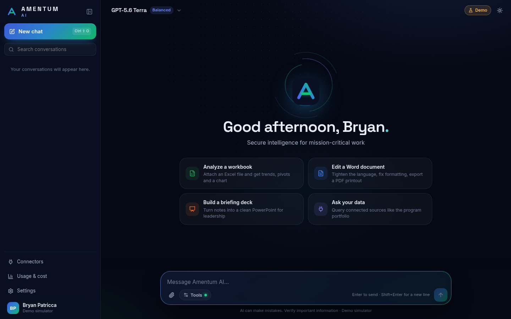
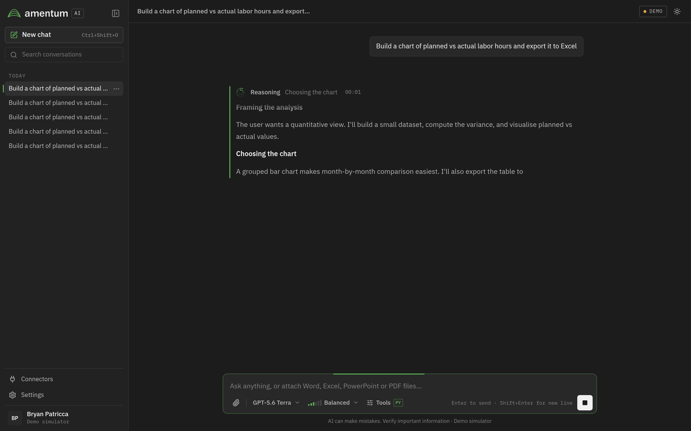
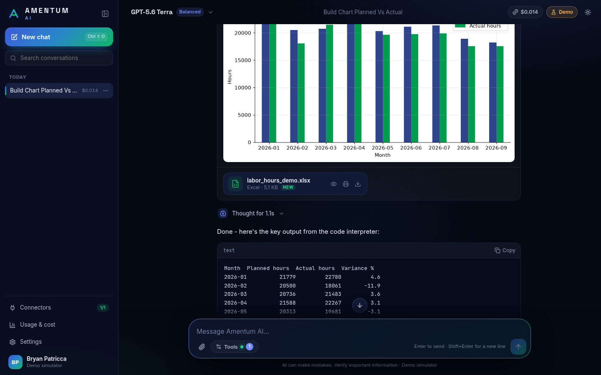
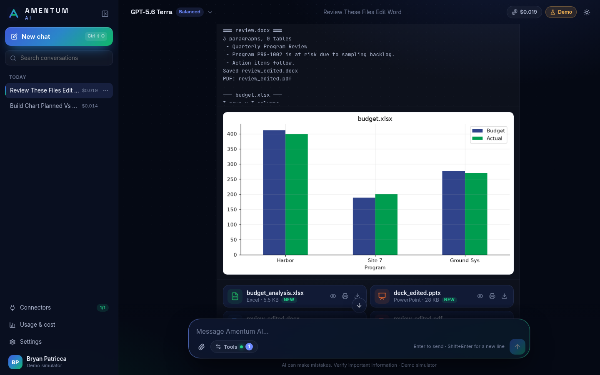
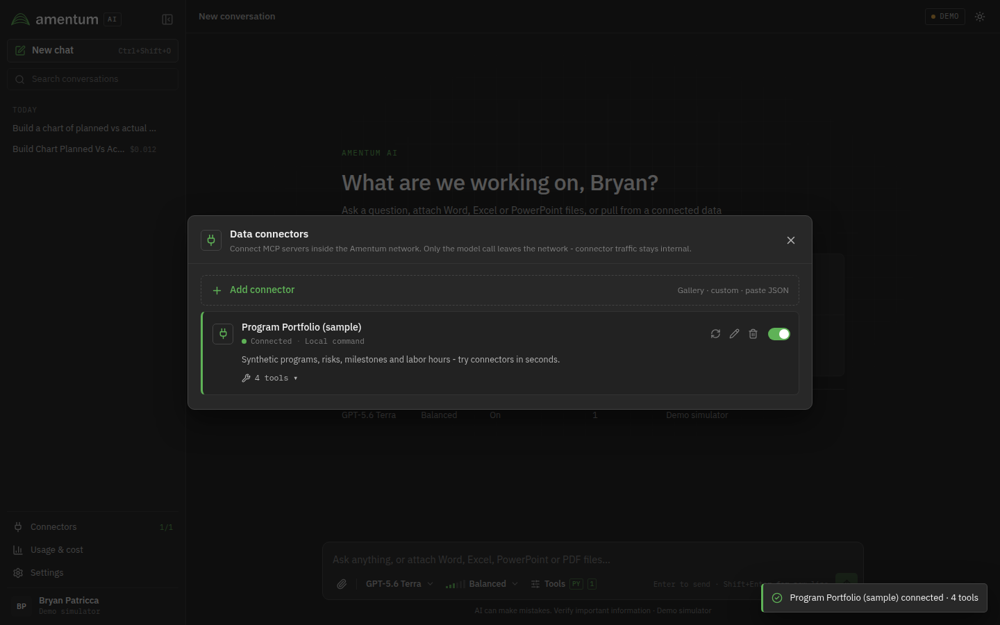
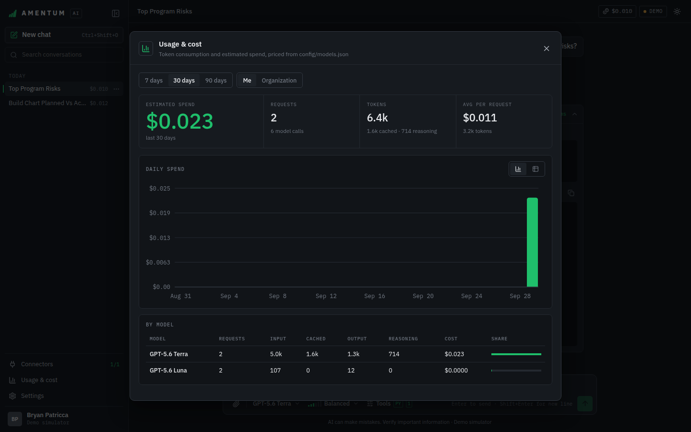
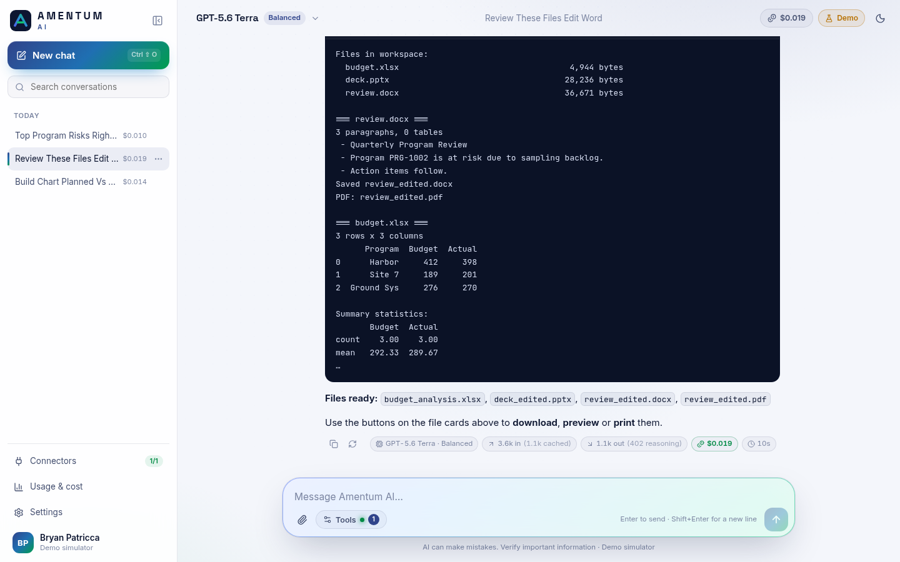
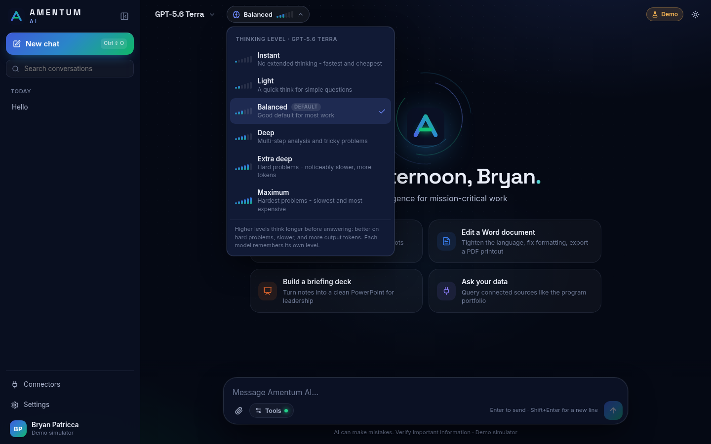

# Amentum AI

A secure, Amentum-branded AI assistant with **live thinking traces**, a **code interpreter** that
reads and edits Word, Excel and PowerPoint files, **one-click MCP data connectors**, and
**per-answer token and cost tracking**. It's built to run inside the Amentum network with Azure
OpenAI in **Azure Government (GCC High)** as the only outbound dependency. The same code runs on
your PC today against the OpenAI API, or with no API key at all in demo mode.



| Live reasoning trace | Code interpreter + charts | Office files → downloads, preview, print |
|---|---|---|
|  |  |  |
| **Data connectors (MCP)** | **Usage & cost** | **Light theme** |
|  |  |  |

<p align="center"></p>

## What you get

- **GPT-5.6 Sol / Terra / Luna** with **model and reasoning-effort dropdowns right in the chat
  composer**. Effort runs Instant, Light, Balanced, Deep, Extra deep and Maximum. All six levels were
  verified against the live API for all three models, and each model remembers its own level.
- **Reasoning traces.** While the model reasons, a small spinner made from the Amentum logo sits
  beside a mm:ss timer and the heading of the current step. The logo breaks into pixels that swirl
  in two counter-rotating rings, and the reasoning summary streams in live from the Responses API.
  When reasoning finishes, the pixels spiral back into place and form the solid logo, and the row
  becomes "Reasoned for 12s · 3 steps", which you can expand.
- **Code interpreter.** A stateful Python (Jupyter) sandbox with pandas, matplotlib, openpyxl,
  python-docx, python-pptx, pypdf and reportlab. You can watch the code as it's written. Charts
  render inline, and every file the code creates shows up as a card with **Download**,
  **Preview** and **Print** (Office files are rendered to PDF with LibreOffice).
- **File input.** Drag and drop, paste, or attach Word, Excel, PowerPoint, PDF, CSV and images.
- **MCP connectors.** Add servers from a gallery, fill in a form, or paste Claude Desktop /
  VS Code JSON. You can test a connection before saving it, turn servers on or off per chat, and
  see each tool call's request and response.
- **Usage and cost.** Every answer records input, cached, output and reasoning tokens, the
  number of model calls, cost and latency. A dashboard shows daily spend and a per-model
  breakdown, with an organization view for admins. Cost display is **off by default** for users
  and can be turned on in Settings.
- **Conversations.** History with search, pinning, renaming, edit-and-resend, regenerate, and
  auto-generated titles.
- **Enterprise touches.** Optional CUI banner, dark and light themes, a responsive mobile
  layout, and bundled fonts (no CDN calls). SSO works through a trusted header. A
  **System status** panel includes a live "Test model connection" check.

## Quick start

### 1. Demo mode (no API key, about 5 minutes)

Requirements: Python 3.11+ and Node.js 22 LTS. LibreOffice is optional; it enables Office
preview and print.

```powershell
# Windows (PowerShell)
cd amentum-chat
.\scripts\dev.ps1
```

```bash
# macOS / Linux
cd amentum-chat
./scripts/dev.sh
```

Your browser opens at **http://localhost:8000**. The built-in simulator stands in for the model
and still exercises the real SDK, streaming, sandbox and tool code paths. To try every feature:

- Ask for *"a chart of planned vs actual hours"*.
- Attach a `.docx`/`.xlsx`/`.pptx` and ask for an edit plus a PDF printout.
- Open **Connectors → Add → Program Portfolio (sample)**, then ask *"what are the top program
  risks?"*

### 2. Your PC with the OpenAI API

```powershell
del backend\.env                    # if you ran demo mode first
.\scripts\dev.ps1 -Mode openai      # prompts for your API key, stores it in backend\.env
```

(`./scripts/dev.sh openai` on macOS/Linux.) This uses exactly the same backend code as GCC High:
the `openai` SDK, the Responses API, reasoning summaries and the same tool loop. Only the
endpoint and credential differ.

### 3. Docker

```bash
cp env/dev-openai.env.example env/app.env     # or demo / gcc-high
docker compose up -d --build                  # http://localhost:8080
```

### 4. Azure Government / GCC High

See **[deploy/gcc-high/README.md](deploy/gcc-high/README.md)**. It covers Bicep provisioning,
Entra ID auth, the egress allow-list, the proxy and CA bundle, SSO and the hardening checklist.

## One codebase, two backends

| | Personal PC / test | Amentum GCC High |
|---|---|---|
| `LLM_PROVIDER` | `openai` (or `demo`) | `azure_gcc_high` |
| Endpoint | `api.openai.com` | `https://<resource>.openai.azure.us/openai/v1/` (or `…/openai?api-version=`) |
| Auth | API key | Entra ID via `login.microsoftonline.us`, scope `https://cognitiveservices.azure.us/.default` (or API key) |
| Client | `openai.AsyncOpenAI` | `openai.AsyncOpenAI` (v1) / `openai.AsyncAzureOpenAI` (versioned) + `azure-identity` |
| Code interpreter | local Jupyter sandbox (embedded) | same sandbox as an isolated container with no egress |
| Everything else | identical | identical |

There's also an `azure` profile (Azure OpenAI commercial). If you have a commercial Azure
subscription, it lets you test the Microsoft auth and endpoint path before moving to Gov.

Two guardrails apply in GCC High mode. The app **refuses to start** if the endpoint isn't a
`.azure.us` host. The code interpreter process never receives API keys or client secrets.

## Architecture

```
frontend/  React 19 + TypeScript + Vite   ── SSE ──►  backend/  FastAPI (Python 3.11+)
                                                       │
  app/llm/engine.py      agent loop: Responses API (reasoning summaries, encrypted reasoning,
                         hosted or local code interpreter) or Chat Completions fallback
  app/llm/clients.py     OpenAI / Azure / Azure Government client factory (Entra, proxy, CA)
  app/tools/             code interpreter bridge + MCP connector manager (stdio / HTTP / SSE)
  app/sandbox/           Jupyter-kernel sandbox: embedded, or `uvicorn app.sandbox.server:app`
  app/demo/              OpenAI-compatible simulator for demo mode and tests
  app/db.py              SQLite: conversations, messages, files, usage events
config/models.json       model catalog: labels, deployments, reasoning efforts, pricing
mcp-servers/amentum-demo sample MCP server (synthetic program-portfolio data)
deploy/gcc-high/         Bicep, provisioning script, nginx example, GCC High guide
```

**Streaming protocol.** `POST /api/chat` returns Server-Sent Events: `reasoning_*`,
`text_delta`, `tool_start` / `tool_input_delta` / `tool_end`, `usage`, `title` and `done`. The
same reducer (`backend/app/llm/parts.py` ⇄ `frontend/src/lib/parts.ts`) turns these into the
message timeline, so a live stream and a reloaded conversation render identically.

**Thinking traces.** With the Responses API the app requests
`reasoning: {effort, summary: "auto"}` and streams `response.reasoning_summary_text.delta`. With
`RESPONSES_STORE=false`, reasoning is carried between tool calls as `reasoning.encrypted_content`,
so nothing is retained by the provider. GPT-5.6 decides how much to think: on easy questions it
often answers with no reasoning at all, and short reasoning may come back without a summary.

Deployments that only support Chat Completions (set `"api": "chat"` per model) still work, with two
limits verified against the live OpenAI API: no thinking text is streamed (reasoning tokens still
appear in usage), and GPT-5.x rejects tools combined with a thinking level. When that happens the app
retries the request with thinking off, keeps tools and code interpreter working, and shows a note.

**Code interpreter modes** (`CODE_INTERPRETER`):

- `local` (default): our own sandbox. It works with every provider and both APIs, and files never
  leave the network.
- `hosted`: the provider's `code_interpreter` tool (Responses API). Files are uploaded to a
  provider container and outputs are downloaded afterwards.
- `off`: document text is extracted and inlined instead.

## Connecting MCP data sources

**Connectors → Add connector** has three options:

1. **Gallery:** the sample portfolio server, a remote HTTP template, a file share, and SQLite.
2. **Custom:** a local command (stdio) or a Streamable HTTP / SSE URL with headers.
3. **Paste JSON:**
   ```json
   { "mcpServers": {
       "sharepoint": { "url": "https://mcp.internal.amentum.com/sharepoint/mcp",
                       "headers": { "Authorization": "Bearer <token>" } },
       "files": { "command": "npx", "args": ["-y", "@modelcontextprotocol/server-filesystem", "D:/Shares"] } } }
   ```

Connected tools are offered to the model as `mcp__<server>__<tool>`. The **Tools** menu in the
composer lets each user pick which connectors a chat may use. Secrets (env values and headers)
are masked in the UI and API. In production, set `CONNECTORS_ADMIN_ONLY=true` and keep
`MCP_ALLOW_STDIO=false` unless the commands are vetted.

## Cost tracking

Prices live in `config/models.json` in USD per 1M tokens:

| Model | Input | Cached input | Output |
|---|---|---|---|
| GPT-5.6 Sol | $5.00 | $0.50 | $30.00 |
| GPT-5.6 Terra | $2.00 | $0.20 | $12.00 |
| GPT-5.6 Luna | $0.20 | $0.02 | $1.20 |

These are OpenAI list prices as of September 2026. Replace them with your Azure Government price
sheet for chargeback.

Cost is calculated as `(input − cached) × input + cached × cached_input + output × output`.
Reasoning tokens are billed as output tokens. Every model call is counted, including tool-loop
steps and title generation. The data is exposed at `GET /api/usage?days=30&scope=me|all`.

## Configuration reference

Everything is an environment variable; see `backend/app/config.py` for the full list.

| Variable | Default | Purpose |
|---|---|---|
| `LLM_PROVIDER` | `demo` | `demo`, `openai`, `azure`, `azure_gcc_high` |
| `OPENAI_API_KEY` | | OpenAI provider |
| `AZURE_OPENAI_ENDPOINT` | | `https://<resource>.openai.azure.us/` |
| `AZURE_API_STYLE` | `v1` | `v1` or `versioned` (+ `AZURE_OPENAI_API_VERSION`) |
| `AZURE_AUTH` | `key` | `key` or `entra` (`AZURE_TENANT_ID`, `AZURE_CLIENT_ID`, secret / certificate / managed identity) |
| `ENFORCE_GOV_ENDPOINTS` | `true` | Block non-`.azure.us` endpoints in GCC High mode |
| `OUTBOUND_PROXY`, `OUTBOUND_CA_BUNDLE` | | Corporate proxy and TLS-inspection CA |
| `MODEL_DEPLOYMENTS` | | JSON map of catalog id → deployment name |
| `DEFAULT_MODEL`, `TITLE_MODEL` | `gpt-5.6-terra`, `gpt-5.6-luna` | |
| `REASONING_SUMMARY` | `auto` | `auto`, `concise`, `detailed`, `off` |
| `RESPONSES_STORE` | `false` | Provider-side storage of responses |
| `CODE_INTERPRETER` | `local` | `local`, `hosted`, `off` |
| `MAX_OUTPUT_TOKENS` | `0` | Output-token cap per model request (`0` = the model's own maximum). Reasoning tokens count toward it, and with `CODE_INTERPRETER=hosted` so does every code step in the reply |
| `MAX_CONTINUATIONS` | `3` | A reply cut off by the output limit is continued automatically this many times before the user sees a warning |
| `MAX_TOOL_STEPS` | `16` | Tool calls (code runs, connector queries) per reply |
| `SANDBOX_URL`, `SANDBOX_TOKEN` | | Use the isolated sandbox service (empty = embedded) |
| `AUTH_MODE`, `AUTH_USER_HEADER`, `ADMIN_USERS` | `none` | SSO via trusted header |
| `CONNECTORS_ADMIN_ONLY`, `MCP_ALLOW_STDIO` | `false`, `true` | Connector governance |
| `SHOW_USAGE_BY_DEFAULT` | `false` | Show token and cost chips to users by default |
| `UI_BANNER_TEXT`, `UI_BANNER_COLOR` | | Classification banner |
| `APP_NAME`, `APP_TAGLINE`, `SYSTEM_PROMPT_EXTRA` | | Branding and org guidance |

## Design and branding

The interface is deliberately plain-spoken: charcoal and white surfaces, hairline rules, tight
corners, IBM Plex Sans with IBM Plex Mono for data. The Amentum logo green is the single accent.
There are no gradients, glows or glass effects. Fonts are bundled, so nothing loads from a CDN.

- **Colors** all live in `frontend/src/styles/tokens.css`. The anchors are the logo green
  `#5FB257` and the charcoal `#282828`, both sampled from amentum.com. In light mode, green text
  uses the darker `#37822F` so it meets 4.5:1 contrast on white. To apply official brand values,
  change the `--brand-*` and per-theme `--accent*` tokens; nothing else hard-codes color.
- **Charts** made by the code interpreter lead with `#43993B`, a darker shade of the logo green,
  because `#5FB257` is too light for bars on white. The palette is validated for color-blind
  separation and contrast in light and dark (`backend/app/sandbox/kernels.py`).
- **Logo:** the four-arch mark and the "amentum" logotype are vector traces of the logo on
  amentum.com (`frontend/src/lib/mark.ts`, `frontend/public/brand/mark.svg`). They are accurate
  enough for an internal tool, but for production swap in the approved artwork from Amentum's brand
  team. The spinner (`frontend/src/lib/logoSpinner.ts`) samples its pixels from the same path at
  runtime, so it follows automatically.

## Development and tests

```bash
cd backend && pip install -r requirements-dev.txt && pytest       # 19 tests
cd frontend && npm run typecheck && npm run build
```

The integration tests run the real `openai` SDK against the simulator mounted in three shapes:
OpenAI, Azure v1 and Azure date-versioned. This covers the GCC High Responses path and the
Chat Completions path, plus the Jupyter sandbox, Office editing, PDF rendering and a live MCP
server.

## Known limits and things to verify at work

- **GPT-5.6 availability and pricing in Azure Government.** I couldn't confirm either.
  Everything model-specific is in `config/models.json` and the env file.
- **Responses API in your Gov region.** If it isn't available, set `"api": "chat"` for the
  affected models. You lose the thinking text, and turns that use tools run without extended
  thinking (see *Thinking traces* above).
- **Hosted code interpreter** (`CODE_INTERPRETER=hosted`) depends on the provider's containers
  API and is untested against Azure Government. `local` is the recommended mode.
- **Single replica.** The app runs as one process; see the scaling notes in the GCC High guide.
