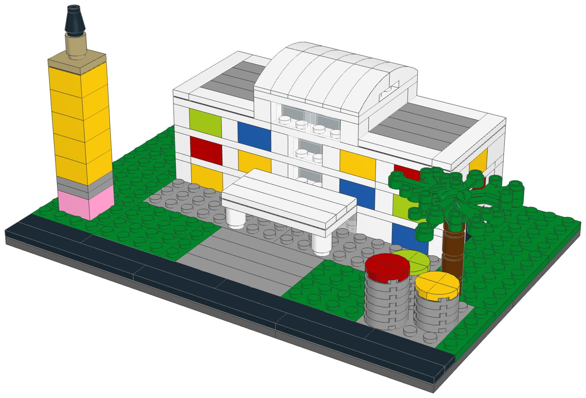
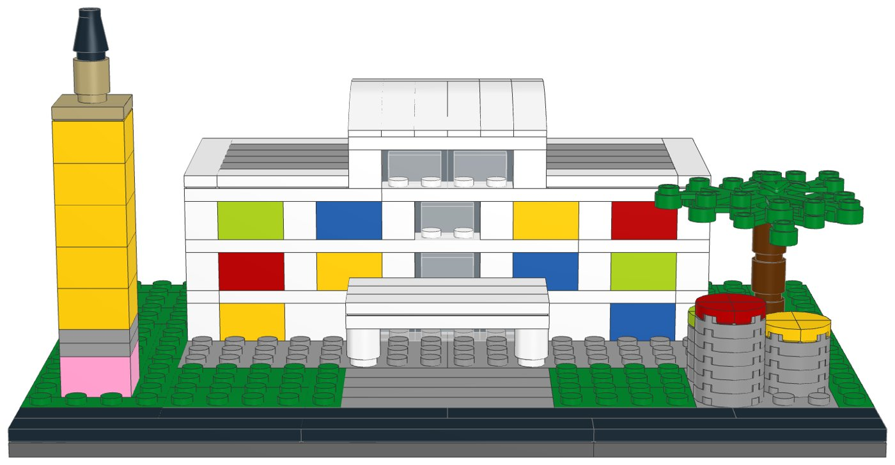
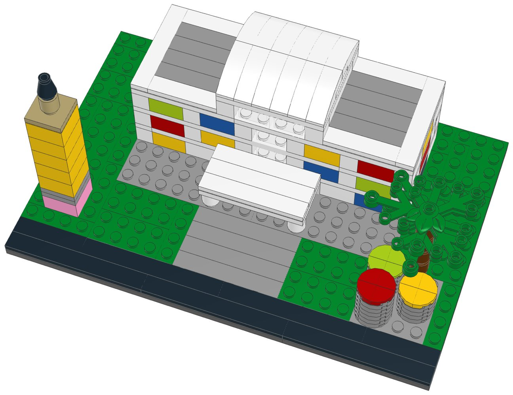

# Art of Animation Resort (compact): LEGO® display kit with build instructions



A compact display model of Disney's Art of Animation Resort at Walt Disney World, part of the [compact resort collection](../resort-collection/README.md). Animation Hall, the resort's lobby building: a modern white hall with a grid of big coloured window panels, a taller glass atrium under a white barrel roof over the entrance, and a flat white canopy in front. Out front stand two generic animation icons: a giant pencil and three pots of paint. The resort's character areas, its guest buildings themed on animated films, are left out on purpose: no characters, character vehicles or character buildings appear, so this kit is less recognisable than the others in the collection.

**Signature features in this kit**

- Animation Hall: a modern white lobby building with big coloured window panels
- A taller glass atrium with a white barrel roof over the entrance
- The flat white entrance canopy on two columns
- A giant yellow pencil with a pink eraser and a sharpened tan and black tip
- Three giant pots of paint in red, yellow and lime

**Left out to keep it compact**

- The resort's character areas, left out on purpose: all film characters, character vehicles and character-themed buildings and icons. This kit is less recognisable than the others as a result
- The guest-room buildings, the pools and the courtyards
- Lettering and logos on Animation Hall, and the Skyliner station

| | |
|---|---|
| Pieces | **222** (49 part/colour lines, 33 kinds of part, 13 colours) |
| Display base | 24 × 16 studs (19.2 × 12.8 cm), the same for every kit in the collection |
| Overall size | 19.2 × 12.8 cm, 9.4 cm tall |
| Scale | about 1:250 (one storey = 4 plates, 1 stud ≈ 2 m), like the large resort models |
| Instructions | 33-page PDF, 28 steps, 5 sections |
| Parts cost | **$31.41 per kit** at the Pick a Brick prices last seen (2022 and late 2025); about $34.55 with 2026 price rises (see [Cost assumptions](#cost-assumptions-and-resale-scenarios)) |



## What's in this folder

| Path | What it is |
|---|---|
| [`instructions/Art_of_Animation_Resort_Compact_Instructions.pdf`](instructions/Art_of_Animation_Resort_Compact_Instructions.pdf) | **The instruction booklet**: cover, section intros with parts lists, 28 numbered steps, gallery, parts inventory with element IDs, ordering guide |
| [`parts/pick_a_brick_upload.csv`](parts/pick_a_brick_upload.csv) | Pick a Brick upload file for **one kit** (49 element IDs) |
| [`parts/pick_a_brick_upload_x10.csv`](parts/pick_a_brick_upload_x10.csv), [`parts/pick_a_brick_upload_x25.csv`](parts/pick_a_brick_upload_x25.csv) | Upload files for **10 kits** (2,220 pieces) and **25 kits** (5,550 pieces) |
| [`parts/kit_cost.csv`](parts/kit_cost.csv) | Cost of one kit, line by line, with the price and when it was seen |
| [`parts/pick_a_brick_list.csv`](parts/pick_a_brick_list.csv) | Bill of materials: element ID, quantity, part, LEGO colour, design ID, BrickLink part and colour, alternate IDs |
| [`parts/pick_a_brick_mapping.csv`](parts/pick_a_brick_mapping.csv) | Part-by-part sourcing: Pick a Brick name, evidence it's sold, last price, the ID to try next, BrickLink backup |
| [`parts/pick_a_brick_upload_retry.csv`](parts/pick_a_brick_upload_retry.csv) | Newer element IDs for 19 of the parts, for lines the upload doesn't match |
| [`parts/bricklink_wanted_list.xml`](parts/bricklink_wanted_list.xml), [`parts/rebrickable_parts.csv`](parts/rebrickable_parts.csv) | BrickLink wanted list and Rebrickable import (one kit) |
| [`parts/parts_by_section.csv`](parts/parts_by_section.csv) | Parts for each section, for bagging |
| [`model/art_of_animation_compact.mpd`](model/art_of_animation_compact.mpd) | The digital model (LDraw, with steps and submodels). Opens in BrickLink Studio, LeoCAD and LDCad |
| [`checks.md`](checks.md) | Results of the digital build checks |
| [`design.py`](design.py) | The design, written as code on the stud grid |

## Ordering the parts

1. On lego.com, open **Pick and Build → Pick a Brick** and choose **Upload list**.
2. Upload the file for 1, 10 or 25 kits.
3. Before you pay, check that every line shows the normal (Bestseller) delivery time and compare the bag total with the cost below.
4. If a line isn't matched, use the ID in the retry file or in the "If not found" column of the mapping, multiplied by the number of kits.

**Kits per order:** Pick a Brick sells up to 999 of one element per order. The part this kit uses most is needed 21 times, so one order holds up to **47 kits**.

**Sourcing evidence** (every part must pass the Bestseller-only check in `export_parts.py`):

| Evidence | Lines |
|---|---|
| In Pick a Brick Bestseller range (2022 listing); still in LEGO sets in 2026 | 31 |
| On Pick a Brick (late-2025 listing) | 18 |

**Sourcing uncertainties:**

- 31 lines are backed only by LEGO's 2022 Bestseller list, so their range and price today are not confirmed.
- 19 lines have newer element IDs (retry file); an upload may match either.
- LEGO pauses Standard parts in the US and Canada from November 2, 2026; this kit uses none, but check that no line shows a longer delivery time.

## Cost assumptions and resale scenarios

These are planning numbers, not quotes. Upload the 10-kit file to see today's prices: the bag total is the real parts cost.

| Assumption | Value |
|---|---|
| Parts, as listed | Pick a Brick prices last seen in LEGO's 2022 Bestseller list and a late-2025 listing (offline data; lego.com could not be reached to check current prices) |
| Parts, 2026 estimate | +10% on the listed prices (stress case +20%); LEGO's September 14, 2026 repricing raised about a third of Pick a Brick elements by 16.7% on average, hitting tiles and small parts hardest |
| Packaging | $3.00 per kit: box, bags, a card with a link or QR code to the PDF booklet, tape and label (a printed colour booklet adds about $4.00) |
| Labour | $15.00/hour; 3 s per piece to count and bag from sorted stock, plus 6 min to pack |
| Etsy fees (US) | $0.20 listing + 6.5% transaction + 3% + $0.25 processing, on the price the buyer pays |
| Shipping | seller-paid (free shipping) $10.50 for a 1-2 lb box by USPS Ground Advantage; or the buyer pays postage |
| Prices | 1.6x / 2x / 2.5x the 2026 parts estimate, rounded up to $x9.99; market prices for custom kits were not researched for each resort |

| Per kit | Listed prices | 2026 estimate | Stress case |
|---|---|---|---|
| Parts | $31.41 | $34.55 | $37.69 |
| Packaging | $3.00 | $3.00 | $3.00 |
| Labour (222 pieces) | $4.28 | $4.28 | $4.28 |
| Before shipping | $38.69 | $41.83 | $44.97 |
| Seller-paid shipping | $10.50 | $10.50 | $10.50 |

Biggest cost lines: 1× Plate 16 x 16 (Dark Stone Grey) $3.04, 4× Plate 4 x 8 (Medium Stone Grey) $1.84, 18× Brick 1 x 2 (Black) $1.80.

| Price | Free shipping (seller pays): profit | margin | Buyer pays postage: profit | margin |
|---|---|---|---|---|
| $59.99 (27¢/piece) | $1.51 | 3% | $11.02 | 18% |
| $69.99 (32¢/piece) | $10.56 | 15% | $20.07 | 29% |
| $89.99 (41¢/piece) | $28.66 | 32% | $38.17 | 42% |

Break-even price: $58.32 with free shipping, $47.82 when the buyer pays postage (2026 estimate). The stress case adds about $3.14 per kit.

## Digital checks and physical prototype

`lego-kit/checks.py` checked the digital model ([`checks.md`](checks.md)):

| Check | Result |
|---|---|
| Collisions | Pass |
| Connections | Pass |
| Assembly order | Pass |
| Stability | Pass |

The model was checked on the computer only: parts fit the stud grid without overlaps and every part is held by a stud. **No physical prototype has been built.** Before selling, build one kit from the uploaded parts and the printed booklet, to confirm the parts arrive as listed, the build holds together when handled, and each step is clear.

## Building notes

- **Sections:**
  1. The display base and the lawn
  2. Animation Hall
  3. The giant pencil
  4. The paint pots
  5. The palm
- The window panels are 1×2 bricks in four colours. Lay out each storey's colours before you start it.
- The glass is 1×2 clear bricks without a centre tube. Press them on gently.
- The pencil's tip stands half a stud off the grid, on the centre stud of the tan plate.



## How it was made

The model is generated by [`design.py`](design.py) with the shared toolkit in [`../lego-kit`](../lego-kit), in the collection's compact format (`lego-kit/compact.py`). `./build.sh` renders the steps with LeoCAD, maps every part to LEGO element IDs, writes the parts lists and upload files, runs the checks, prints the booklet and writes this README.

```bash
./build.sh            # set DATA_DIR to refresh element IDs (see ../lego-kit/README.md)
```

lego.com, BrickLink and Rebrickable could not be reached from the environment this was made in. Availability comes from an August 2026 Rebrickable snapshot and Pick a Brick listings from 2022 and late 2025. With internet access, `node ../lego-kit/pab_check.cjs .` checks every element live.

## Disclaimer

An unofficial fan design (MOC) inspired by Disney's Art of Animation Resort at Walt Disney World. It is not affiliated with, sponsored or endorsed by The LEGO Group or Disney. LEGO® is a trademark of The LEGO Group. Resort names are trademarks of Disney; see the trademark note in the [collection README](../resort-collection/README.md) before selling.
