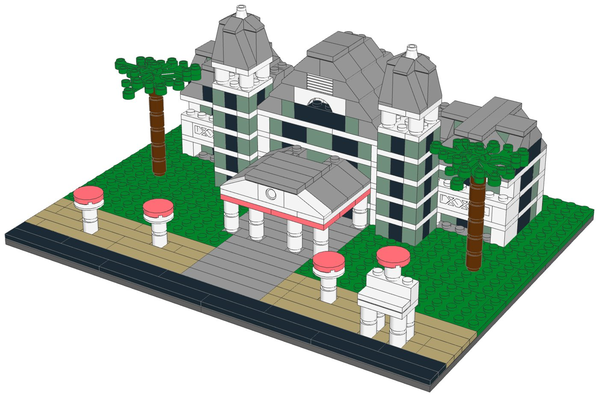
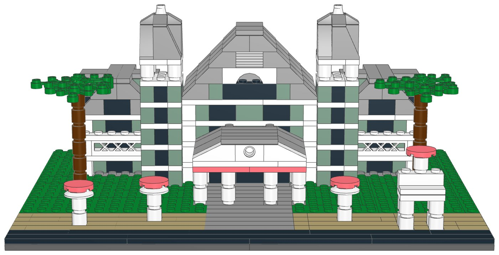
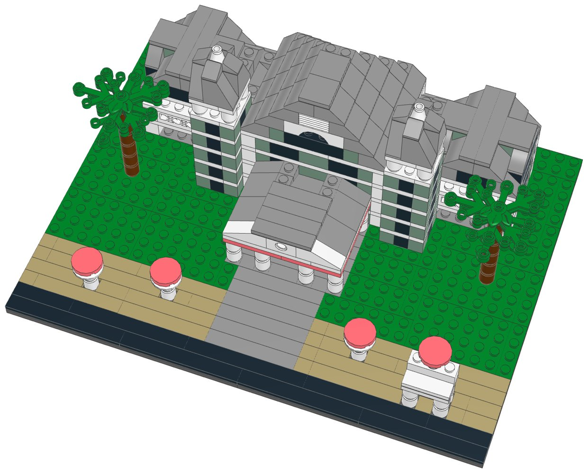

# Beach Club Resort (mid-size): LEGO® display kit with build instructions



A mid-size display model of Disney's Beach Club Resort at Walt Disney World, part of the [resort collection](../resort-collection/README.md). The Beach Club's entrance front as a seaside Victorian beach cottage, facing the viewer: a four-storey centre of pale sea-green clapboard with crisp white trim under a steep light grey gable with a white fan window; two slim turrets flanking the entrance, each with an open white lookout and a pointed cap; lower wings with white porches and lattice railings under cross gables; and a white porte-cochere with a low pediment, a round window and a coral fascia over the walk. In front, a sandy beach strip with coral-topped umbrellas and a lifeguard chair, and two palms.

This kit covers Disney's Beach Club Villas as well: they share the property, and the mid-size model shows the part that makes it recognisable.

**Signature features in this kit**

- The entrance front, facing the viewer and symmetric: the porte-cochere, the central gable and the two turrets on one axis
- Pale sea-green clapboard walls (sand green) with white floor bands, corner boards and eaves
- A steep central gable with a white fan window and a louvre
- Two turrets flanking the entrance, with an open white lookout and a pointed light grey cap
- Wings with white porches: columns on the ground floor, lattice railings on the balcony above, and a cross gable over each porch
- A white porte-cochere on six columns, with a low pediment, a round window and a coral fascia
- A sandy beach strip with three coral-topped umbrellas and a lifeguard chair, and two palms

**Left out**

- The long guest wings, the Beach Club Villas and the Yacht Club next door
- Stormalong Bay, the croquet lawn and the beach on Crescent Lake, which lie behind the building (the beach strip in front stands in for them)
- The gingerbread trim, shutters and window frames (shown as plain rows of windows)

| | |
|---|---|
| Pieces | **634** (70 part/colour lines, 44 kinds of part, 9 colours) |
| Display base | 32 × 24 studs (25.6 × 19.2 cm), the same for every mid-size kit in the collection |
| Overall size | 25.6 × 19.2 cm, 11.4 cm tall |
| Scale | about 1:250 (one storey = 4 plates, 1 stud ≈ 2 m), like the large resort models |
| Instructions | 61-page PDF, 80 steps, 7 sections |
| Parts cost | **$76.31 per kit** at the Pick a Brick prices last seen (2022 and late 2025); about $83.94 with 2026 price rises (see [Cost assumptions](#cost-assumptions-and-resale-scenarios)) |
| Compact version | [`../beach-club-compact-lego`](../beach-club-compact-lego) |



## What's in this folder

| Path | What it is |
|---|---|
| [`instructions/Beach_Club_Resort_Midsize_Instructions.pdf`](instructions/Beach_Club_Resort_Midsize_Instructions.pdf) | **The instruction booklet**: cover, section intros with parts lists, 80 numbered steps, gallery, parts inventory with element IDs, ordering guide |
| [`parts/pick_a_brick_upload.csv`](parts/pick_a_brick_upload.csv) | Pick a Brick upload file for **one kit** (70 element IDs) |
| [`parts/pick_a_brick_upload_x10.csv`](parts/pick_a_brick_upload_x10.csv), [`parts/pick_a_brick_upload_x25.csv`](parts/pick_a_brick_upload_x25.csv) | Upload files for **10 kits** (6,340 pieces) and **25 kits** (15,850 pieces) |
| [`parts/kit_cost.csv`](parts/kit_cost.csv) | Cost of one kit, line by line, with the price and when it was seen |
| [`parts/pick_a_brick_list.csv`](parts/pick_a_brick_list.csv) | Bill of materials: element ID, quantity, part, LEGO colour, design ID, BrickLink part and colour, alternate IDs |
| [`parts/pick_a_brick_mapping.csv`](parts/pick_a_brick_mapping.csv) | Part-by-part sourcing: Pick a Brick name, evidence it's sold, last price, the ID to try next, BrickLink backup |
| [`parts/pick_a_brick_upload_retry.csv`](parts/pick_a_brick_upload_retry.csv) | Newer element IDs for 23 of the parts, for lines the upload doesn't match |
| [`parts/bricklink_wanted_list.xml`](parts/bricklink_wanted_list.xml), [`parts/rebrickable_parts.csv`](parts/rebrickable_parts.csv) | BrickLink wanted list and Rebrickable import (one kit) |
| [`parts/parts_by_section.csv`](parts/parts_by_section.csv) | Parts for each section, for bagging |
| [`model/beach_club_midsize.mpd`](model/beach_club_midsize.mpd) | The digital model (LDraw, with steps and submodels). Opens in BrickLink Studio, LeoCAD and LDCad |
| [`checks.md`](checks.md) | Results of the digital build checks |
| [`design.py`](design.py) | The design, written as code on the stud grid |

## Ordering the parts

1. On lego.com, open **Pick and Build → Pick a Brick** and choose **Upload list**.
2. Upload the file for 1, 10 or 25 kits.
3. Before you pay, check that every line shows the normal (Bestseller) delivery time and compare the bag total with the cost below.
4. If a line isn't matched, use the ID in the retry file or in the "If not found" column of the mapping, multiplied by the number of kits.

**Kits per order:** Pick a Brick sells up to 999 of one element per order. The part this kit uses most is needed 104 times, so one order holds up to **9 kits**.

**Sourcing evidence** (every part must pass the Bestseller-only check in `export_parts.py`):

| Evidence | Lines |
|---|---|
| In Pick a Brick Bestseller range (2022 listing); still in LEGO sets in 2026 | 46 |
| On Pick a Brick (late-2025 listing) | 22 |
| In Pick a Brick Bestseller range (2022 listing); still in LEGO sets in 2026 (including sets listed for 2027) | 2 |

**Sourcing uncertainties:**

- 48 lines are backed only by LEGO's 2022 Bestseller list, so their range and price today are not confirmed.
- 23 lines have newer element IDs (retry file); an upload may match either.
- LEGO pauses Standard parts in the US and Canada from November 2, 2026; this kit uses none, but check that no line shows a longer delivery time.

## Cost assumptions and resale scenarios

These are planning numbers, not quotes. Upload the 10-kit file to see today's prices: the bag total is the real parts cost.

| Assumption | Value |
|---|---|
| Parts, as listed | Pick a Brick prices last seen in LEGO's 2022 Bestseller list and a late-2025 listing (offline data; lego.com could not be reached to check current prices) |
| Parts, 2026 estimate | +10% on the listed prices (stress case +20%); LEGO's September 14, 2026 repricing raised about a third of Pick a Brick elements by 16.7% on average, hitting tiles and small parts hardest |
| Packaging | $3.00 per kit: box, bags, a card with a link or QR code to the PDF booklet, tape and label (a printed colour booklet adds about $4.00) |
| Labour | $15.00/hour; 3 s per piece to count and bag from sorted stock, plus 6 min to pack |
| Etsy fees (US) | $0.20 listing + 6.5% transaction + 3% + $0.25 processing, on the price the buyer pays |
| Shipping | seller-paid (free shipping) $10.50 for a 1-2 lb box by USPS Ground Advantage; or the buyer pays postage |
| Prices | 1.6x / 2x / 2.5x the 2026 parts estimate, rounded up to $x9.99; market prices for custom kits were not researched for each resort |

| Per kit | Listed prices | 2026 estimate | Stress case |
|---|---|---|---|
| Parts | $76.31 | $83.94 | $91.57 |
| Packaging | $3.00 | $3.00 | $3.00 |
| Labour (634 pieces) | $9.42 | $9.42 | $9.42 |
| Before shipping | $88.73 | $96.37 | $104.00 |
| Seller-paid shipping | $10.50 | $10.50 | $10.50 |

Biggest cost lines: 104× Brick 1 x 1 (Sand Green) $7.28, 48× Slope 45 2 x 2 (Medium Stone Grey) $6.72, 2× Plate 16 x 16 (Dark Stone Grey) $6.08.

| Price | Free shipping (seller pays): profit | margin | Buyer pays postage: profit | margin |
|---|---|---|---|---|
| $139.99 (22¢/piece) | $19.37 | 14% | $28.88 | 21% |
| $169.99 (27¢/piece) | $46.52 | 27% | $56.03 | 33% |
| $209.99 (33¢/piece) | $82.72 | 39% | $92.23 | 44% |

Break-even price: $118.58 with free shipping, $108.08 when the buyer pays postage (2026 estimate). The stress case adds about $7.63 per kit.

## Digital checks and physical prototype

`lego-kit/checks.py` checked the digital model ([`checks.md`](checks.md)):

| Check | Result |
|---|---|
| Collisions | Pass |
| Connections | Pass |
| Assembly order | Pass |
| Stability | Pass |

The model was checked on the computer only: parts fit the stud grid without overlaps and every part is held by a stud. **No physical prototype has been built.** Before selling, build one kit from the uploaded parts and the printed booklet, to confirm the parts arrive as listed, the build holds together when handled, and each step is clear.

## Building notes

- **Sections:**
  1. The display base, the walk, the lawns and the beach
  2. The centre
  3. The turrets (build 2)
  4. The left wing
  5. The right wing
  6. The porte-cochere
  7. The palms, the beach umbrellas and the lifeguard chair
- Each storey is a course of sand green bricks, with black bricks for the windows and white bricks at the corners, then a ring of white plates. The rings take turns: on one storey the front and back rows hold the corners, on the next the side rows do, so the walls lock together.
- On the wings the porch goes up with the walls: a white column on the ground floor, a lattice fence on the balcony, each tied in by the 2-wide white plate above it.
- Roofs go up one row of slopes at a time. Hidden bricks under the gables and the ridges have a step of their own, just before the slopes that rest on them.
- The umbrella canopies and the lifeguard chair's sunshade sit on a single centre stud, half a stud off the grid.
- A “Build 2” badge means you build that module twice.



## How it was made

The model is generated by [`design.py`](design.py) with the shared toolkit in [`../lego-kit`](../lego-kit), in the collection's mid-size format (`lego-kit/compact.py`). `./build.sh` renders the steps with LeoCAD, maps every part to LEGO element IDs, writes the parts lists and upload files, runs the checks, prints the booklet and writes this README.

```bash
./build.sh            # set DATA_DIR to refresh element IDs (see ../lego-kit/README.md)
```

lego.com, BrickLink and Rebrickable could not be reached from the environment this was made in. Availability comes from an August 2026 Rebrickable snapshot and Pick a Brick listings from 2022 and late 2025. With internet access, `node ../lego-kit/pab_check.cjs .` checks every element live.

## Disclaimer

An unofficial fan design (MOC) inspired by Disney's Beach Club Resort at Walt Disney World. It is not affiliated with, sponsored or endorsed by The LEGO Group or Disney. LEGO® is a trademark of The LEGO Group. Resort names are trademarks of Disney; see the trademark note in the [collection README](../resort-collection/README.md) before selling.
