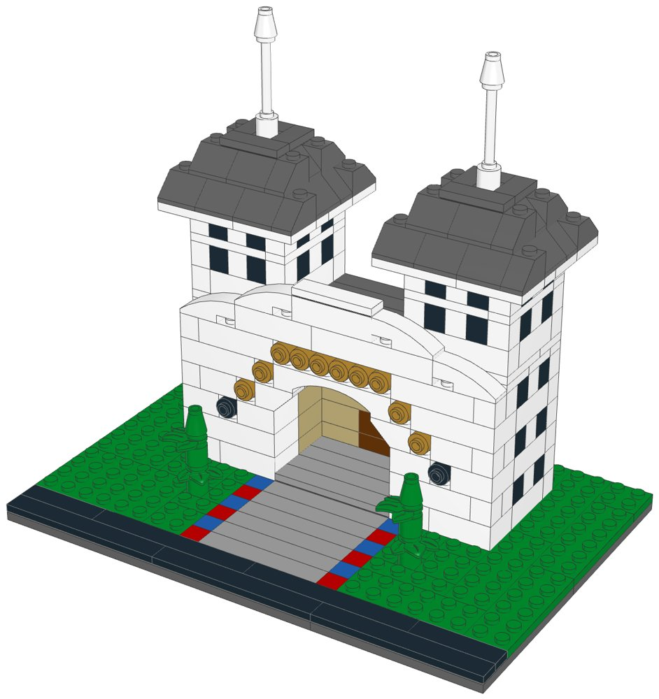
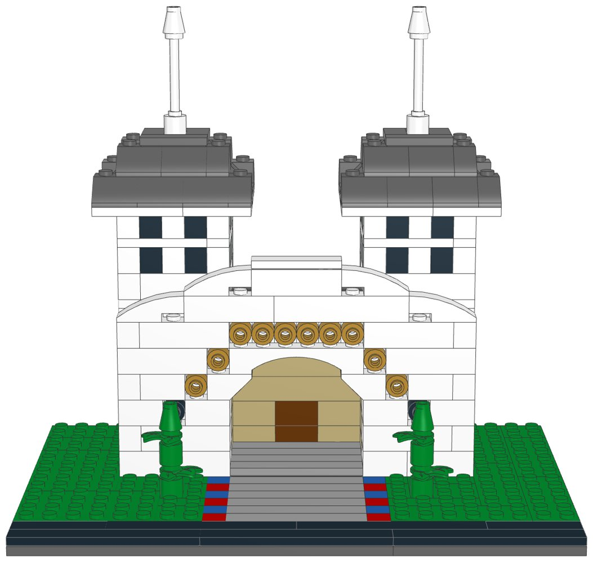
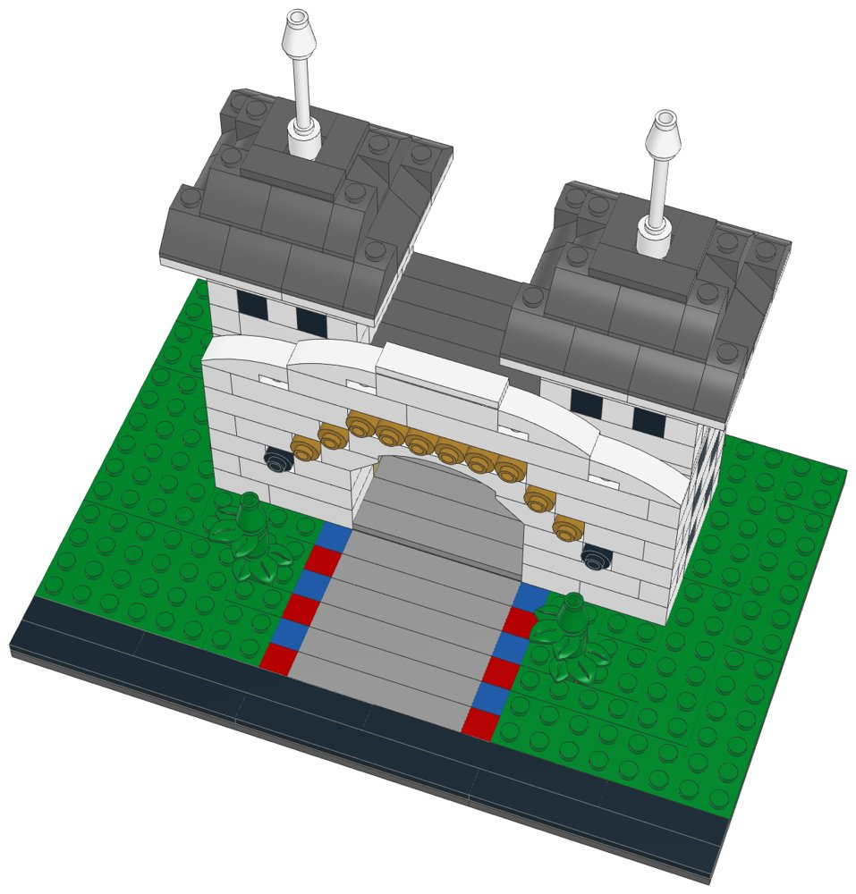

# BoardWalk Inn (compact): LEGO® display kit with build instructions



A compact display model of Disney's BoardWalk Inn at Walt Disney World, part of the [compact resort collection](../resort-collection/README.md). The entrance of the BoardWalk Inn: the white gatehouse with its big round arch, a ring of gold dots where the sign's letters run over it and a curved roofline, two towers with dark pyramid roofs and white spires, and the drive with its red-and-blue painted curb between two topiaries.

This kit covers Disney's BoardWalk Villas as well: they share the property, and the compact model shows the part that makes it recognisable.

**Signature features in this kit**

- White gatehouse with the big round arch and the passage behind it
- Gold dots over the arch in place of the sign's letters
- The curved roofline over the arch
- Two towers with dark pyramid roofs and white spires
- Red-and-blue painted curb along the drive, and two topiaries

**Left out to keep it compact**

- The side wings and the BoardWalk Villas buildings
- The lookout on the roof and the flower bed
- The boardwalk itself, the lake and the shops

| | |
|---|---|
| Pieces | **383** (53 part/colour lines, 38 kinds of part, 10 colours) |
| Display base | 24 × 16 studs (19.2 × 12.8 cm), the same for every kit in the collection |
| Overall size | 19.2 × 12.8 cm, 17.4 cm tall |
| Scale | about 1:250 (one storey = 4 plates, 1 stud ≈ 2 m), like the large resort models |
| Instructions | 40-page PDF, 37 steps, 3 sections |
| Parts cost | **$48.89 per kit** at the Pick a Brick prices last seen (2022 and late 2025); about $53.78 with 2026 price rises (see [Cost assumptions](#cost-assumptions-and-resale-scenarios)) |
| Large version | [`../boardwalk-lego`](../boardwalk-lego) (the full display model) |



## What's in this folder

| Path | What it is |
|---|---|
| [`instructions/BoardWalk_Inn_Compact_Instructions.pdf`](instructions/BoardWalk_Inn_Compact_Instructions.pdf) | **The instruction booklet**: cover, section intros with parts lists, 37 numbered steps, gallery, parts inventory with element IDs, ordering guide |
| [`parts/pick_a_brick_upload.csv`](parts/pick_a_brick_upload.csv) | Pick a Brick upload file for **one kit** (53 element IDs) |
| [`parts/pick_a_brick_upload_x10.csv`](parts/pick_a_brick_upload_x10.csv), [`parts/pick_a_brick_upload_x25.csv`](parts/pick_a_brick_upload_x25.csv) | Upload files for **10 kits** (3,830 pieces) and **25 kits** (9,575 pieces) |
| [`parts/kit_cost.csv`](parts/kit_cost.csv) | Cost of one kit, line by line, with the price and when it was seen |
| [`parts/pick_a_brick_list.csv`](parts/pick_a_brick_list.csv) | Bill of materials: element ID, quantity, part, LEGO colour, design ID, BrickLink part and colour, alternate IDs |
| [`parts/pick_a_brick_mapping.csv`](parts/pick_a_brick_mapping.csv) | Part-by-part sourcing: Pick a Brick name, evidence it's sold, last price, the ID to try next, BrickLink backup |
| [`parts/pick_a_brick_upload_retry.csv`](parts/pick_a_brick_upload_retry.csv) | Newer element IDs for 20 of the parts, for lines the upload doesn't match |
| [`parts/bricklink_wanted_list.xml`](parts/bricklink_wanted_list.xml), [`parts/rebrickable_parts.csv`](parts/rebrickable_parts.csv) | BrickLink wanted list and Rebrickable import (one kit) |
| [`parts/parts_by_section.csv`](parts/parts_by_section.csv) | Parts for each section, for bagging |
| [`model/boardwalk_compact.mpd`](model/boardwalk_compact.mpd) | The digital model (LDraw, with steps and submodels). Opens in BrickLink Studio, LeoCAD and LDCad |
| [`checks.md`](checks.md) | Results of the digital build checks |
| [`design.py`](design.py) | The design, written as code on the stud grid |

## Ordering the parts

1. On lego.com, open **Pick and Build → Pick a Brick** and choose **Upload list**.
2. Upload the file for 1, 10 or 25 kits.
3. Before you pay, check that every line shows the normal (Bestseller) delivery time and compare the bag total with the cost below.
4. If a line isn't matched, use the ID in the retry file or in the "If not found" column of the mapping, multiplied by the number of kits.

**Kits per order:** Pick a Brick sells up to 999 of one element per order. The part this kit uses most is needed 60 times, so one order holds up to **16 kits**.

**Sourcing evidence** (every part must pass the Bestseller-only check in `export_parts.py`):

| Evidence | Lines |
|---|---|
| In Pick a Brick Bestseller range (2022 listing); still in LEGO sets in 2026 | 34 |
| On Pick a Brick (late-2025 listing) | 18 |
| In Pick a Brick Bestseller range (2022 listing); still in LEGO sets in 2026 (including sets listed for 2027) | 1 |

**Sourcing uncertainties:**

- 35 lines are backed only by LEGO's 2022 Bestseller list, so their range and price today are not confirmed.
- 20 lines have newer element IDs (retry file); an upload may match either.
- LEGO pauses Standard parts in the US and Canada from November 2, 2026; this kit uses none, but check that no line shows a longer delivery time.

## Cost assumptions and resale scenarios

These are planning numbers, not quotes. Upload the 10-kit file to see today's prices: the bag total is the real parts cost.

| Assumption | Value |
|---|---|
| Parts, as listed | Pick a Brick prices last seen in LEGO's 2022 Bestseller list and a late-2025 listing (offline data; lego.com could not be reached to check current prices) |
| Parts, 2026 estimate | +10% on the listed prices (stress case +20%); LEGO's September 14, 2026 repricing raised about a third of Pick a Brick elements by 16.7% on average, hitting tiles and small parts hardest |
| Packaging | $3.00 per kit: box, bags, a card with a link or QR code to the PDF booklet, tape and label (a printed colour booklet adds about $4.00) |
| Labour | $15.00/hour; 3 s per piece to count and bag from sorted stock, plus 6 min to pack |
| Etsy fees (US) | $0.20 listing + 6.5% transaction + 3% + $0.25 processing, on the price the buyer pays |
| Shipping | seller-paid (free shipping) $10.50 for a 1-2 lb box by USPS Ground Advantage; or the buyer pays postage |
| Prices | 1.6x / 2x / 2.5x the 2026 parts estimate, rounded up to $x9.99; market prices for custom kits were not researched for each resort |

| Per kit | Listed prices | 2026 estimate | Stress case |
|---|---|---|---|
| Parts | $48.89 | $53.78 | $58.67 |
| Packaging | $3.00 | $3.00 | $3.00 |
| Labour (383 pieces) | $6.29 | $6.29 | $6.29 |
| Before shipping | $58.18 | $63.07 | $67.96 |
| Seller-paid shipping | $10.50 | $10.50 | $10.50 |

Biggest cost lines: 60× Brick 1 x 1 (White) $4.20, 24× Slope 45 2 x 2 (Dark Stone Grey) $3.36, 44× Brick 1 x 1 (Black) $3.08.

| Price | Free shipping (seller pays): profit | margin | Buyer pays postage: profit | margin |
|---|---|---|---|---|
| $89.99 (23¢/piece) | $7.42 | 8% | $16.93 | 19% |
| $109.99 (29¢/piece) | $25.52 | 23% | $35.03 | 32% |
| $139.99 (37¢/piece) | $52.67 | 38% | $62.18 | 44% |

Break-even price: $81.79 with free shipping, $71.29 when the buyer pays postage (2026 estimate). The stress case adds about $4.89 per kit.

## Digital checks and physical prototype

`lego-kit/checks.py` checked the digital model ([`checks.md`](checks.md)):

| Check | Result |
|---|---|
| Collisions | Pass |
| Connections | Pass |
| Assembly order | Pass |
| Stability | Pass |

The model was checked on the computer only: parts fit the stud grid without overlaps and every part is held by a stud. **No physical prototype has been built.** Before selling, build one kit from the uploaded parts and the printed booklet, to confirm the parts arrive as listed, the build holds together when handled, and each step is clear.

## Building notes

- **Sections:**
  1. The display base, the lawn and the drive
  2. The gatehouse
  3. The towers (build 2)
  4. The topiaries (build 2)
- The front wall is two studs thick, so the arch has a deep reveal. Around the arch it is two rows of 1-wide bricks; elsewhere 2-wide bricks tie the rows together.
- Each gold dot is a gold round brick on the side stud of a white brick in the inner row; it fills the gap left in the outer row. The two dark portholes are made the same way with black round bricks.
- The arch steps in with inverted slopes, then the raised 1×6 arch closes it. The sloped side of each inverted slope faces the middle of the arch.
- A “Build 2” badge means you build that module twice.



## How it was made

The model is generated by [`design.py`](design.py) with the shared toolkit in [`../lego-kit`](../lego-kit), in the collection's compact format (`lego-kit/compact.py`). `./build.sh` renders the steps with LeoCAD, maps every part to LEGO element IDs, writes the parts lists and upload files, runs the checks, prints the booklet and writes this README.

```bash
./build.sh            # set DATA_DIR to refresh element IDs (see ../lego-kit/README.md)
```

lego.com, BrickLink and Rebrickable could not be reached from the environment this was made in. Availability comes from an August 2026 Rebrickable snapshot and Pick a Brick listings from 2022 and late 2025. With internet access, `node ../lego-kit/pab_check.cjs .` checks every element live.

## Disclaimer

An unofficial fan design (MOC) inspired by Disney's BoardWalk Inn at Walt Disney World. It is not affiliated with, sponsored or endorsed by The LEGO Group or Disney. LEGO® is a trademark of The LEGO Group. Resort names are trademarks of Disney; see the trademark note in the [collection README](../resort-collection/README.md) before selling.
