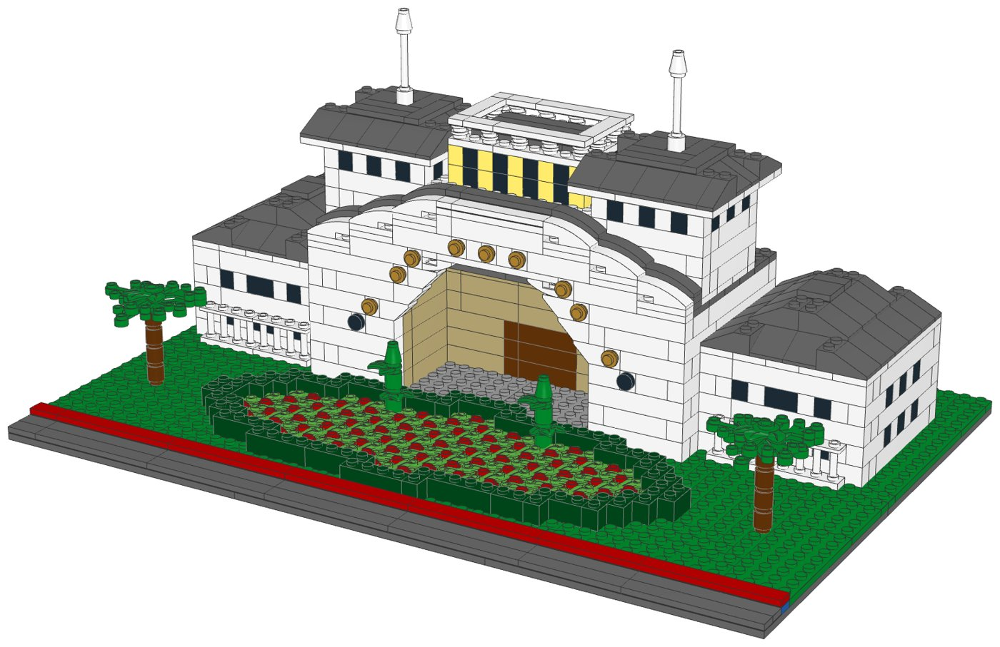
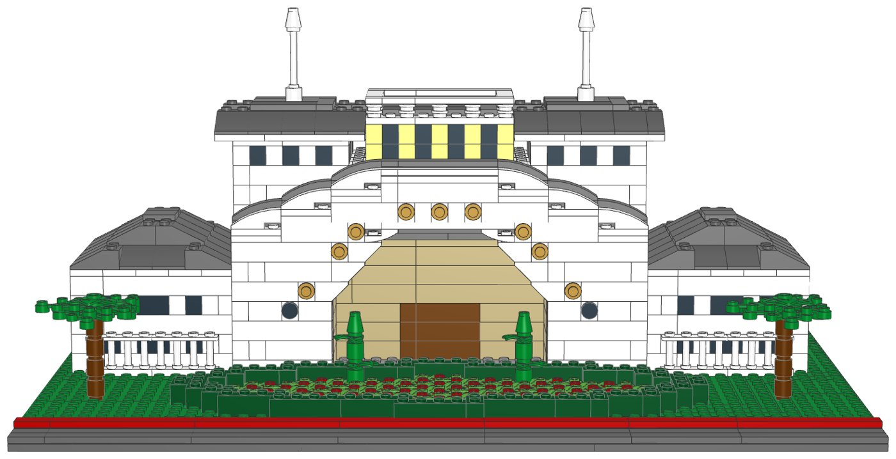
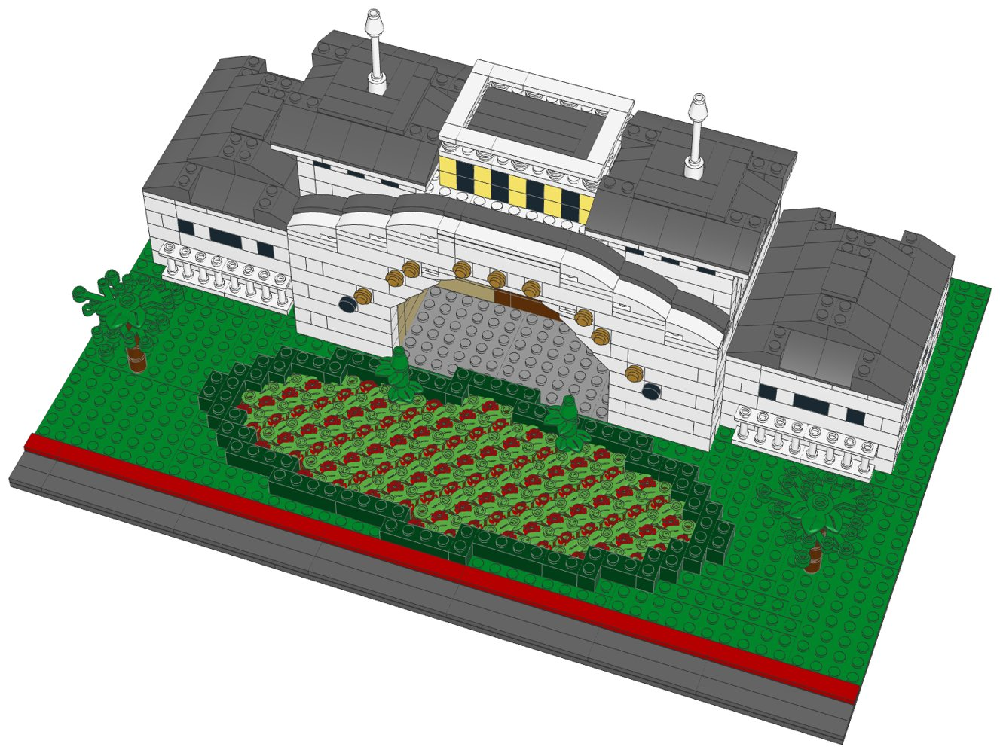

# BoardWalk Inn Entrance: LEGO® model with build instructions



A buildable LEGO model of the entrance to the BoardWalk Inn (Walt Disney World),
designed from a photo. It includes:
- the white gatehouse with its big round arch, gold lettering around it, round
  porthole windows and the curved roofline with a dark roof edge
- the passage through the arch to the lobby doors
- two towers with rows of windows, dark pyramid roofs and white spires
- the cream lookout on the roof, with its railing
- low side wings with dark hipped roofs and white fences
- the oval flower bed: a dark green hedge around red flowers, two topiaries, shade
  trees, the lawn and the red-and-blue painted curb

Every part is a real LEGO element in current production. The parts list is mapped
to LEGO Pick a Brick element IDs, and one file uploads the whole list.

| | |
|---|---|
| Pieces | **1,239** (101 kinds, 13 colours) |
| Footprint | 48 × 32 studs (38.4 × 25.6 cm) |
| Height | 18 cm to the tops of the spires |
| Scale | about 1:76 (1 stud = 2 ft), like the Family Home model |
| Instructions | 67-page PDF, 65 steps, 5 sections |
| Estimated cost | about US$169 at 2022–2025 Pick a Brick prices for the 1,227 pieces with a known price, roughly US$172 with the rest. LEGO raised about a third of Pick a Brick prices in 2026, so expect more. |



## What's in this folder

| Path | What it is |
|---|---|
| [`instructions/BoardWalk_Entrance_Instructions.pdf`](instructions/BoardWalk_Entrance_Instructions.pdf) | **The instruction booklet**: cover, section intros with parts lists, 65 numbered steps with parts callouts, gallery, full inventory with element IDs, ordering guide |
| [`parts/pick_a_brick_upload.csv`](parts/pick_a_brick_upload.csv) | **Upload this to Pick a Brick** (Upload list). It holds all 101 element IDs with their quantities |
| [`parts/pick_a_brick_upload_retry.csv`](parts/pick_a_brick_upload_retry.csv) | Newer element IDs for the same parts (31 lines, mostly white), for anything the first upload misses |
| [`parts/pick_a_brick_mapping.csv`](parts/pick_a_brick_mapping.csv) | Part-by-part mapping: Pick a Brick name, LEGO colour, design ID, evidence it's sold, last price seen, whether you need more than 10, the ID to try next, and a BrickLink backup |
| [`parts/pick_a_brick_list.csv`](parts/pick_a_brick_list.csv) | Full parts list with element IDs, alternates and production years |
| [`parts/bricklink_wanted_list.xml`](parts/bricklink_wanted_list.xml), [`parts/rebrickable_parts.csv`](parts/rebrickable_parts.csv) | BrickLink wanted list and Rebrickable import |
| [`parts/parts_by_section.csv`](parts/parts_by_section.csv) | Parts for each section, to pre-sort before you build |
| [`model/boardwalk_entrance.mpd`](model/boardwalk_entrance.mpd) | The digital model (LDraw, with steps and submodels). Opens in BrickLink Studio, LeoCAD and LDCad |
| [`data/elements.csv`](data/elements.csv) | How each LDraw part and colour maps to a LEGO element ID, BrickLink item, Rebrickable part and production data |
| [`design.py`](design.py) | The design, written as code on the stud grid (see "How it was made") |

## Ordering the parts from Pick a Brick

1. On lego.com, open **Pick and Build → Pick a Brick** and choose **Upload list**.
2. Upload [`parts/pick_a_brick_upload.csv`](parts/pick_a_brick_upload.csv).
3. If some lines aren't matched, upload
   [`parts/pick_a_brick_upload_retry.csv`](parts/pick_a_brick_upload_retry.csv).
   It has LEGO's newer IDs for the same parts; many white parts got new IDs in 2025.
4. For anything still missing, look it up in
   [`parts/pick_a_brick_mapping.csv`](parts/pick_a_brick_mapping.csv) and search by
   design ID and colour, or order it on BrickLink with `parts/bricklink_wanted_list.xml`.

| Evidence | Kinds of part |
|---|---|
| Listed on Pick a Brick in late 2025 | 32 |
| In Pick a Brick's Bestseller range in 2022, and still in LEGO sets in 2026 | 66 |
| Not on the Pick a Brick listings checked, but in current LEGO sets | 3 |

The three unlisted parts are:
- the nine gold round plates of the lettering;
- the two curved inverted slopes at the top of the arch;
- one grey 1×12 plate in the gatehouse floor.

Pick a Brick's Standard range caps many elements at 10 per order, so the model uses
no more than 9 of each of these. The model needs more than 10 of 30 parts, the most
being 124 white 1×1 bricks. All 30 were in the Bestseller range, which sells up to
999 per order.

**Shipping (US):** Bestseller parts ship from a US warehouse and follow LEGO's normal
3–5 business days. Standard parts ship from Denmark and can take up to 28 days. On
October 1, 2026, LEGO stops selling the Standard parts on its latest removal list in
the US and Canada. The three parts above are the ones to check; BrickLink sellers in
the US are the quick backup for them.

lego.com could not be reached from the environment this was made in. Availability
comes from an August 2026 Rebrickable snapshot and Pick a Brick listings from 2022
and late 2025. With internet access, `node ../lego-kit/pab_check.cjs .` checks every
element live (see [`../lego-kit/README.md`](../lego-kit/README.md)).

## Building notes

- **Sections**:
  1. The grounds: base, road, curb, lawn and the flower bed's soil
  2. The gatehouse
  3. The towers (build 2)
  4. The side wings (build 2)
  5. The flower bed: hedge, flowers, topiaries and trees
- **The arch**: 13 studs wide. Inverted slopes step inward one course at a time and
  a curved slope finishes each side, so the opening rises about as high as it is
  half wide, like a semicircle.
- **The lettering**: nine gold round plates clip onto bricks with a stud on one side
  and follow the curve of the arch, one for each letter of BOARDWALK. Printed letter
  tiles can go on the same studs if you have them.
- **Roofline**: the white front rises in three curved steps to a flat top, with a
  dark grey row behind it one plate higher, which reads as the roof edge.
- **Towers and lookout**: the towers sit on the gatehouse's roof deck. Each spire is
  a white 4L bar pushed into a round brick, with a white cone on top.
- **Hidden supports**: under the tower and wing roofs, a few dark grey 1×1 bricks hold
  up the ridge tiles. They have a step of their own.



## How it was made

The model is generated by [`design.py`](design.py) with the shared toolkit in
[`../lego-kit`](../lego-kit). The toolkit builds on the stud grid using the real
part shapes from the LDraw library, and checks that:
- no two elements overlap;
- every element is attached by at least one stud, including within the gatehouse,
  tower, wing, topiary and tree submodels, so each can be built and moved on its own.

The same kit renders the steps with LeoCAD, maps every part to LEGO element IDs,
writes the parts lists and prints the booklet. To rebuild after changing the design:

```bash
./build.sh            # set DATA_DIR to refresh element IDs (see ../lego-kit/README.md)
```

## Disclaimer

An unofficial fan design (MOC) inspired by the entrance of Disney's BoardWalk Inn.
It is not affiliated with, sponsored or endorsed by The LEGO Group or Disney. LEGO®
is a trademark of The LEGO Group.
