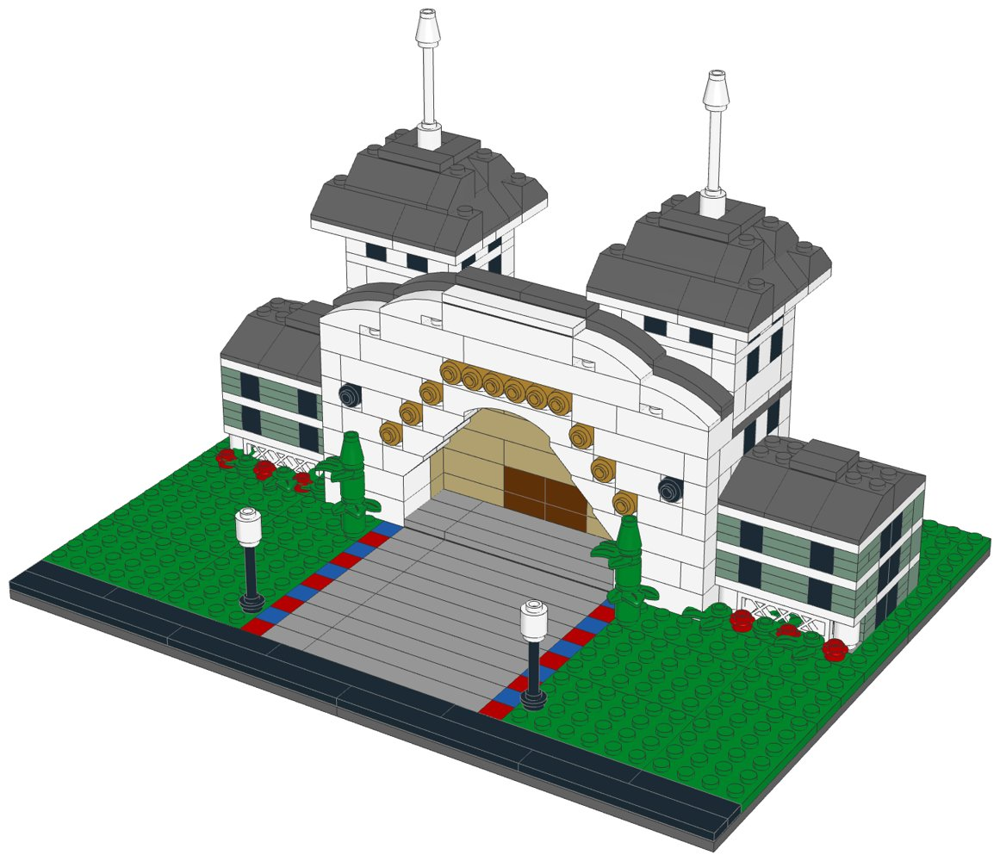
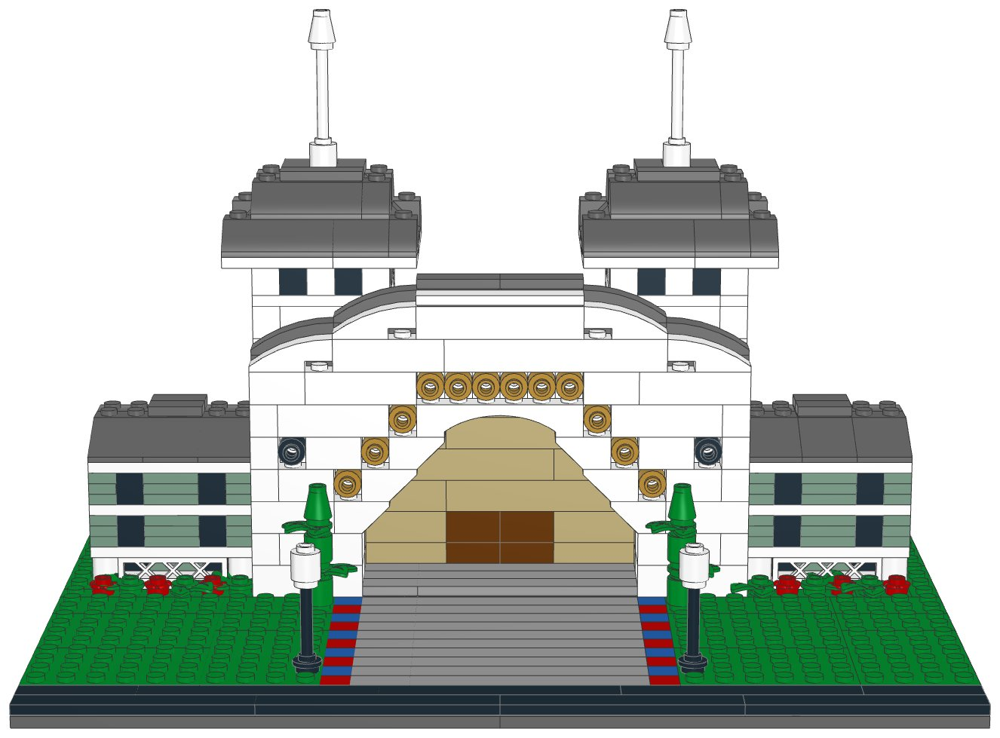
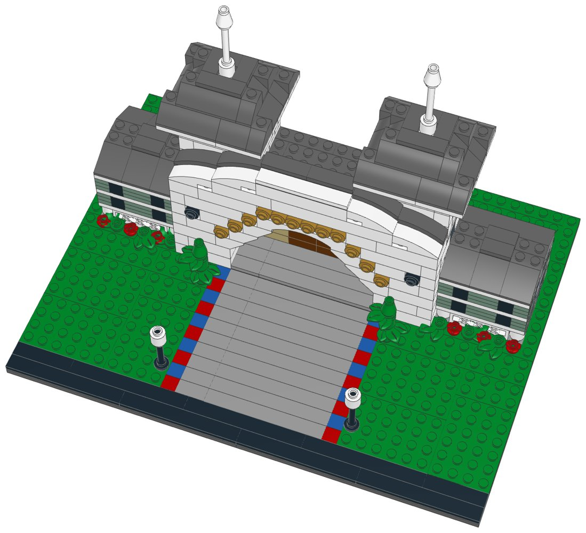

# BoardWalk Inn (mid-size): LEGO® display kit with build instructions



A mid-size display model of Disney's BoardWalk Inn at Walt Disney World, part of the [resort collection](../resort-collection/README.md). The arrival front of the BoardWalk Inn, as a smaller version of the large build: the white entrance with its big round arch, a ring of gold dots where the sign's letters run over it, two dark portholes and the roofline rising in curved steps to a flat top, with a dark roof edge behind it; two towers on the roof with dark pyramid roofs and white spires; and on either side the inn itself, with a porch of white columns and a railing below two storeys of sea-green clapboard, under low dark hipped roofs. The drive with its red-and-blue painted curb runs into the arch between lamp posts and topiaries, and red flowers line the porches.

This kit covers Disney's BoardWalk Villas as well: they share the property, and the mid-size model shows the part that makes it recognisable.

**Signature features in this kit**

- White entrance front with the big round arch, stepped in with inverted slopes, and the warm passage to the lobby doors
- A ring of gold dots around the arch where the sign's letters are, and two dark portholes
- The roofline rising in curved steps to a flat top, with a dark roof edge behind it
- Two towers on the roof with windows, dark pyramid roofs and white spires
- The inn on either side: sea-green clapboard of stacked plates with windows, a porch with white columns and a lattice railing, and a low dark hipped roof
- The drive with its red-and-blue painted curb, two lamp posts, two topiaries and red flower borders

**Left out**

- The cream lookout on the roof and the oval flower bed of the large build
- The rest of the inn's guest wings and the BoardWalk Villas buildings
- The boardwalk itself, the lake and the shops

| | |
|---|---|
| Pieces | **597** (74 part/colour lines, 44 kinds of part, 11 colours) |
| Display base | 32 × 24 studs (25.6 × 19.2 cm), the same for every mid-size kit in the collection |
| Overall size | 25.6 × 19.2 cm, 17.4 cm tall |
| Scale | about 1:250 (one storey = 4 plates, 1 stud ≈ 2 m), like the large resort models |
| Instructions | 63-page PDF, 65 steps, 6 sections |
| Parts cost | **$77.54 per kit** at the Pick a Brick prices last seen (2022 and late 2025); about $85.29 with 2026 price rises (see [Cost assumptions](#cost-assumptions-and-resale-scenarios)) |
| Compact version | [`../boardwalk-compact-lego`](../boardwalk-compact-lego) |
| Large version | [`../boardwalk-lego`](../boardwalk-lego) |



## What's in this folder

| Path | What it is |
|---|---|
| [`instructions/BoardWalk_Inn_Midsize_Instructions.pdf`](instructions/BoardWalk_Inn_Midsize_Instructions.pdf) | **The instruction booklet**: cover, section intros with parts lists, 65 numbered steps, gallery, parts inventory with element IDs, ordering guide |
| [`parts/pick_a_brick_upload.csv`](parts/pick_a_brick_upload.csv) | Pick a Brick upload file for **one kit** (74 element IDs) |
| [`parts/pick_a_brick_upload_x10.csv`](parts/pick_a_brick_upload_x10.csv), [`parts/pick_a_brick_upload_x25.csv`](parts/pick_a_brick_upload_x25.csv) | Upload files for **10 kits** (5,970 pieces) and **25 kits** (14,925 pieces) |
| [`parts/kit_cost.csv`](parts/kit_cost.csv) | Cost of one kit, line by line, with the price and when it was seen |
| [`parts/pick_a_brick_list.csv`](parts/pick_a_brick_list.csv) | Bill of materials: element ID, quantity, part, LEGO colour, design ID, BrickLink part and colour, alternate IDs |
| [`parts/pick_a_brick_mapping.csv`](parts/pick_a_brick_mapping.csv) | Part-by-part sourcing: Pick a Brick name, evidence it's sold, last price, the ID to try next, BrickLink backup |
| [`parts/pick_a_brick_upload_retry.csv`](parts/pick_a_brick_upload_retry.csv) | Newer element IDs for 25 of the parts, for lines the upload doesn't match |
| [`parts/bricklink_wanted_list.xml`](parts/bricklink_wanted_list.xml), [`parts/rebrickable_parts.csv`](parts/rebrickable_parts.csv) | BrickLink wanted list and Rebrickable import (one kit) |
| [`parts/parts_by_section.csv`](parts/parts_by_section.csv) | Parts for each section, for bagging |
| [`model/boardwalk_midsize.mpd`](model/boardwalk_midsize.mpd) | The digital model (LDraw, with steps and submodels). Opens in BrickLink Studio, LeoCAD and LDCad |
| [`checks.md`](checks.md) | Results of the digital build checks |
| [`design.py`](design.py) | The design, written as code on the stud grid |

## Ordering the parts

1. On lego.com, open **Pick and Build → Pick a Brick** and choose **Upload list**.
2. Upload the file for 1, 10 or 25 kits.
3. Before you pay, check that every line shows the normal (Bestseller) delivery time and compare the bag total with the cost below.
4. If a line isn't matched, use the ID in the retry file or in the "If not found" column of the mapping, multiplied by the number of kits.

**Kits per order:** Pick a Brick sells up to 999 of one element per order. The part this kit uses most is needed 54 times, so one order holds up to **18 kits**.

**Sourcing evidence** (every part must pass the Bestseller-only check in `export_parts.py`):

| Evidence | Lines |
|---|---|
| In Pick a Brick Bestseller range (2022 listing); still in LEGO sets in 2026 | 48 |
| On Pick a Brick (late-2025 listing) | 24 |
| In Pick a Brick Bestseller range (2022 listing); still in LEGO sets in 2026 (including sets listed for 2027) | 2 |

**Sourcing uncertainties:**

- 50 lines are backed only by LEGO's 2022 Bestseller list, so their range and price today are not confirmed.
- 25 lines have newer element IDs (retry file); an upload may match either.
- LEGO pauses Standard parts in the US and Canada from November 2, 2026; this kit uses none, but check that no line shows a longer delivery time.

## Cost assumptions and resale scenarios

These are planning numbers, not quotes. Upload the 10-kit file to see today's prices: the bag total is the real parts cost.

| Assumption | Value |
|---|---|
| Parts, as listed | Pick a Brick prices last seen in LEGO's 2022 Bestseller list and a late-2025 listing (offline data; lego.com could not be reached to check current prices) |
| Parts, 2026 estimate | +10% on the listed prices (stress case +20%); LEGO's September 14, 2026 repricing raised about a third of Pick a Brick elements by 16.7% on average, hitting tiles and small parts hardest |
| Packaging | $3.00 per kit: box, bags, a card with a link or QR code to the PDF booklet, tape and label (a printed colour booklet adds about $4.00) |
| Labour | $15.00/hour; 3 s per piece to count and bag from sorted stock, plus 6 min to pack |
| Etsy fees (US) | $0.20 listing + 6.5% transaction + 3% + $0.25 processing, on the price the buyer pays |
| Shipping | seller-paid (free shipping) $10.50 for a 1-2 lb box by USPS Ground Advantage; or the buyer pays postage |
| Prices | 1.6x / 2x / 2.5x the 2026 parts estimate, rounded up to $x9.99; market prices for custom kits were not researched for each resort |

| Per kit | Listed prices | 2026 estimate | Stress case |
|---|---|---|---|
| Parts | $77.54 | $85.29 | $93.05 |
| Packaging | $3.00 | $3.00 | $3.00 |
| Labour (597 pieces) | $8.96 | $8.96 | $8.96 |
| Before shipping | $89.50 | $97.26 | $105.01 |
| Seller-paid shipping | $10.50 | $10.50 | $10.50 |

Biggest cost lines: 2× Plate 16 x 16 (Dark Stone Grey) $6.08, 11× Plate 4 x 6 (Dark Green) $4.73, 13× Brick 1 x 8 (White) $3.77.

| Price | Free shipping (seller pays): profit | margin | Buyer pays postage: profit | margin |
|---|---|---|---|---|
| $139.99 (23¢/piece) | $18.48 | 13% | $27.99 | 20% |
| $179.99 (30¢/piece) | $54.68 | 30% | $64.19 | 36% |
| $219.99 (37¢/piece) | $90.88 | 41% | $100.39 | 46% |

Break-even price: $119.57 with free shipping, $109.07 when the buyer pays postage (2026 estimate). The stress case adds about $7.75 per kit.

## Digital checks and physical prototype

`lego-kit/checks.py` checked the digital model ([`checks.md`](checks.md)):

| Check | Result |
|---|---|
| Collisions | Pass |
| Connections | Pass |
| Assembly order | Pass |
| Stability | Pass |

The model was checked on the computer only: parts fit the stud grid without overlaps and every part is held by a stud. **No physical prototype has been built.** Before selling, build one kit from the uploaded parts and the printed booklet, to confirm the parts arrive as listed, the build holds together when handled, and each step is clear.

## Building notes

- **Sections:**
  1. The display base, the lawns and the drive
  2. The entrance
  3. The towers (build 2)
  4. The left wing
  5. The right wing
  6. The garden: lamp posts, topiaries and flowers
- The front wall is two studs thick, so the arch has a deep reveal. The arch steps in with inverted slopes, then the raised 1×6 arch closes it; the sloped side of each inverted slope faces the middle of the arch.
- Each gold dot is a gold round brick on the side stud of a white brick in the inner row; it fills the gap left in the outer row. The two dark portholes are made the same way with black round bricks.
- The wings' clapboard is three sand green plates per storey. Put the black window bricks in first, then lay the plates around them one layer at a time; their joints are staggered.
- The two wings are mirror images, each with its own pages: the clapboard side with the windows faces out, and the side that stands against the entrance stays open.
- Slide each lamp's white globe down over the top of the black bar, until the bar's end is level with the top of the globe.
- A “Build 2” badge means you build that module twice.



## How it was made

The model is generated by [`design.py`](design.py) with the shared toolkit in [`../lego-kit`](../lego-kit), in the collection's mid-size format (`lego-kit/compact.py`). `./build.sh` renders the steps with LeoCAD, maps every part to LEGO element IDs, writes the parts lists and upload files, runs the checks, prints the booklet and writes this README.

```bash
./build.sh            # set DATA_DIR to refresh element IDs (see ../lego-kit/README.md)
```

lego.com, BrickLink and Rebrickable could not be reached from the environment this was made in. Availability comes from an August 2026 Rebrickable snapshot and Pick a Brick listings from 2022 and late 2025. With internet access, `node ../lego-kit/pab_check.cjs .` checks every element live.

## Disclaimer

An unofficial fan design (MOC) inspired by Disney's BoardWalk Inn at Walt Disney World. It is not affiliated with, sponsored or endorsed by The LEGO Group or Disney. LEGO® is a trademark of The LEGO Group. Resort names are trademarks of Disney; see the trademark note in the [collection README](../resort-collection/README.md) before selling.
