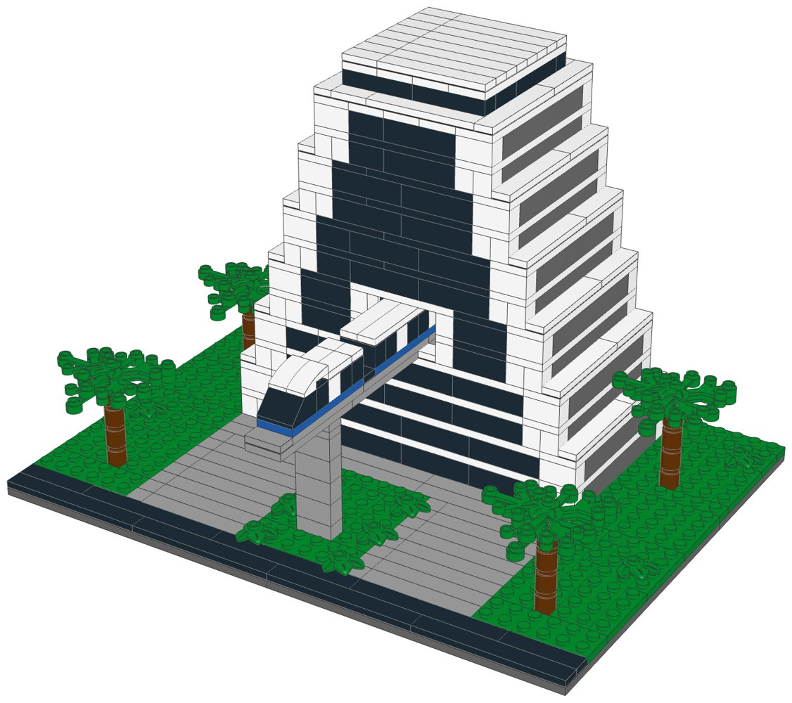
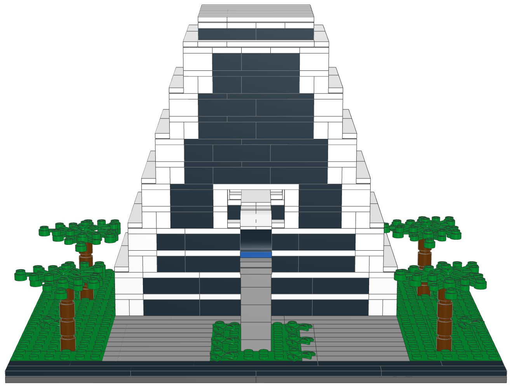
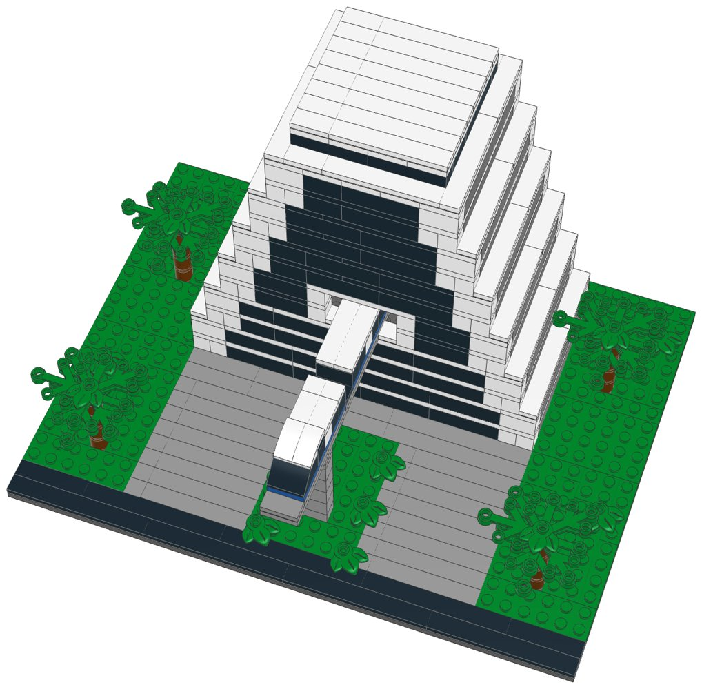

# Contemporary Resort (mid-size): LEGO® display kit with build instructions



A mid-size display model of Disney's Contemporary Resort at Walt Disney World, part of the [resort collection](../resort-collection/README.md). The front end and a longer length of the Contemporary's A-frame tower: twelve storeys whose long sides step up in rows of dark balconies, and an end wall where the tall dark glass of the Grand Canyon Concourse rises in a white sloping frame. The monorail beam runs the whole depth of the display, straight through the building and out of both ends, and a two-car white monorail train with a blue stripe comes out of the front. Four palms stand round a paved forecourt.

This kit covers Bay Lake Tower at Disney's Contemporary Resort as well: they share the property, and the mid-size model shows the part that makes it recognisable.

**Signature features in this kit**

- The A-frame tower: twelve storeys, a trapezoid from the front, its long sides stepped in twelve rows of dark balconies between white bands
- Both end walls: the tall glass wall of the Grand Canyon Concourse in a white sloping frame, over four lower floors
- A two-storey portal in each end wall, with the monorail beam running straight through the building and out of both ends, on two pylons
- A two-car white monorail train with a blue stripe coming out of the front
- The glass top floor on the roof
- A paved forecourt with a lawn and shrubs under the monorail, and four palms

**Left out**

- The rest of the A-frame's length
- The Garden Wing, Bay Lake Tower and the convention centre
- Bay Lake, the marina and the parking lots

| | |
|---|---|
| Pieces | **502** (51 part/colour lines, 30 kinds of part, 7 colours) |
| Display base | 32 × 24 studs (25.6 × 19.2 cm), the same for every mid-size kit in the collection |
| Overall size | 25.6 × 19.2 cm, 17.6 cm tall |
| Scale | about 1:250 (one storey = 4 plates, 1 stud ≈ 2 m), like the large resort models |
| Instructions | 37-page PDF, 48 steps, 3 sections |
| Parts cost | **$74.75 per kit** at the Pick a Brick prices last seen (2022 and late 2025); about $82.23 with 2026 price rises (see [Cost assumptions](#cost-assumptions-and-resale-scenarios)) |
| Compact version | [`../contemporary-compact-lego`](../contemporary-compact-lego) |



## What's in this folder

| Path | What it is |
|---|---|
| [`instructions/Contemporary_Resort_Midsize_Instructions.pdf`](instructions/Contemporary_Resort_Midsize_Instructions.pdf) | **The instruction booklet**: cover, section intros with parts lists, 48 numbered steps, gallery, parts inventory with element IDs, ordering guide |
| [`parts/pick_a_brick_upload.csv`](parts/pick_a_brick_upload.csv) | Pick a Brick upload file for **one kit** (51 element IDs) |
| [`parts/pick_a_brick_upload_x10.csv`](parts/pick_a_brick_upload_x10.csv), [`parts/pick_a_brick_upload_x25.csv`](parts/pick_a_brick_upload_x25.csv) | Upload files for **10 kits** (5,020 pieces) and **25 kits** (12,550 pieces) |
| [`parts/kit_cost.csv`](parts/kit_cost.csv) | Cost of one kit, line by line, with the price and when it was seen |
| [`parts/pick_a_brick_list.csv`](parts/pick_a_brick_list.csv) | Bill of materials: element ID, quantity, part, LEGO colour, design ID, BrickLink part and colour, alternate IDs |
| [`parts/pick_a_brick_mapping.csv`](parts/pick_a_brick_mapping.csv) | Part-by-part sourcing: Pick a Brick name, evidence it's sold, last price, the ID to try next, BrickLink backup |
| [`parts/pick_a_brick_upload_retry.csv`](parts/pick_a_brick_upload_retry.csv) | Newer element IDs for 14 of the parts, for lines the upload doesn't match |
| [`parts/bricklink_wanted_list.xml`](parts/bricklink_wanted_list.xml), [`parts/rebrickable_parts.csv`](parts/rebrickable_parts.csv) | BrickLink wanted list and Rebrickable import (one kit) |
| [`parts/parts_by_section.csv`](parts/parts_by_section.csv) | Parts for each section, for bagging |
| [`model/contemporary_midsize.mpd`](model/contemporary_midsize.mpd) | The digital model (LDraw, with steps and submodels). Opens in BrickLink Studio, LeoCAD and LDCad |
| [`checks.md`](checks.md) | Results of the digital build checks |
| [`design.py`](design.py) | The design, written as code on the stud grid |

## Ordering the parts

1. On lego.com, open **Pick and Build → Pick a Brick** and choose **Upload list**.
2. Upload the file for 1, 10 or 25 kits.
3. Before you pay, check that every line shows the normal (Bestseller) delivery time and compare the bag total with the cost below.
4. If a line isn't matched, use the ID in the retry file or in the "If not found" column of the mapping, multiplied by the number of kits.

**Kits per order:** Pick a Brick sells up to 999 of one element per order. The part this kit uses most is needed 56 times, so one order holds up to **17 kits**.

**Sourcing evidence** (every part must pass the Bestseller-only check in `export_parts.py`):

| Evidence | Lines |
|---|---|
| In Pick a Brick Bestseller range (2022 listing); still in LEGO sets in 2026 | 32 |
| On Pick a Brick (late-2025 listing) | 19 |

**Sourcing uncertainties:**

- 32 lines are backed only by LEGO's 2022 Bestseller list, so their range and price today are not confirmed.
- 14 lines have newer element IDs (retry file); an upload may match either.
- LEGO pauses Standard parts in the US and Canada from November 2, 2026; this kit uses none, but check that no line shows a longer delivery time.

## Cost assumptions and resale scenarios

These are planning numbers, not quotes. Upload the 10-kit file to see today's prices: the bag total is the real parts cost.

| Assumption | Value |
|---|---|
| Parts, as listed | Pick a Brick prices last seen in LEGO's 2022 Bestseller list and a late-2025 listing (offline data; lego.com could not be reached to check current prices) |
| Parts, 2026 estimate | +10% on the listed prices (stress case +20%); LEGO's September 14, 2026 repricing raised about a third of Pick a Brick elements by 16.7% on average, hitting tiles and small parts hardest |
| Packaging | $3.00 per kit: box, bags, a card with a link or QR code to the PDF booklet, tape and label (a printed colour booklet adds about $4.00) |
| Labour | $15.00/hour; 3 s per piece to count and bag from sorted stock, plus 6 min to pack |
| Etsy fees (US) | $0.20 listing + 6.5% transaction + 3% + $0.25 processing, on the price the buyer pays |
| Shipping | seller-paid (free shipping) $10.50 for a 1-2 lb box by USPS Ground Advantage; or the buyer pays postage |
| Prices | 1.6x / 2x / 2.5x the 2026 parts estimate, rounded up to $x9.99; market prices for custom kits were not researched for each resort |

| Per kit | Listed prices | 2026 estimate | Stress case |
|---|---|---|---|
| Parts | $74.75 | $82.23 | $89.70 |
| Packaging | $3.00 | $3.00 | $3.00 |
| Labour (502 pieces) | $7.77 | $7.77 | $7.77 |
| Before shipping | $85.53 | $93.00 | $100.48 |
| Seller-paid shipping | $10.50 | $10.50 | $10.50 |

Biggest cost lines: 54× Brick 1 x 4 (Black) $8.64, 24× Brick 1 x 8 (Dark Stone Grey) $6.96, 27× Plate 2 x 10 (White) $6.75.

| Price | Free shipping (seller pays): profit | margin | Buyer pays postage: profit | margin |
|---|---|---|---|---|
| $139.99 (28¢/piece) | $22.74 | 16% | $32.24 | 23% |
| $169.99 (34¢/piece) | $49.89 | 29% | $59.39 | 35% |
| $209.99 (42¢/piece) | $86.09 | 41% | $95.59 | 46% |

Break-even price: $114.86 with free shipping, $104.36 when the buyer pays postage (2026 estimate). The stress case adds about $7.47 per kit.

## Digital checks and physical prototype

`lego-kit/checks.py` checked the digital model ([`checks.md`](checks.md)):

| Check | Result |
|---|---|
| Collisions | Pass |
| Connections | Pass |
| Assembly order | Pass |
| Stability | Pass |

The model was checked on the computer only: parts fit the stud grid without overlaps and every part is held by a stud. **No physical prototype has been built.** Before selling, build one kit from the uploaded parts and the printed booklet, to confirm the parts arrive as listed, the build holds together when handled, and each step is clear.

## Building notes

- **Sections:**
  1. The display base and the forecourt
  2. The A-frame tower
  3. The monorail, the train and the palms (build 4)
- Each storey is one course of bricks, then a band of plates. The end walls are white at the edges and black (the glass) in between; the long sides are dark grey (the balconies). Keep the three colours in separate trays.
- Every second storey is a stud narrower on both long sides. The white tiles on each step are the balcony fronts.
- The monorail beam is built into the tower before the fifth storey, so the train can run straight through it. Above it, the bands across the glass are black.
- A “Build 4” badge means you build that module four times.



## How it was made

The model is generated by [`design.py`](design.py) with the shared toolkit in [`../lego-kit`](../lego-kit), in the collection's mid-size format (`lego-kit/compact.py`). `./build.sh` renders the steps with LeoCAD, maps every part to LEGO element IDs, writes the parts lists and upload files, runs the checks, prints the booklet and writes this README.

```bash
./build.sh            # set DATA_DIR to refresh element IDs (see ../lego-kit/README.md)
```

lego.com, BrickLink and Rebrickable could not be reached from the environment this was made in. Availability comes from an August 2026 Rebrickable snapshot and Pick a Brick listings from 2022 and late 2025. With internet access, `node ../lego-kit/pab_check.cjs .` checks every element live.

## Disclaimer

An unofficial fan design (MOC) inspired by Disney's Contemporary Resort at Walt Disney World. It is not affiliated with, sponsored or endorsed by The LEGO Group or Disney. LEGO® is a trademark of The LEGO Group. Resort names are trademarks of Disney; see the trademark note in the [collection README](../resort-collection/README.md) before selling.
