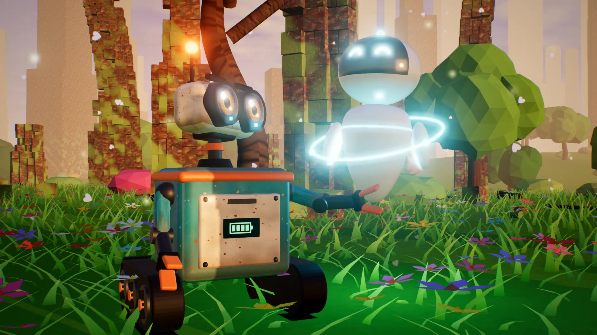

# Bolt & Luma

*An animated short film made entirely with code.*

**▶ Watch: [`bolt-and-luma.mp4`](bolt-and-luma.mp4)** (2:39, 1080p, with sound) · smaller 720p copy: [`bolt-and-luma-720p.mp4`](bolt-and-luma-720p.mp4)



On a quiet, dusty world full of junk, a little trash-compacting robot named **Bolt** works
alone every day. One morning he finds something he has never seen before: a tiny green
sprout. Then a glowing explorer robot named **Luma** zooms down from the sky, and a small
act of care grows into something much bigger.

- Runtime: about 2 min 39 s, 1920×1080, 24 fps
- Picture: real-time 3D (three.js / WebGL) rendered frame by frame in headless Chromium
- Voices: Kokoro neural text-to-speech, with robot voices shaped by a WORLD vocoder
- Music and sound effects: synthesized from scratch in Python (no samples)

No images, 3D models, audio samples or stock assets are used. Every texture, character,
landscape, note and sound effect is generated by the code in this folder.

## How it's made

| Part | Where | What it does |
|---|---|---|
| Story and timing | `src/story/timeline.js`, `src/story/shots.js` | 26 shots. Each one sets the camera, lighting mood and every character pose as a pure function of time, so any frame can be rendered on its own |
| Characters | `src/characters/bolt.js`, `luma.js`, `props.js` | Bolt (treads, compactor hatch, telescoping neck, shader-drawn eyes with eyelids, antenna), Luma (pearl body, canvas-drawn glowing eyes, halo ring, scanning beam), the sprout, the tin can and the watering can |
| World | `src/world/*.js` | Procedural sky (sun, moon, clouds, stars, milky way), dunes, junk towers, the meadow that blooms out of the dust, trees, butterflies, particles |
| Look | `src/main.js`, `src/post.js` | ACES tone mapping, soft shadows, bloom, FXAA, vignette, film grain, fades and the iris-out |
| Voices | `src/story/script.json`, `audio/voices.py` | 30 lines of dialogue and narration |
| Score | `audio/music.py`, `audio/synth.py` | An original waltz theme on music box, felt piano, celesta, strings, choir, harp, pizzicato and timpani |
| Sound effects | `src/story/cues.js`, `audio/sfx.py` | Motors, servos, chirps, the bonk, a slide whistle, a rubber-duck squeak, magic shimmer, birds, crickets and wind |
| Mix | `audio/mix.py` | Places everything on the timeline, adds reverb and ducks the music under dialogue |
| Render | `render.mjs`, `build.sh` | Drives the page in headless Chromium, captures frames, encodes with ffmpeg and adds the soundtrack |

## Build it yourself

You need Node 18+, Python 3.10+ and Chromium for Playwright. No GPU is required.

```bash
./setup.sh                                   # npm + pip installs, downloads the TTS model
export KOKORO_DIR=~/.cache/bolt-and-luma
./build.sh preview                           # quick 640x360 preview
./build.sh                                   # full 1080p film -> out/bolt-and-luma.mp4
```

Handy commands while you work:

```bash
node render.mjs stills --times 21.9,35.9,129.5 --w 960   # render single frames to out/stills/
python3 audio/asr_check.py                                 # check each voice line with speech recognition
python3 audio/qa_mix.py                                    # check dialogue is still clear in the final mix
```
