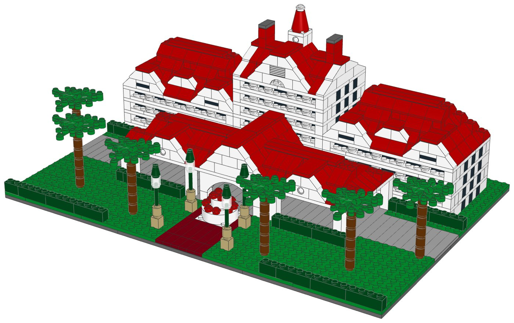
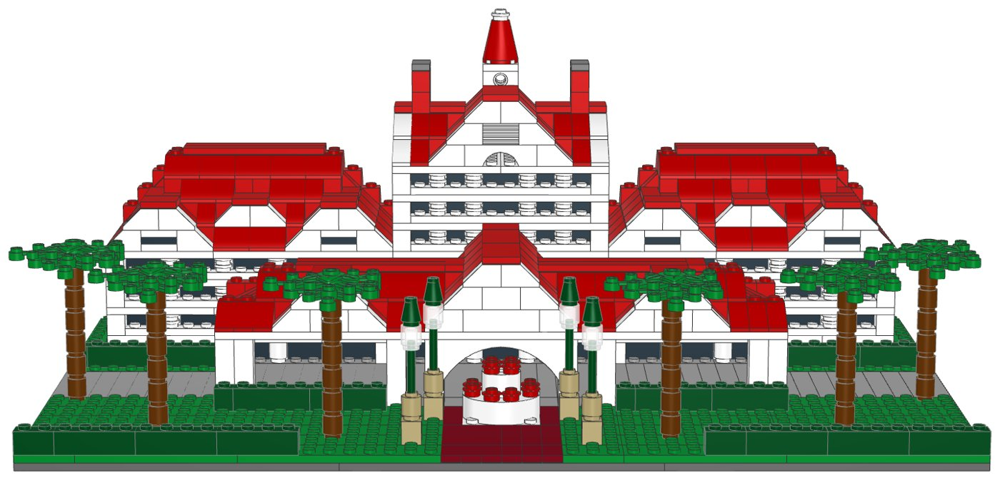
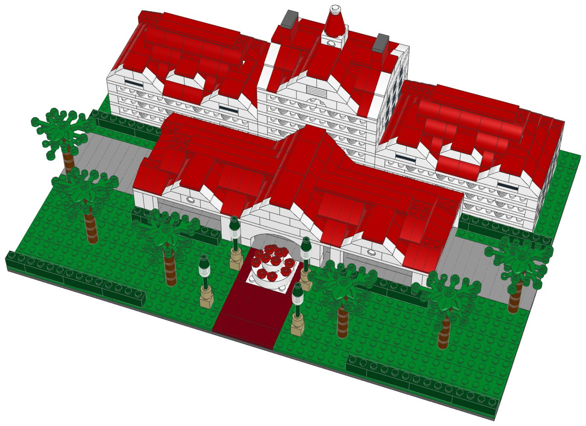

# Grand Floridian Resort: micro-scale LEGO® model with build instructions



A buildable LEGO model of the main building of the Grand Floridian Resort (Walt
Disney World), designed from a photo. It includes:
- the seven-storey central block with its white verandas, steep front gable, twin
  chimneys and the cupola with its red spire
- two guest wings under hipped red roofs, each with a front gable at both ends and
  a dormer between them
- the porte-cochère with its arched entrance and three gables
- the entrance garden: a red brick walk, the fountain, green lamp posts, palms and
  hedges

Every part is a real LEGO element in current production. The parts list is mapped
to LEGO Pick a Brick element IDs, and one file uploads the whole list.

| | |
|---|---|
| Pieces | **1,498** (70 kinds, 11 colours) |
| Footprint | 48 × 32 studs (38.4 × 25.6 cm) |
| Height | 16 cm to the top of the spire |
| Scale | about 1:250 (1 stud ≈ 2 m, one storey = 4 plates) |
| Instructions | 64-page PDF, 81 steps, 5 sections |
| Estimated cost | about US$186 at 2022–2025 Pick a Brick prices for the 1,486 pieces with a known price, roughly US$190 with the rest. LEGO raised about a third of Pick a Brick prices in 2026, so expect more. |



## What's in this folder

| Path | What it is |
|---|---|
| [`instructions/Grand_Floridian_Instructions.pdf`](instructions/Grand_Floridian_Instructions.pdf) | **The instruction booklet**: cover, section intros with parts lists, 81 numbered steps with parts callouts, gallery, full inventory with element IDs, ordering guide |
| [`parts/pick_a_brick_upload.csv`](parts/pick_a_brick_upload.csv) | **Upload this to Pick a Brick** (Upload list). It holds all 70 element IDs with their quantities |
| [`parts/pick_a_brick_upload_retry.csv`](parts/pick_a_brick_upload_retry.csv) | Newer element IDs for the same parts (27 lines, mostly white), for anything the first upload misses |
| [`parts/pick_a_brick_mapping.csv`](parts/pick_a_brick_mapping.csv) | Part-by-part mapping: Pick a Brick name, LEGO colour, design ID, evidence it's sold, last price seen, whether you need more than 10, the ID to try next, and a BrickLink backup |
| [`parts/pick_a_brick_list.csv`](parts/pick_a_brick_list.csv) | Full parts list with element IDs, alternates and production years |
| [`parts/bricklink_wanted_list.xml`](parts/bricklink_wanted_list.xml), [`parts/rebrickable_parts.csv`](parts/rebrickable_parts.csv) | BrickLink wanted list and Rebrickable import |
| [`parts/parts_by_section.csv`](parts/parts_by_section.csv) | Parts for each section, to pre-sort before you build |
| [`model/grand_floridian.mpd`](model/grand_floridian.mpd) | The digital model (LDraw, with steps and submodels). Opens in BrickLink Studio, LeoCAD and LDCad |
| [`data/elements.csv`](data/elements.csv) | How each LDraw part and colour maps to a LEGO element ID, BrickLink item, Rebrickable part and production data |
| [`design.py`](design.py) | The design, written as code on the stud grid (see "How it was made") |

## Ordering the parts from Pick a Brick

1. On lego.com, open **Pick and Build → Pick a Brick** and choose **Upload list**.
2. Upload [`parts/pick_a_brick_upload.csv`](parts/pick_a_brick_upload.csv).
3. If some lines aren't matched, upload
   [`parts/pick_a_brick_upload_retry.csv`](parts/pick_a_brick_upload_retry.csv).
   It has LEGO's newer IDs for the same parts; many white parts got new IDs in 2025.
4. For anything still missing, look it up in
   [`parts/pick_a_brick_mapping.csv`](parts/pick_a_brick_mapping.csv) and search by
   design ID and colour, or order it on BrickLink with `parts/bricklink_wanted_list.xml`.

| Evidence | Kinds of part |
|---|---|
| Listed on Pick a Brick in late 2025 | 16 |
| In Pick a Brick's Bestseller range in 2022, and still in LEGO sets in 2026 | 48 |
| Not on the Pick a Brick listings checked, but in 2026 LEGO sets | 6 |

The six unlisted parts are:
- the 1×8 raised arch over the entrance;
- the fountain's 4×4 and 2×2 round bricks;
- the red cone of the spire;
- the lamp posts' dark green 3L bars and 1×1 cones.

Pick a Brick's Standard range caps many elements at 10 per order, so the model
uses no more than 4 of each of these. The model needs more than 10 of 25 parts,
the most being 240 white 1×1 bricks. All 25 were in the Bestseller range, which
sells up to 999 per order.

lego.com could not be reached from the environment this was made in. Availability
comes from an August 2026 Rebrickable snapshot and Pick a Brick listings from 2022
and late 2025. With internet access, `node ../lego-kit/pab_check.cjs .` checks every
element live (see [`../lego-kit/README.md`](../lego-kit/README.md)).

## Building notes

- **Sections**:
  1. The grounds: base, drive, brick walk and lawns
  2. The central block
  3. The guest wings (build 2)
  4. The porte-cochère
  5. Gardens, palms and lamp posts
- **Modules**: the central block and the two identical guest wings are built on their
  own and set on the base. The porte-cochère is built in place in front of them.
- **Verandas**: each storey is a wall of black and white bricks set one stud back,
  a white railing with slim round columns in front of it, and a white floor band
  that ties the two together.
- **Roofs**: the wings have hipped roofs with front gables and a dormer set up on the
  slope. The central block has a gabled roof crossed by a steep front gable, with the
  cupola on its ridge. The porte-cochère roof is hipped, with three gables. The white
  slopes along the gable edges are the trim.
- **Hidden supports**: where a gable meets a roof, some red 1×1 bricks go under the
  slopes. They have a step of their own just before the slopes that rest on them.
- **Lamp posts**: a 3L bar pushed into a round brick, with a clear round brick as the
  lantern.



## How it was made

The model is generated by [`design.py`](design.py) with the shared toolkit in
[`../lego-kit`](../lego-kit). The toolkit builds on the stud grid using the real
part shapes from the LDraw library, and checks that:
- no two elements overlap;
- every element is attached by at least one stud, including within the central
  block, wing, palm and lamp submodels, so each can be built and moved on its own.

The same kit renders the steps with LeoCAD, maps every part to LEGO element IDs,
writes the parts lists and prints the booklet. To rebuild after changing the design:

```bash
./build.sh            # set DATA_DIR to refresh element IDs (see ../lego-kit/README.md)
```

## Disclaimer

An unofficial fan design (MOC) inspired by Disney's Grand Floridian Resort & Spa.
It is not affiliated with, sponsored or endorsed by The LEGO Group or Disney. LEGO®
is a trademark of The LEGO Group.
