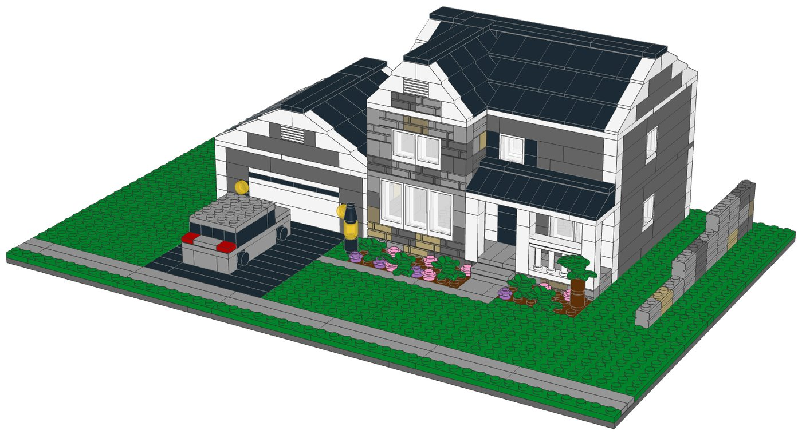
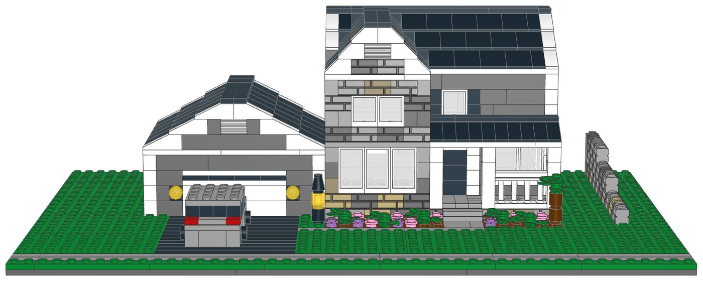
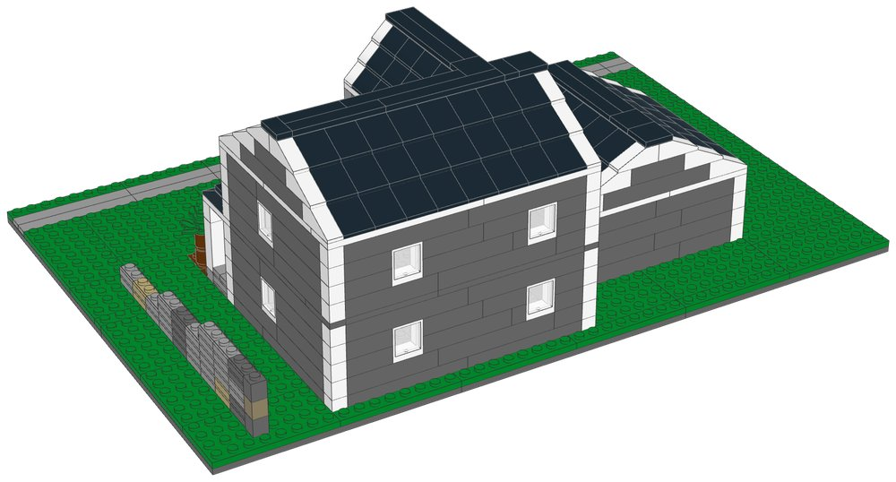

# Family Home: LEGO® model with build instructions



A buildable LEGO model of a two-storey family home, designed from a photo. It
includes:
- the two-car garage with its white carriage door, coach lamps and a
  white-trimmed front gable with a louvred vent
- the two-storey stacked-stone front with a steep gable
- the covered porch with white columns, a spindled railing and a black metal roof
- charcoal siding under a black shingle roof
- the driveway with the car, the sidewalk, flower beds, a lamp post, a young
  tree and the stepped retaining wall

Every part is a real LEGO element in current production. The parts list is mapped
to LEGO Pick a Brick element IDs, and one file uploads the whole list.

| | |
|---|---|
| Pieces | **699** (96 kinds, 13 colours) |
| Footprint | 48 × 32 studs (38.4 × 25.6 cm) |
| Height | 13 cm to the roof ridge |
| Scale | about 1:76 (1 stud = 2 ft, one storey = 4 bricks) |
| Instructions | 54-page PDF, 45 steps, 5 sections |
| Estimated cost | about US$115 at 2022–2025 Pick a Brick prices for the 668 pieces with a known price, roughly US$125 with the windows. LEGO raised about a third of Pick a Brick prices in 2026, so expect more. |



## What's in this folder

| Path | What it is |
|---|---|
| [`instructions/Family_Home_Instructions.pdf`](instructions/Family_Home_Instructions.pdf) | **The instruction booklet**: cover, section intros with parts lists, 45 numbered steps with parts callouts, gallery, full inventory with element IDs, ordering guide |
| [`parts/pick_a_brick_upload.csv`](parts/pick_a_brick_upload.csv) | **Upload this to Pick a Brick** (Upload list). It holds all 96 element IDs with their quantities |
| [`parts/pick_a_brick_upload_retry.csv`](parts/pick_a_brick_upload_retry.csv) | Newer element IDs for the same parts (15 lines, mostly white), for anything the first upload misses |
| [`parts/pick_a_brick_mapping.csv`](parts/pick_a_brick_mapping.csv) | Part-by-part mapping: Pick a Brick name, LEGO colour, design ID, evidence it's sold, last price seen, whether you need more than 10, the ID to try next, and a BrickLink backup |
| [`parts/pick_a_brick_list.csv`](parts/pick_a_brick_list.csv) | Full parts list with element IDs, alternates and production years |
| [`parts/bricklink_wanted_list.xml`](parts/bricklink_wanted_list.xml), [`parts/rebrickable_parts.csv`](parts/rebrickable_parts.csv) | BrickLink wanted list and Rebrickable import |
| [`parts/parts_by_section.csv`](parts/parts_by_section.csv) | Parts for each section, to pre-sort before you build |
| [`model/family_home.mpd`](model/family_home.mpd) | The digital model (LDraw, with steps and submodels). Opens in BrickLink Studio, LeoCAD and LDCad |
| [`design.py`](design.py) | The design, written as code on the stud grid (see "How it was made") |

## Ordering the parts from Pick a Brick

1. On lego.com, open **Pick and Build → Pick a Brick** and choose **Upload list**.
2. Upload [`parts/pick_a_brick_upload.csv`](parts/pick_a_brick_upload.csv).
3. If some lines aren't matched, upload
   [`parts/pick_a_brick_upload_retry.csv`](parts/pick_a_brick_upload_retry.csv).
   It has LEGO's newer IDs for the same parts; many white parts got new IDs in 2025.
4. For anything still missing, look it up in
   [`parts/pick_a_brick_mapping.csv`](parts/pick_a_brick_mapping.csv) and search by
   design ID and colour, or order it on BrickLink with `parts/bricklink_wanted_list.xml`.

| Evidence | Kinds of part |
|---|---|
| Listed on Pick a Brick in late 2025 | 27 |
| In Pick a Brick's Bestseller range in 2022, and still in LEGO sets in 2026 | 63 |
| Not on the Pick a Brick listings checked, but in 2026 LEGO sets | 6 |

The six unlisted parts are:
- the two window frames and their glass;
- the black headlight bricks used for the garage lamps;
- the yellow round brick used for the lamp-post lantern.

Pick a Brick's Standard range caps many elements at 10 per order, so the model
uses no more than 10 of each of these. The model needs more than 10 of 21 parts,
the most being 68 black 33° roof slopes. All 21 were in the Bestseller range,
which sells up to 999 per order.

lego.com could not be reached from the environment this was made in. Availability
comes from an August 2026 Rebrickable snapshot and Pick a Brick listings from 2022
and late 2025. With internet access, `node ../lego-kit/pab_check.cjs .` checks every
element live (see [`../lego-kit/README.md`](../lego-kit/README.md)).

## Building notes

- **Sections**:
  1. The lot
  2. The garage
  3. The house
  4. The garden
  5. The car (inside the garden section)
- **Modules**: the garage, house and car are built on their own and then set on
  the lot.
- **Walls**: each storey is four brick courses. The corners swap between the two
  walls on every course, and joints are staggered, so the walls lock together.
- **Stone front**: masonry-profile 1×2 bricks in four colours, mixed like stacked
  stone.
- **Roof**: the side-gable main roof (33° slopes) is crossed by the steep stone
  gable (45° slopes). They meet in a stepped valley. The white slopes along the
  gable edges form the rake trim.
- **Interior**: the house is hollow. A floor ring between the storeys and a full
  plate deck under the roof tie it together.



## How it was made

The model is generated by [`design.py`](design.py) with the shared toolkit in
[`../lego-kit`](../lego-kit). The toolkit builds on the stud grid using the real
part shapes from the LDraw library, and checks that:
- no two elements overlap;
- every element is attached by at least one stud, including within the garage,
  house and car submodels, so each can be built and moved on its own.

The same kit renders the steps with LeoCAD, maps every part to LEGO element IDs,
writes the parts lists and prints the booklet. To rebuild after changing the design:

```bash
./build.sh            # set DATA_DIR to refresh element IDs (see ../lego-kit/README.md)
```

## Disclaimer

A custom model (MOC) made from a photo. LEGO® is a trademark of The LEGO Group,
which does not sponsor or endorse this model. The house number and the car's
licence plate from the photo are deliberately not reproduced.
