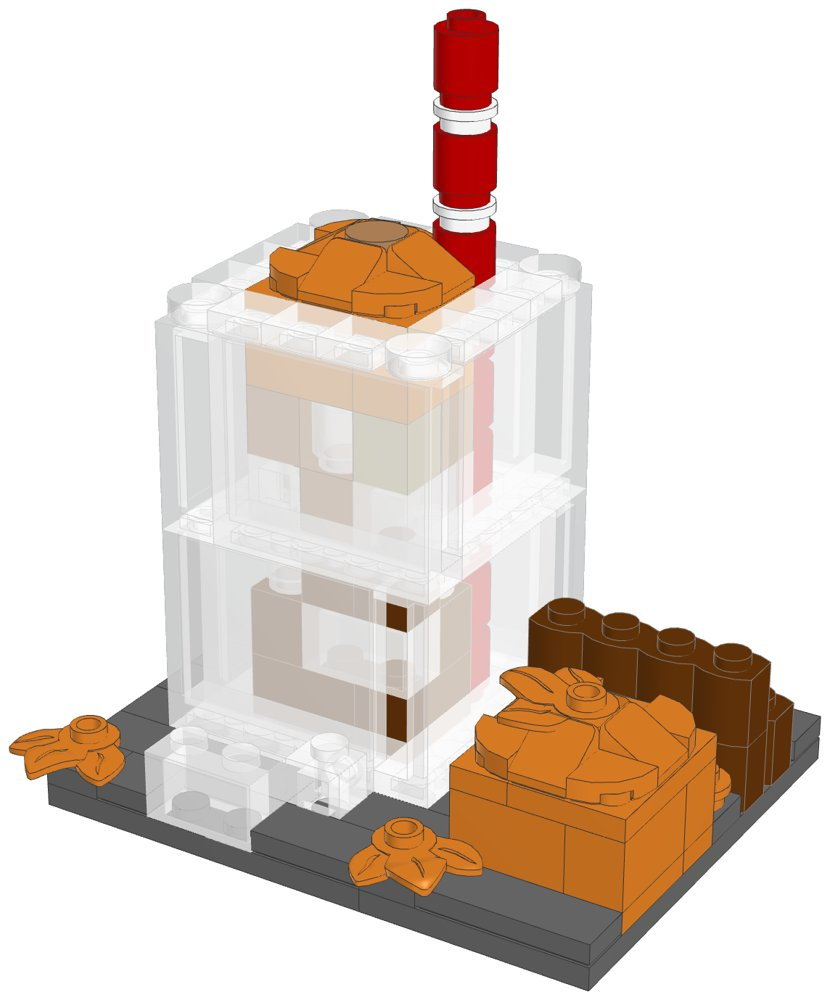
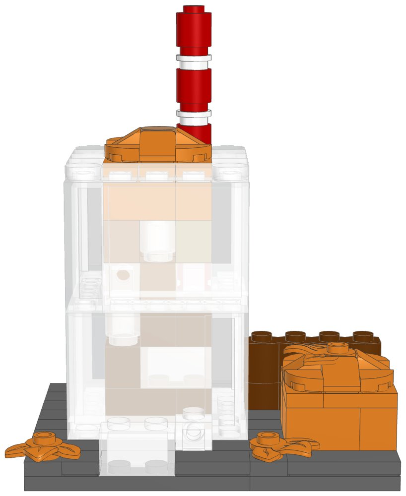
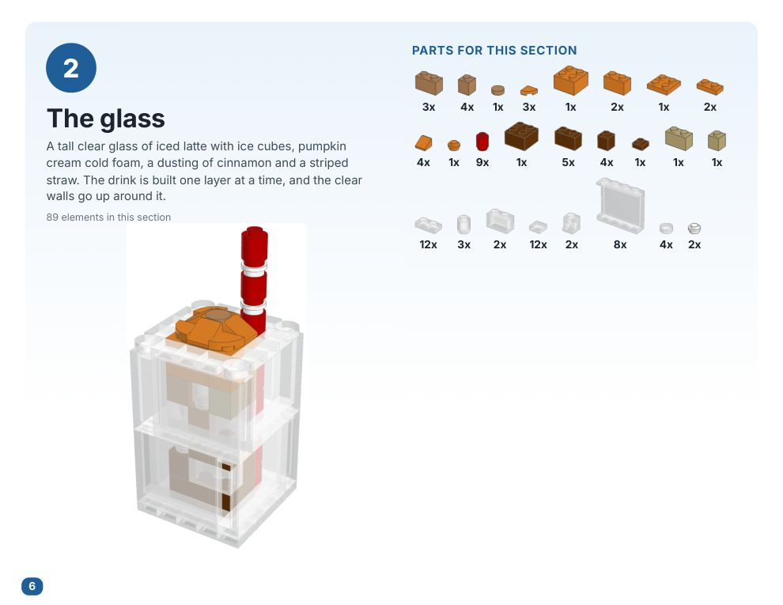
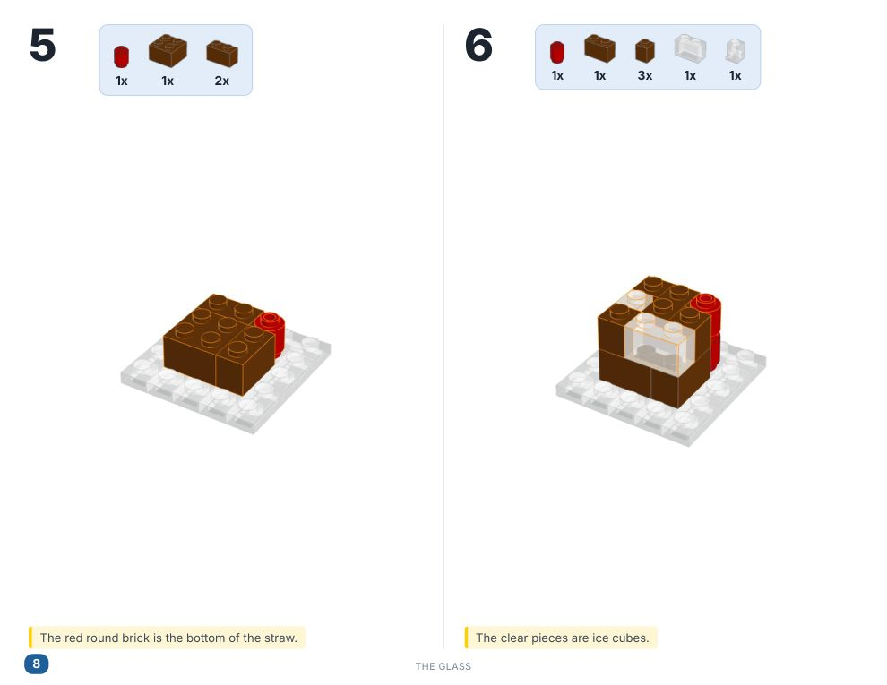
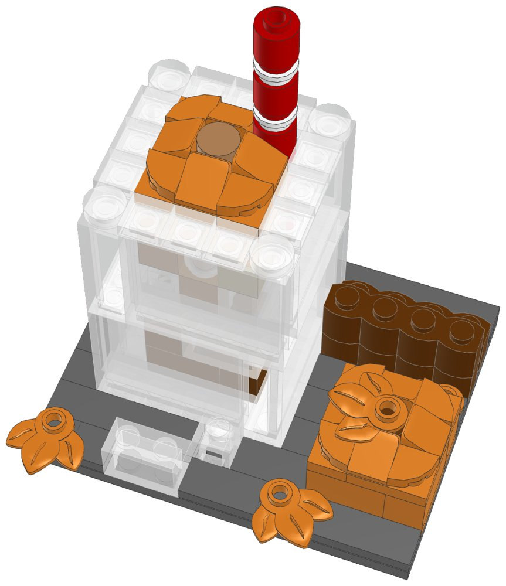

# Iced Pumpkin Spice Latte: a small LEGO® kit to build and sell



A tall clear glass of iced latte on a slate board, designed to be cheap to make and
quick to order. It's the cold partner to the hot latte in
[`../pumpkin-spice-latte-lego`](../pumpkin-spice-latte-lego). It includes:
- a clear glass with a clear base and a clear rim, built from two rings of panels
- dark coffee at the bottom fading to milky latte at the top, with seven clear ice
  cubes set in the drink
- a thick orange layer of pumpkin cream cold foam with a mound on top and a dusting
  of cinnamon
- a red straw with white stripes that runs down inside the glass
- a little pumpkin, a bundle of cinnamon sticks, three autumn leaves and two ice cubes
  on the board

Every element was in Pick a Brick's **Bestseller** range and is still in 2026 LEGO
sets, so an order should ship from LEGO's US warehouse in about a week. It uses no
Standard-range parts, which ship more slowly. `export_parts.py` checks this and stops
if a part isn't a Bestseller.

| | |
|---|---|
| Pieces | **137** (39 kinds, 8 colours) |
| Size | 10 × 8 studs (8 × 6.4 cm), 10 cm tall to the top of the straw. The glass is 5 × 5 studs (4 cm) and 6.4 cm tall |
| Build time | about 30 to 45 minutes |
| Instructions | 27-page PDF, 28 steps, 4 sections |
| Parts cost | **US$14.22 per kit** at the Pick a Brick prices last seen (2022 and late 2025). Some prices went up in 2026, so check the total in your bag. |



## What's in this folder

| Path | What it is |
|---|---|
| [`instructions/Iced_Pumpkin_Spice_Latte_Instructions.pdf`](instructions/Iced_Pumpkin_Spice_Latte_Instructions.pdf) | **The instruction booklet** to include with each kit: cover, section intros with parts lists, 28 numbered steps, gallery, parts inventory, ordering guide |
| [`parts/pick_a_brick_upload.csv`](parts/pick_a_brick_upload.csv) | Pick a Brick upload file for **one kit** (39 element IDs) |
| [`parts/pick_a_brick_upload_x10.csv`](parts/pick_a_brick_upload_x10.csv) | Upload file for **10 kits** (1,370 pieces) |
| [`parts/pick_a_brick_upload_x25.csv`](parts/pick_a_brick_upload_x25.csv) | Upload file for **25 kits** (3,425 pieces) |
| [`parts/kit_cost.csv`](parts/kit_cost.csv) | Cost of one kit, line by line, with the price and when it was seen |
| [`parts/parts_by_section.csv`](parts/parts_by_section.csv) | Parts for the glass, the pumpkin and everything else: use it to bag each kit in 3 bags |
| [`parts/pick_a_brick_upload_retry.csv`](parts/pick_a_brick_upload_retry.csv) | Newer element IDs for 12 of the parts (all 7 clear parts among them), for anything the upload doesn't match |
| [`parts/pick_a_brick_mapping.csv`](parts/pick_a_brick_mapping.csv) | Part-by-part mapping: Pick a Brick name, LEGO colour, design ID, evidence, last price, the ID to try next, BrickLink backup |
| [`parts/bricklink_wanted_list.xml`](parts/bricklink_wanted_list.xml), [`parts/rebrickable_parts.csv`](parts/rebrickable_parts.csv) | BrickLink wanted list and Rebrickable import (for one kit) |
| [`model/iced_pumpkin_latte.mpd`](model/iced_pumpkin_latte.mpd) | The digital model. Opens in BrickLink Studio, LeoCAD and LDCad |
| [`design.py`](design.py) | The design, written as code on the stud grid |
| [`images/`](images) | The pictures in this README, and two sample booklet pages |

| A section page | A step page |
|---|---|
|  |  |

## Ordering

1. On lego.com, open **Pick and Build → Pick a Brick** and choose **Upload list**.
2. Upload the file for the number of kits you want: 1, 10 or 25.
3. Before you pay, check that every line shows the normal delivery time. The
   Bestseller evidence comes from LEGO's 2022 list (15 of the 39 parts were also
   on the late-2025 listing). LEGO sometimes moves parts between ranges, so a
   line that says it ships later has moved to Standard.
4. If a line isn't matched, try the ID in the "If not found" column of
   [`parts/pick_a_brick_mapping.csv`](parts/pick_a_brick_mapping.csv) or in the
   retry file, multiplied by the number of kits. All seven clear parts have a
   newer element ID (starting 65…), so they are the most likely to need it.

**How many kits per order:** Pick a Brick sells up to 999 of one element per
order. The parts this kit needs most are the clear 1×2 plate and the clear 1×1
tile (12 of each per kit), so one order holds up to **83 kits**. Above 999 you have
to go through LEGO Customer Service, and they only take large orders from March 1
to October 31.

**Shipping to you (US):** LEGO ships Bestseller parts from its US warehouse in
3–5 business days, so an order arrives within about a week. LEGO.com ships US
orders over $35 free. Its terms also mention extra handling fees for Pick a Brick,
so check the shipping line at checkout. LEGO adds a $3.50 fee to Bestseller orders
under $14; one kit comes to $14.22 at the last prices seen, just over that line.

The 999 limit, the Customer Service window and the shipping terms above are the
ones noted for the hot latte kit; lego.com couldn't be reached from here to check
them again.

## Cost and profit

The parts cost **$14.22 per kit** at the last prices seen, so a batch of 10 costs about
$142 and a batch of 25 about $356. [`parts/kit_cost.csv`](parts/kit_cost.csv) has
every line. The glass is the biggest cost: the eight clear 1×4×3 panels are $3.04,
and all the clear parts together come to $6.11. The two slate board plates are
$1.13. To see today's prices, upload the 10-kit file: the total in your bag is the
real number.

Example with Etsy's US fees and some assumed costs. **Change the numbers to your own.**
- Parts: $15.65 (the $14.22 above plus about 10% for 2026 price rises).
- Packaging: $2.50 (a small box, 3 bags and a printed card with a link to the PDF).
- Etsy: $0.20 listing, 6.5% transaction fee, 3% + $0.25 payment processing.
- Shipping: the buyer pays postage.

| Price | Etsy fees | Parts + packaging | Profit per kit | Margin |
|---|---|---|---|---|
| $24.99 | $2.82 | $18.15 | **$4.02** | 16% |
| $29.99 | $3.30 | $18.15 | **$8.54** | 28% |
| $34.99 | $3.77 | $18.15 | **$13.07** | 37% |
| $39.99 | $4.25 | $18.15 | **$17.59** | 44% |

**$29.99–34.99 is a good place to start.** That's 22–26¢ a piece. The kit is a new
design, you bag it and it comes with a booklet. It costs about $4 less to make than
the hot latte kit, so it can sit a little below it in price, or the two can be sold
as a hot-and-iced pair.

The table leaves out the following:
- Your time to sort and bag the kits (the per-section parts list makes this faster).
- Spare parts.
- Etsy's Offsite Ads fee (15% when a sale comes from one of their ads).
- Sales tax (Etsy collects it on US orders).

Printing the full booklet in colour costs more than a card with a link or QR
code to the PDF.

## Before you sell

- **LEGO's shop terms.** LEGO.com's terms of sale say the shop is for personal
  use, not resale. I couldn't open the terms page from here, so read it before you
  order in bulk. LEGO can limit or cancel orders. BrickLink sellers are the usual
  source for kit makers:
  [`parts/bricklink_wanted_list.xml`](parts/bricklink_wanted_list.xml) uploads the
  whole list there, so multiply the quantities by the number of kits.
- **The name and the look.**
  - Don't use "PSL", which is Starbucks' trademark.
  - Don't use their green, logo or cup design. This kit has no green at all, a
    plain glass with no lid or logo, and a red straw.
  - "Pumpkin spice latte" is widely used to describe the drink, but trademark
    filings do exist for the phrase. For a safer title, use something like
    "Iced Autumn Spice Latte". The title is one line in `design.py`.
  - This isn't legal advice.
- **LEGO's trademark.** Don't put "LEGO" in your shop name or product title. In
  the description you can say "built with genuine LEGO® elements; not
  affiliated with or endorsed by the LEGO Group", as the booklet cover does.
- **Age and safety.**
  - Sell it as a display kit for ages 14 and up. In the US, toys for children
    12 and under need third-party safety testing.
  - Put a small-parts warning on the box.
- **Photos.** LeoCAD draws every clear surface half-transparent (LDraw's
  Trans-Clear has alpha 128), so the drink looks paler in these renders than
  through real clear parts. Photograph a real build for your listing.
- **Clear parts.** Bag the clear panels on their own so they don't get scratched.

## Building notes

- **Sections:**
  1. The board
  2. The glass
  3. The pumpkin
  4. Cinnamon sticks, leaves and ice

  The glass and the pumpkin are built on their own and set on the board.
- **The glass:** 5 × 5 studs. Its base is twelve clear 1×2 plates with a hidden
  reddish brown 1×1 plate in the middle. The walls are two rings of four clear
  1×4×3 panels, each with its thin wall facing out. The upper ring turns the other
  way from the lower one, so every upper panel sits across a corner and locks the
  walls together. Clear 1×1 tiles make the rim, with round tiles on the corners.
- **The drink:** built inside the glass one brick layer at a time, before each ring
  of panels goes on. Reddish brown coffee at the bottom, then medium nougat and tan
  latte, then an orange layer of cold foam at the top. The ice is three clear
  headlight bricks, three clear round bricks and three clear 1×2 bricks without
  bottom tube (two of those are the ice cubes on the board). The headlight bricks
  turn their side stud inward, so the glass shows their plain side.
- **The straw:** a stack of red round 1×1 bricks in the back-right corner, one per
  layer, that you can see through the side of the glass. Above the foam, two white
  round plates make the stripes.
- **The foam top:** slopes and quarter-round tiles make a soft mound, with a medium
  nougat round tile for the cinnamon.
- **The board:** a 6×8 and a 4×8 dark grey plate. The rows of tiles in front of and
  behind the glass run across the joint and tie the two plates together. The leaves
  sit on 1×1 plates so they spread over the tiles.



## How it was made

The model is generated by [`design.py`](design.py) with the shared toolkit in
[`../lego-kit`](../lego-kit). The toolkit checks that no two elements overlap and
that every element is attached by at least one stud. It then renders the steps with
LeoCAD, maps every part to LEGO element IDs, writes the parts lists and batch files,
and prints the booklet. To rebuild after a change:

```bash
./build.sh            # set DATA_DIR to refresh element IDs (see ../lego-kit/README.md)
```

lego.com could not be reached from the environment this was made in. Availability
comes from a 2026 Rebrickable snapshot and Pick a Brick listings from 2022 and late
2025. With internet access, `node ../lego-kit/pab_check.cjs .` checks every element
live.

## Disclaimer

A custom model built from genuine LEGO elements. It is not affiliated with,
sponsored or endorsed by The LEGO Group or Starbucks. LEGO® is a trademark of The
LEGO Group.
