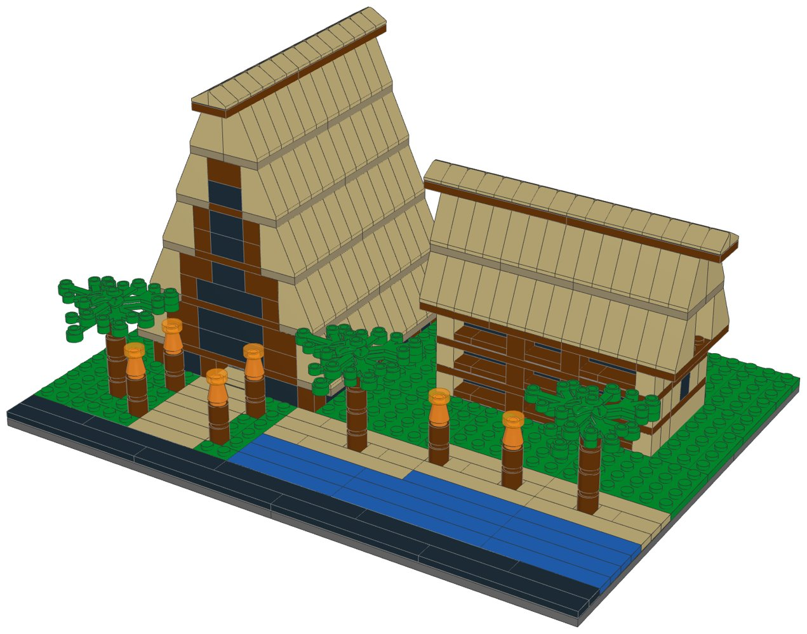
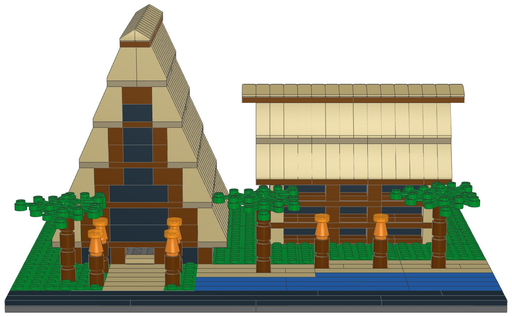
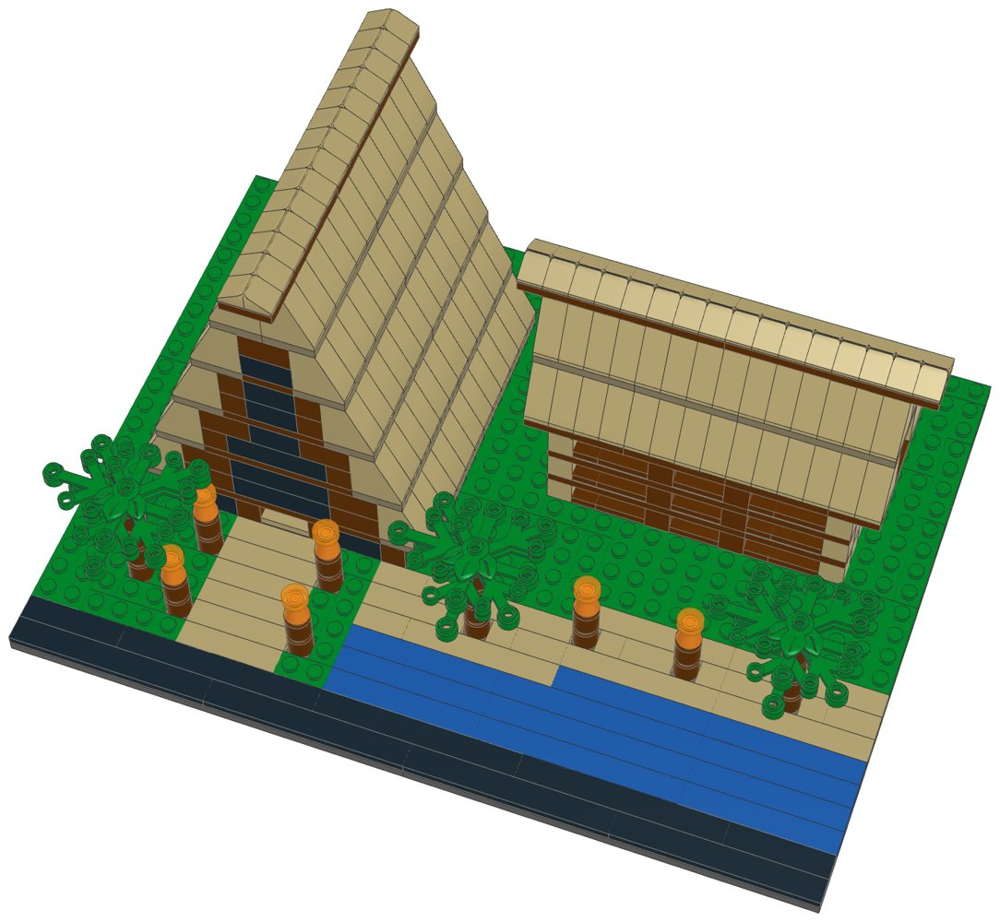

# Polynesian Village Resort (mid-size): LEGO® display kit with build instructions



A mid-size display model of Disney's Polynesian Village Resort at Walt Disney World, part of the [resort collection](../resort-collection/README.md). The heart of the Polynesian: the Great Ceremonial House, a long hall under a very tall, steep thatched A-frame roof, with its dark timber gable and tall window over the entrance, and timber posts and glass along its long sides. Beside it stands a three-storey guest longhouse with balconies under a steep thatched roof of its own, looking out over a sandy beach and a strip of the lagoon. A sandy path lined with tiki torches leads to the door, and palms grow on the lawn and the beach.

This kit covers Disney's Polynesian Villas & Bungalows, Island Tower at Disney's Polynesian Village Resort as well: they share the property, and the mid-size model shows the part that makes it recognisable.

**Signature features in this kit**

- The Great Ceremonial House: a long hall under a very tall, steep A-frame roof, shown from the gable and along its long side
- The thatch: tan 65-degree slopes laid in five layers with dark tan edges
- The dark timber gable with a tall window over the entrance, and the ridge beam sticking out at both ends
- A three-storey guest longhouse with balconies behind timber railings, under a steep thatched roof with timber gables
- Six tiki torches with glowing flames: four along the sandy path to the door and two on the beach
- A strip of the lagoon with a sandy beach, and three palms

**Left out**

- The other guest longhouses, Island Tower and the over-water bungalows
- The porte-cochere, the monorail station, the pools and most of the gardens

| | |
|---|---|
| Pieces | **570** (52 part/colour lines, 32 kinds of part, 9 colours) |
| Display base | 32 × 24 studs (25.6 × 19.2 cm), the same for every mid-size kit in the collection |
| Overall size | 25.6 × 19.2 cm, 13.7 cm tall |
| Scale | about 1:250 (one storey = 4 plates, 1 stud ≈ 2 m), like the large resort models |
| Instructions | 39-page PDF, 43 steps, 4 sections |
| Parts cost | **$76.55 per kit** at the Pick a Brick prices last seen (2022 and late 2025); about $84.20 with 2026 price rises (see [Cost assumptions](#cost-assumptions-and-resale-scenarios)) |
| Compact version | [`../polynesian-compact-lego`](../polynesian-compact-lego) |



## What's in this folder

| Path | What it is |
|---|---|
| [`instructions/Polynesian_Village_Resort_Midsize_Instructions.pdf`](instructions/Polynesian_Village_Resort_Midsize_Instructions.pdf) | **The instruction booklet**: cover, section intros with parts lists, 43 numbered steps, gallery, parts inventory with element IDs, ordering guide |
| [`parts/pick_a_brick_upload.csv`](parts/pick_a_brick_upload.csv) | Pick a Brick upload file for **one kit** (52 element IDs) |
| [`parts/pick_a_brick_upload_x10.csv`](parts/pick_a_brick_upload_x10.csv), [`parts/pick_a_brick_upload_x25.csv`](parts/pick_a_brick_upload_x25.csv) | Upload files for **10 kits** (5,700 pieces) and **25 kits** (14,250 pieces) |
| [`parts/kit_cost.csv`](parts/kit_cost.csv) | Cost of one kit, line by line, with the price and when it was seen |
| [`parts/pick_a_brick_list.csv`](parts/pick_a_brick_list.csv) | Bill of materials: element ID, quantity, part, LEGO colour, design ID, BrickLink part and colour, alternate IDs |
| [`parts/pick_a_brick_mapping.csv`](parts/pick_a_brick_mapping.csv) | Part-by-part sourcing: Pick a Brick name, evidence it's sold, last price, the ID to try next, BrickLink backup |
| [`parts/pick_a_brick_upload_retry.csv`](parts/pick_a_brick_upload_retry.csv) | Newer element IDs for 3 of the parts, for lines the upload doesn't match |
| [`parts/bricklink_wanted_list.xml`](parts/bricklink_wanted_list.xml), [`parts/rebrickable_parts.csv`](parts/rebrickable_parts.csv) | BrickLink wanted list and Rebrickable import (one kit) |
| [`parts/parts_by_section.csv`](parts/parts_by_section.csv) | Parts for each section, for bagging |
| [`model/polynesian_midsize.mpd`](model/polynesian_midsize.mpd) | The digital model (LDraw, with steps and submodels). Opens in BrickLink Studio, LeoCAD and LDCad |
| [`checks.md`](checks.md) | Results of the digital build checks |
| [`design.py`](design.py) | The design, written as code on the stud grid |

## Ordering the parts

1. On lego.com, open **Pick and Build → Pick a Brick** and choose **Upload list**.
2. Upload the file for 1, 10 or 25 kits.
3. Before you pay, check that every line shows the normal (Bestseller) delivery time and compare the bag total with the cost below.
4. If a line isn't matched, use the ID in the retry file or in the "If not found" column of the mapping, multiplied by the number of kits.

**Kits per order:** Pick a Brick sells up to 999 of one element per order. The part this kit uses most is needed 176 times, so one order holds up to **5 kits**.

**Sourcing evidence** (every part must pass the Bestseller-only check in `export_parts.py`):

| Evidence | Lines |
|---|---|
| In Pick a Brick Bestseller range (2022 listing); still in LEGO sets in 2026 | 31 |
| On Pick a Brick (late-2025 listing) | 20 |
| In Pick a Brick Bestseller range (2022 listing); still in LEGO sets in 2026 (including sets listed for 2027) | 1 |

**Sourcing uncertainties:**

- 32 lines are backed only by LEGO's 2022 Bestseller list, so their range and price today are not confirmed.
- 3 lines have newer element IDs (retry file); an upload may match either.
- LEGO pauses Standard parts in the US and Canada from November 2, 2026; this kit uses none, but check that no line shows a longer delivery time.

## Cost assumptions and resale scenarios

These are planning numbers, not quotes. Upload the 10-kit file to see today's prices: the bag total is the real parts cost.

| Assumption | Value |
|---|---|
| Parts, as listed | Pick a Brick prices last seen in LEGO's 2022 Bestseller list and a late-2025 listing (offline data; lego.com could not be reached to check current prices) |
| Parts, 2026 estimate | +10% on the listed prices (stress case +20%); LEGO's September 14, 2026 repricing raised about a third of Pick a Brick elements by 16.7% on average, hitting tiles and small parts hardest |
| Packaging | $3.00 per kit: box, bags, a card with a link or QR code to the PDF booklet, tape and label (a printed colour booklet adds about $4.00) |
| Labour | $15.00/hour; 3 s per piece to count and bag from sorted stock, plus 6 min to pack |
| Etsy fees (US) | $0.20 listing + 6.5% transaction + 3% + $0.25 processing, on the price the buyer pays |
| Shipping | seller-paid (free shipping) $10.50 for a 1-2 lb box by USPS Ground Advantage; or the buyer pays postage |
| Prices | 1.6x / 2x / 2.5x the 2026 parts estimate, rounded up to $x9.99; market prices for custom kits were not researched for each resort |

| Per kit | Listed prices | 2026 estimate | Stress case |
|---|---|---|---|
| Parts | $76.55 | $84.20 | $91.86 |
| Packaging | $3.00 | $3.00 | $3.00 |
| Labour (570 pieces) | $8.62 | $8.62 | $8.62 |
| Before shipping | $88.17 | $95.83 | $103.48 |
| Seller-paid shipping | $10.50 | $10.50 | $10.50 |

Biggest cost lines: 176× Slope 65 2 x 1 x 2 (Brick Yellow) $22.88, 2× Plate 16 x 16 (Dark Stone Grey) $6.08, 22× Plate 2 x 6 (Sand Yellow) $4.18.

| Price | Free shipping (seller pays): profit | margin | Buyer pays postage: profit | margin |
|---|---|---|---|---|
| $139.99 (25¢/piece) | $19.91 | 14% | $29.41 | 21% |
| $169.99 (30¢/piece) | $47.06 | 28% | $56.56 | 33% |
| $219.99 (39¢/piece) | $92.31 | 42% | $101.81 | 46% |

Break-even price: $117.99 with free shipping, $107.49 when the buyer pays postage (2026 estimate). The stress case adds about $7.66 per kit.

## Digital checks and physical prototype

`lego-kit/checks.py` checked the digital model ([`checks.md`](checks.md)):

| Check | Result |
|---|---|
| Collisions | Pass |
| Connections | Pass |
| Assembly order | Pass |
| Stability | Pass |

The model was checked on the computer only: parts fit the stud grid without overlaps and every part is held by a stud. **No physical prototype has been built.** Before selling, build one kit from the uploaded parts and the printed booklet, to confirm the parts arrive as listed, the build holds together when handled, and each step is clear.

## Building notes

- **Sections:**
  1. The display base, the lawn, the path, the beach and the lagoon
  2. The Great Ceremonial House
  3. The guest longhouse
  4. The tiki torches and the palms (build 6 torches and 3 palms)
- The roofs go up one course at a time: first the dark tan plates, then the tan slopes on them, then the reddish brown bricks of the gables at the ends.
- Each slope sits on the dark tan plate below it. Press every slope down firmly before the next plates go on: they lock the slopes together.
- On the longhouse, the railings and the posts between the balconies stand one stud in front of the glass doors; the floor plates above tie them to the walls.
- A “Build 6” or “Build 3” badge means you build that module that many times.



## How it was made

The model is generated by [`design.py`](design.py) with the shared toolkit in [`../lego-kit`](../lego-kit), in the collection's mid-size format (`lego-kit/compact.py`). `./build.sh` renders the steps with LeoCAD, maps every part to LEGO element IDs, writes the parts lists and upload files, runs the checks, prints the booklet and writes this README.

```bash
./build.sh            # set DATA_DIR to refresh element IDs (see ../lego-kit/README.md)
```

lego.com, BrickLink and Rebrickable could not be reached from the environment this was made in. Availability comes from an August 2026 Rebrickable snapshot and Pick a Brick listings from 2022 and late 2025. With internet access, `node ../lego-kit/pab_check.cjs .` checks every element live.

## Disclaimer

An unofficial fan design (MOC) inspired by Disney's Polynesian Village Resort at Walt Disney World. It is not affiliated with, sponsored or endorsed by The LEGO Group or Disney. LEGO® is a trademark of The LEGO Group. Resort names are trademarks of Disney; see the trademark note in the [collection README](../resort-collection/README.md) before selling.
