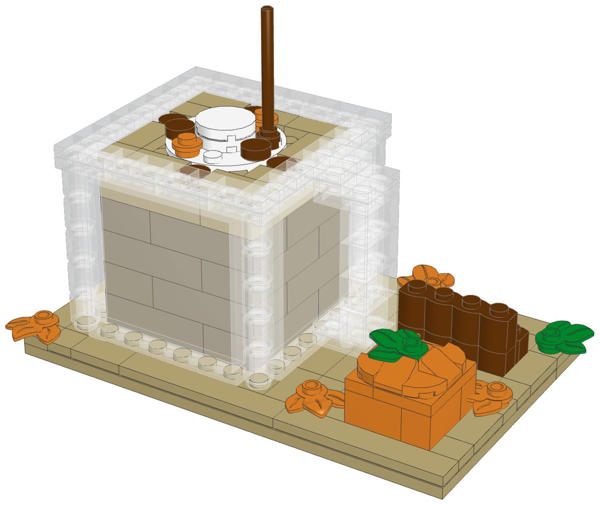
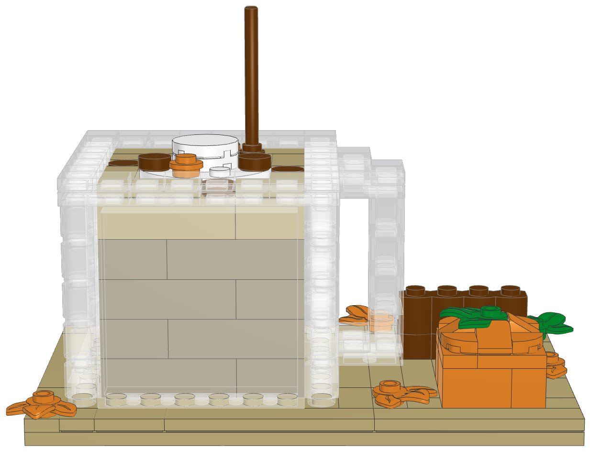
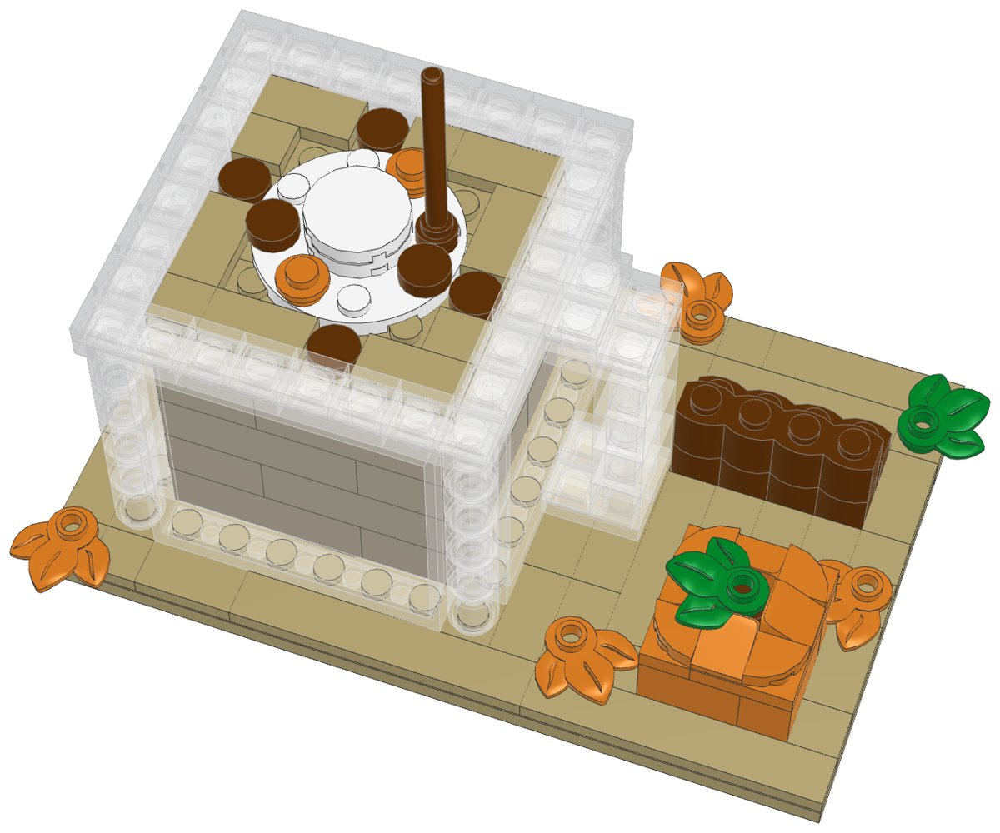

# Pumpkin Spice Latte, clear mug edition: a LEGO® kit to build and sell



The [Pumpkin Spice Latte](../pumpkin-spice-latte-lego) kit with the white mug swapped
for a clear glass one. You can see the latte and its foam through the glass. The rest
of the scene is the same:
- whipped cream in three tiers with sprinkles, and a cinnamon stick
- a little pumpkin, a bundle of cinnamon sticks and five autumn leaves
- the wooden board

Every element was in Pick a Brick's **Bestseller** range and is still in 2026 LEGO
sets, so an order ships from LEGO's US warehouse in LEGO's normal 3–5 business days.
`export_parts.py` checks this and stops if a part isn't a Bestseller.

| | |
|---|---|
| Pieces | **189** (35 kinds, 7 colours) |
| Size | 16 × 10 studs (12.8 × 8 cm), 9 cm tall to the top of the cinnamon stick |
| Build time | about 40 to 50 minutes |
| Instructions | 29-page PDF, 30 steps, 4 sections |
| Parts cost | **US$23.45 per kit** at the Pick a Brick prices last seen (2022 and late 2025), $5.28 more than the white mug. Some prices went up in 2026, so check the total in your bag. |



## How the clear mug works

LEGO doesn't make the rounded corner brick of the white mug in clear, and most other
clear bricks are either out of production or in the slow Standard range. The glass
is built from the clear parts that are Bestsellers:

- **Sides:** four clear 1×6×5 panels. Each one is a whole side, so the glass is
  smooth with no brick seams. The flat side of each panel faces out.
- **Corners:** stacks of five clear 1×1 round bricks, which soften the corners.
- **Rim:** a ring of clear 1×2 plates that locks each corner to a panel, topped with
  clear 1×1 tiles.
- **Handle:** clear 1×2 bricks and plates in a C shape, hanging from the rim.
- **The latte:** dark tan bricks, built up inside before the panels go on, with a
  course of tan bricks at the top for the foam. On top: tan foam tiles, a dusting
  of cinnamon, and the same whipped cream and cinnamon stick as the white mug.

The base under the glass is a tan 8×8 plate, the same colour as the board, so the
glass seems to stand on the board.

Real clear LEGO is clearer than most renderers draw it. The pictures here use a
lighter clear to match. Photograph a real build for your listing.

## What's in this folder

| Path | What it is |
|---|---|
| [`instructions/Pumpkin_Spice_Latte_Clear_Mug_Instructions.pdf`](instructions/Pumpkin_Spice_Latte_Clear_Mug_Instructions.pdf) | **The instruction booklet** to include with each kit |
| [`parts/pick_a_brick_upload.csv`](parts/pick_a_brick_upload.csv) | Pick a Brick upload file for **one kit** (35 element IDs) |
| [`parts/pick_a_brick_upload_x10.csv`](parts/pick_a_brick_upload_x10.csv) | Upload file for **10 kits** (1,890 pieces) |
| [`parts/pick_a_brick_upload_x25.csv`](parts/pick_a_brick_upload_x25.csv) | Upload file for **25 kits** (4,725 pieces) |
| [`parts/kit_cost.csv`](parts/kit_cost.csv) | Cost of one kit, line by line |
| [`parts/parts_by_section.csv`](parts/parts_by_section.csv) | Parts for each section, for bagging each kit in 4 bags |
| [`parts/pick_a_brick_upload_retry.csv`](parts/pick_a_brick_upload_retry.csv) | Newer element IDs for 11 of the parts, for anything the upload doesn't match |
| [`parts/pick_a_brick_mapping.csv`](parts/pick_a_brick_mapping.csv) | Part-by-part mapping with evidence, last price, the ID to try next and a BrickLink backup |
| [`parts/bricklink_wanted_list.xml`](parts/bricklink_wanted_list.xml), [`parts/rebrickable_parts.csv`](parts/rebrickable_parts.csv) | BrickLink wanted list and Rebrickable import (for one kit) |
| [`model/pumpkin_spice_latte_clear.mpd`](model/pumpkin_spice_latte_clear.mpd) | The digital model. Opens in BrickLink Studio, LeoCAD and LDCad |
| [`design.py`](design.py) | The design, written as code on the stud grid |

## Ordering

Ordering works as for the [white mug kit](../pumpkin-spice-latte-lego/README.md#ordering):
upload the file for 1, 10 or 25 kits, and before you pay check that every line
shows the normal delivery time.

**How many kits per order:** Pick a Brick sells up to 999 of one element per
order. This kit uses 34 clear 1×1 tiles, so one order holds up to **29 kits**.

**The clear parts:** clear parts often get new element IDs. If a clear line isn't
matched, use the ID from the retry file or the "If not found" column of the
mapping.

## Cost and profit

The parts cost **$23.45 per kit** at the last prices seen, so a batch of 10 costs
about $235. The four clear panels are the most expensive part at $0.89 each ($3.56
together). The latte inside comes next: 20 dark tan and 5 tan bricks, $4.85.

The table uses the same assumptions as the white mug kit. **Change the numbers to your own.**
- Parts: $25.80 (the $23.45 above plus about 10% for 2026 price rises).
- Packaging: $2.50.
- Etsy: $0.20 listing, 6.5% transaction fee, 3% + $0.25 payment processing.
- Shipping: the buyer pays postage.

| Price | Etsy fees | Parts + packaging | Profit per kit | Margin |
|---|---|---|---|---|
| $39.99 | $4.25 | $28.30 | **$7.44** | 19% |
| $44.99 | $4.72 | $28.30 | **$11.97** | 27% |
| $49.99 | $5.20 | $28.30 | **$16.49** | 33% |
| $54.99 | $5.67 | $28.30 | **$21.02** | 38% |

**$44.99–49.99 is a good place to start.** That is $10 above the white mug kit,
which fits a premium version with a see-through glass. It works out to 24–26¢ a
piece, in line with the white kit.

The notes in the white kit's README on
[before you sell](../pumpkin-spice-latte-lego/README.md#before-you-sell) all apply
here too:
- LEGO's shop terms
- the name, with no "PSL" or Starbucks look
- LEGO's trademark
- ages 14+ with a small-parts warning

## Building notes

- **Sections:**
  1. The board
  2. The glass mug
  3. The pumpkin
  4. Cinnamon sticks and leaves
- **Order inside the mug:** the latte goes in first, course by course, with the
  corner posts. The four panels then press straight down onto the base around it.
  The rim plates go on next and lock the corners to the panels. Press them firmly.
- **The handle:** it hangs from two rim plates. The booklet has a note for the step
  where you hold it from below to press on its bottom plates.



## How it was made

The model is generated by [`design.py`](design.py) with the shared toolkit in
[`../lego-kit`](../lego-kit). The toolkit checks that no two elements overlap and
that every element is attached by at least one stud. It then renders the steps,
maps every part to LEGO element IDs, writes the parts lists and batch files, and
prints the booklet. `clear_alpha` in `design.py` draws the clear parts more
see-through in the renders only. To rebuild after a change:

```bash
./build.sh            # set DATA_DIR to refresh element IDs (see ../lego-kit/README.md)
```

lego.com could not be reached from the environment this was made in. Availability
comes from an August 2026 Rebrickable snapshot and Pick a Brick listings from 2022
and late 2025.

## Disclaimer

A custom model built from genuine LEGO elements. It is not affiliated with,
sponsored or endorsed by The LEGO Group or Starbucks. LEGO® is a trademark of The
LEGO Group.
