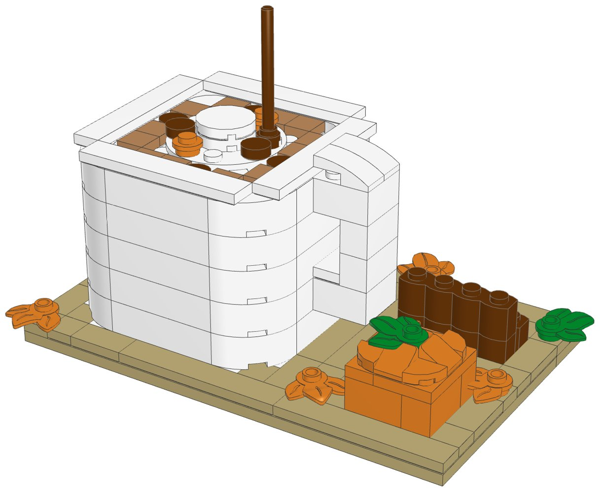
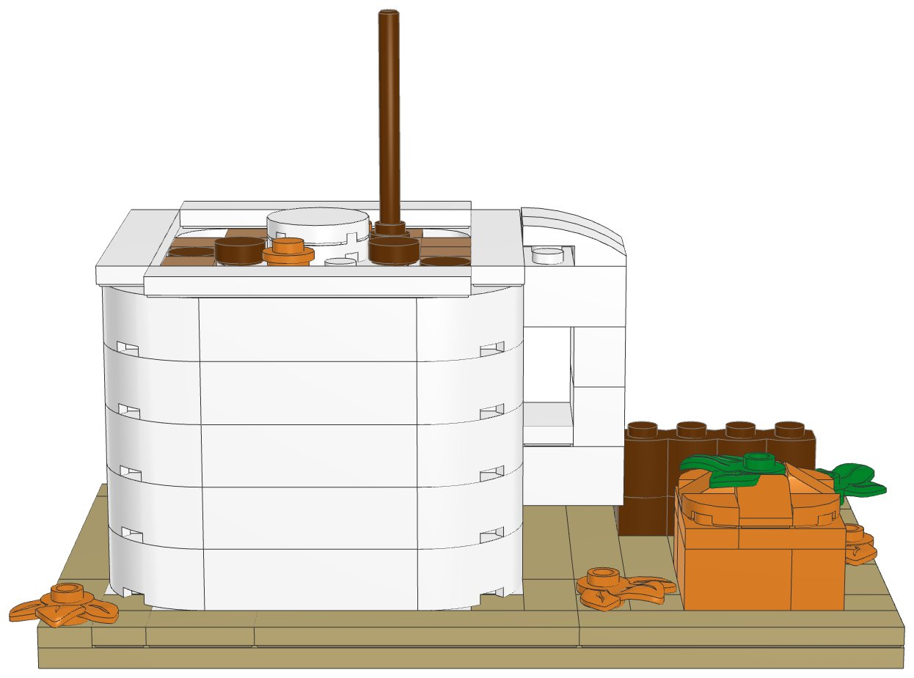
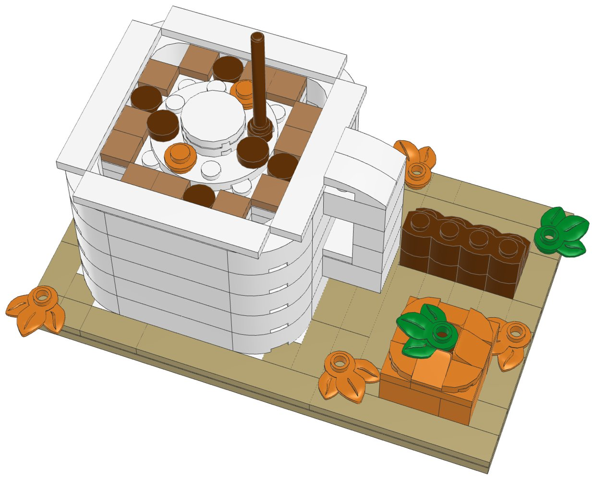

# Pumpkin Spice Latte: a small LEGO® kit to build and sell



A white mug of pumpkin spice latte on a wooden board, designed to be cheap to make
and quick to order. It includes:
- a mug with rounded corners and a handle
- a ring of latte foam dusted with cinnamon
- whipped cream in three tiers with sprinkles, and a cinnamon stick
- a little pumpkin with a stem and a leaf
- a bundle of cinnamon sticks and five autumn leaves

Every element was in Pick a Brick's **Bestseller** range and is still in 2026 LEGO
sets, so an order ships from LEGO's US warehouse in LEGO's normal 3–5 business days.
It uses no Standard-range parts (those ship from Denmark and take up to 28 days).
`export_parts.py` checks this and stops if a part isn't a Bestseller.

| | |
|---|---|
| Pieces | **158** (39 kinds, 6 colours) |
| Size | 16 × 10 studs (12.8 × 8 cm), 9 cm tall to the top of the cinnamon stick |
| Build time | about 30 to 45 minutes |
| Instructions | 27-page PDF, 26 steps, 4 sections |
| Parts cost | **US$18.17 per kit** at the Pick a Brick prices last seen (2022 and late 2025). Some prices went up in 2026, so check the total in your bag. |



## What's in this folder

| Path | What it is |
|---|---|
| [`instructions/Pumpkin_Spice_Latte_Instructions.pdf`](instructions/Pumpkin_Spice_Latte_Instructions.pdf) | **The instruction booklet** to include with each kit: cover, section intros with parts lists, 26 numbered steps, gallery, parts inventory, ordering guide |
| [`parts/pick_a_brick_upload.csv`](parts/pick_a_brick_upload.csv) | Pick a Brick upload file for **one kit** (39 element IDs) |
| [`parts/pick_a_brick_upload_x10.csv`](parts/pick_a_brick_upload_x10.csv) | Upload file for **10 kits** (1,580 pieces) |
| [`parts/pick_a_brick_upload_x25.csv`](parts/pick_a_brick_upload_x25.csv) | Upload file for **25 kits** (3,950 pieces) |
| [`parts/kit_cost.csv`](parts/kit_cost.csv) | Cost of one kit, line by line, with the price and when it was seen |
| [`parts/parts_by_section.csv`](parts/parts_by_section.csv) | Parts for each section: use it to bag each kit in 4 bags |
| [`parts/pick_a_brick_upload_retry.csv`](parts/pick_a_brick_upload_retry.csv) | Newer element IDs for 17 of the parts (mostly white), for anything the upload doesn't match |
| [`parts/pick_a_brick_mapping.csv`](parts/pick_a_brick_mapping.csv) | Part-by-part mapping: Pick a Brick name, LEGO colour, design ID, evidence, last price, the ID to try next, BrickLink backup |
| [`parts/bricklink_wanted_list.xml`](parts/bricklink_wanted_list.xml), [`parts/rebrickable_parts.csv`](parts/rebrickable_parts.csv) | BrickLink wanted list and Rebrickable import (for one kit) |
| [`model/pumpkin_spice_latte.mpd`](model/pumpkin_spice_latte.mpd) | The digital model. Opens in BrickLink Studio, LeoCAD and LDCad |
| [`design.py`](design.py) | The design, written as code on the stud grid |

## Ordering

1. On lego.com, open **Pick and Build → Pick a Brick** and choose **Upload list**.
2. Upload the file for the number of kits you want: 1, 10 or 25.
3. Before you pay, check that every line shows the normal delivery time. The
   Bestseller evidence comes from LEGO's 2022 list (11 of the 39 parts were also
   on the late-2025 listing). LEGO sometimes moves parts between ranges, so a
   line that says it ships later has moved to Standard.
4. If a line isn't matched, try the ID in the "If not found" column of
   [`parts/pick_a_brick_mapping.csv`](parts/pick_a_brick_mapping.csv) or in the
   retry file, multiplied by the number of kits.

**How many kits per order:** Pick a Brick sells up to 999 of one element per
order. The part this kit needs most is the rounded white corner brick (20 per
kit), so one order holds up to **49 kits**. Above 999 you have to go through
LEGO Customer Service, and they only take large orders from March 1 to
October 31.

**Shipping to you (US):** LEGO ships Bestseller parts from its US warehouse in
3–5 business days, so an order arrives within about a week. LEGO.com ships US
orders over $35 free. Its terms also mention extra handling fees for Pick a Brick,
so check the shipping line at checkout. LEGO adds a $3.50 fee to Bestseller orders
under $14.

## Cost and profit

The parts cost **$18.17 per kit** at the last prices seen, so a batch of 10 costs about
$182 and a batch of 25 about $454. [`parts/kit_cost.csv`](parts/kit_cost.csv) has
every line. The board and the mug are the biggest costs: the 8×16 plate, 20 rounded
corner bricks and 18 white 1×4 bricks come to $6.68 together. To see today's
prices, upload the 10-kit file: the total in your bag is the real number.

Example with Etsy's US fees and some assumed costs. **Change the numbers to your own.**
- Parts: $20.00 (the $18.17 above plus about 10% for 2026 price rises).
- Packaging: $2.50 (a small box, 4 bags and a printed card with a link to the PDF).
- Etsy: $0.20 listing, 6.5% transaction fee, 3% + $0.25 payment processing.
- Shipping: the buyer pays postage.

| Price | Etsy fees | Parts + packaging | Profit per kit | Margin |
|---|---|---|---|---|
| $29.99 | $3.30 | $22.50 | **$4.19** | 14% |
| $34.99 | $3.77 | $22.50 | **$8.72** | 25% |
| $39.99 | $4.25 | $22.50 | **$13.24** | 33% |
| $44.99 | $4.72 | $22.50 | **$17.77** | 39% |

**$34.99–39.99 is a good place to start.** That's 22–25¢ a piece, which is normal
for a custom kit. The kit is a new design, you bag it and it comes with a
booklet. LEGO's own sets usually cost about 10–12¢ a piece.

The table leaves out the following:
- Your time to sort and bag the kits (the per-section parts list makes this faster).
- Spare parts.
- Etsy's Offsite Ads fee (15% when a sale comes from one of their ads).
- Sales tax (Etsy collects it on US orders).

Printing the full booklet in colour costs more than a card with a link or QR
code to the PDF.

## Before you sell

- **LEGO's shop terms.** LEGO.com's terms of sale say the shop is for personal
  use, not resale. I couldn't open the terms page from here, so read it before you
  order in bulk. LEGO can limit or cancel orders. BrickLink sellers are the usual
  source for kit makers:
  [`parts/bricklink_wanted_list.xml`](parts/bricklink_wanted_list.xml) uploads the
  whole list there, so multiply the quantities by the number of kits.
- **The name.**
  - Don't use "PSL", which is Starbucks' trademark.
  - Don't use their green, logo or cup design.
  - "Pumpkin spice latte" is widely used to describe the drink, but trademark
    filings do exist for the phrase. For a safer title, use something like
    "Autumn Spice Latte Mug". The title is one line in `design.py`.
  - This isn't legal advice.
- **LEGO's trademark.** Don't put "LEGO" in your shop name or product title. In
  the description you can say "built with genuine LEGO® elements; not
  affiliated with or endorsed by the LEGO Group", as the booklet cover does.
- **Age and safety.**
  - Sell it as a display kit for ages 14 and up. In the US, toys for children
    12 and under need third-party safety testing.
  - Put a small-parts warning on the box.

## Building notes

- **Sections:**
  1. The board
  2. The mug
  3. The pumpkin
  4. Cinnamon sticks and leaves

  The mug and the pumpkin are built on their own and set on the board.
- **The mug:** five courses of bricks. The rounded corners are 2×2 macaroni bricks.
  The white 1×6 tiles around the rim tie the walls together at the top, and the base
  plates tie them together at the bottom. The latte sits on plates inside the top
  course, held up by a stack of 2×2 bricks.
- **The handle:** two 2×3 bricks sticking out of the side, joined by 1×2 bricks,
  with curved slopes on top.
- **The board:** the planks run front to back so they tie the two long plates to the
  big one. The leaves sit on tan 1×1 plates so they spread over the planks.



## How it was made

The model is generated by [`design.py`](design.py) with the shared toolkit in
[`../lego-kit`](../lego-kit). The toolkit checks that no two elements overlap and
that every element is attached by at least one stud. It then renders the steps with
LeoCAD, maps every part to LEGO element IDs, writes the parts lists and batch files,
and prints the booklet. To rebuild after a change:

```bash
./build.sh            # set DATA_DIR to refresh element IDs (see ../lego-kit/README.md)
```

lego.com could not be reached from the environment this was made in. Availability
comes from an August 2026 Rebrickable snapshot and Pick a Brick listings from 2022
and late 2025. With internet access, `node ../lego-kit/pab_check.cjs .` checks every
element live.

## Disclaimer

A custom model built from genuine LEGO elements. It is not affiliated with,
sponsored or endorsed by The LEGO Group or Starbucks. LEGO® is a trademark of The
LEGO Group.
