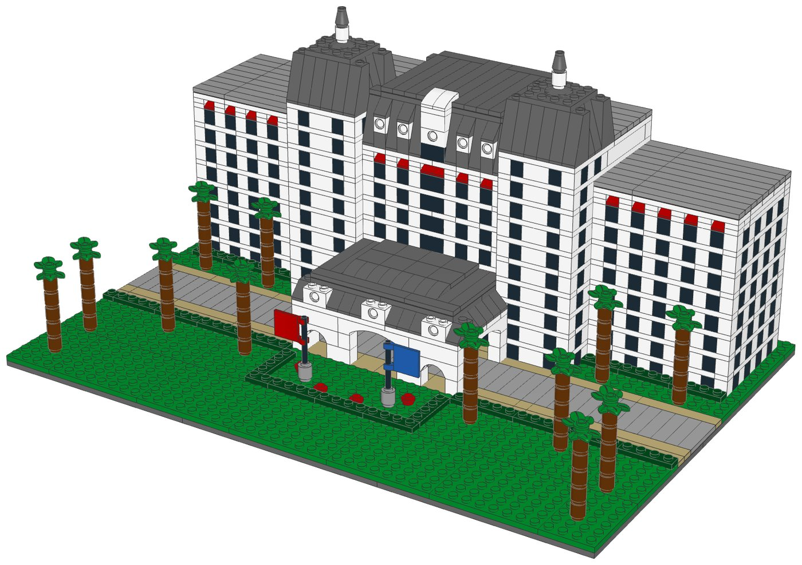
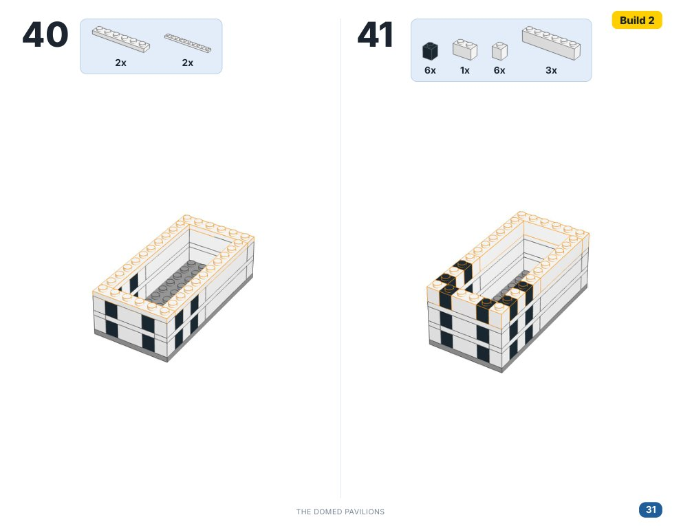

# Riviera Resort: micro-scale LEGO® model with build instructions



A buildable LEGO model of the grand entrance of the Riviera Resort (Walt Disney
World). It includes:
- the arched porte-cochère
- the central pavilion with its steep mansard roof and oval dormers
- two domed corner pavilions
- two guest wings with red awnings
- the lawn, lined with palms

Every part is a real LEGO element in current production. Each one is mapped to its
LEGO Pick a Brick Element ID. You can upload one file to Pick a Brick on lego.com to
fill your bag.

| | |
|---|---|
| Pieces | **1,771** (87 kinds, 10 colours) |
| Footprint | 48 × 32 studs (38.4 × 25.6 cm) |
| Height | 16 cm at the domes |
| Scale | about 1:250 (1 stud ≈ 2 m, one storey = 4 plates) |
| Instructions | 74-page PDF, 95 steps, 6 sections |
| Estimated cost | about US$228 at 2022–2025 Pick a Brick prices (1,769 of the 1,771 pieces have a known price). LEGO raised about a third of Pick a Brick prices in 2026, so expect more. |

## What's in this folder

| Path | What it is |
|---|---|
| [`instructions/Riviera_Resort_Instructions.pdf`](instructions/Riviera_Resort_Instructions.pdf) | **The instruction booklet**: cover, section intros with parts lists, 95 numbered steps with parts callouts, gallery, full inventory with Element IDs, ordering guide |
| [`parts/pick_a_brick_upload.csv`](parts/pick_a_brick_upload.csv) | **Upload this to Pick a Brick** (Upload list). It holds all 87 element IDs with their quantities (`elementId,quantity`) |
| [`parts/pick_a_brick_upload_retry.csv`](parts/pick_a_brick_upload_retry.csv) | Second upload for anything the first one misses. It uses LEGO's newer IDs for the same parts (31 lines, mostly white) |
| [`parts/pick_a_brick_mapping.csv`](parts/pick_a_brick_mapping.csv) | Part-by-part Pick a Brick mapping: Element ID, Pick a Brick's own item name, LEGO colour, design ID, evidence it's sold, last price seen, whether you need more than 10, the ID to try if not found, and a BrickLink backup |
| [`parts/pick_a_brick_list.csv`](parts/pick_a_brick_list.csv) | Full parts list with element IDs, design IDs, alternates, production years and availability notes |
| [`parts/bricklink_wanted_list.xml`](parts/bricklink_wanted_list.xml) | BrickLink wanted list (BrickLink → Want → Upload) |
| [`parts/rebrickable_parts.csv`](parts/rebrickable_parts.csv) | Rebrickable part-list import (`Part,Color,Quantity`) |
| [`parts/parts_by_section.csv`](parts/parts_by_section.csv) | Parts for each section, to pre-sort before you build |
| [`model/riviera_resort.mpd`](model/riviera_resort.mpd) | The digital model (LDraw MPD with build steps and submodels). Opens in BrickLink Studio, LeoCAD, LDCad and LDView |
| [`data/elements.csv`](data/elements.csv) | How each LDraw part and colour maps to a LEGO Element ID, BrickLink item, Rebrickable part and production data |
| `tools/` | The generator: design, validation, rendering, element lookup, booklet, and `pab_check.cjs`, a live Pick a Brick check |

## Ordering the parts from Pick a Brick

1. Open **lego.com → Pick and Build → Pick a Brick** and choose **Upload list**.
2. Upload [`parts/pick_a_brick_upload.csv`](parts/pick_a_brick_upload.csv). It
   holds all 87 element IDs and quantities, well under Pick a Brick's 400-item
   upload limit.
3. If some lines aren't matched, upload
   [`parts/pick_a_brick_upload_retry.csv`](parts/pick_a_brick_upload_retry.csv).
   LEGO gave many white parts new element IDs in 2025 (for example the white 1×1
   brick 300501 → 6552096), and Pick a Brick may list either number.
4. Anything still missing: look it up in
   [`parts/pick_a_brick_mapping.csv`](parts/pick_a_brick_mapping.csv) and search
   Pick a Brick by design ID and colour. Or order it from BrickLink with
   `parts/bricklink_wanted_list.xml`.

**Quantity limits.** Pick a Brick's *Bestseller* range sells up to 999 of an
element per order. Many *Standard* elements are capped at 10 per order. This model
needs more than 10 of 30 elements, for example 384 white and 360 black 1×1 bricks
and 64 dark grey 75° slopes. All 30 were in the Bestseller range, so one order
should cover them. If Pick a Brick caps one of them, split it across orders or
buy the rest on BrickLink.

### How the parts map to Pick a Brick

The model was designed to use only elements that were in Pick a Brick's Bestseller
range. Three parts were swapped to make that true:
- steep 2×1 slopes 60481 became 75° slopes 4460;
- 2×4 tiles became 1×N and 2×2 tiles;
- the 1×6×2 arch became the 1×6 raised arch 92950.

| Evidence | Line items |
|---|---|
| Listed on Pick a Brick in late 2025 | 22 |
| In Pick a Brick's Bestseller range in 2022, and still in LEGO sets in 2026 | 63 |
| Not on the Pick a Brick listings checked (the two 2×2 flags, design 80326) | 2 |

The mapping file also gives Pick a Brick's own item names (for example
"ROOF TILE 1X2X3/73°" for the 75° slope). Those names help when searching by hand.

**Not yet checked live.** lego.com could not be reached from the environment this
was made in. The mapping is built from an August 2026 Rebrickable snapshot and
Pick a Brick listings from 2022 and late 2025. With internet access, run the live
check:

```bash
NODE_PATH=$(npm root -g) node tools/pab_check.cjs    # needs Playwright + Chromium
```

It writes `parts/pick_a_brick_live.csv` with, for each element, whether Pick a
Brick has it, the current price, Bestseller or Standard, stock, and the per-order
limit if the site reports one. It uses the page's own GraphQL query, taken from the
open-source LegoSharp client. It has not been run against the live site yet, so the
query may need adjusting if LEGO has changed its API.

Two more notes:
- **Flags**: the model draws the 2×2 flag with LDraw part 2335, the old mould.
  Order the current flag, **design 80326** (Red 6365459, Blue 6365486). BrickLink
  has it if Pick a Brick doesn't.
- **Domes**: the tower domes are built from 75° slopes, a 4×4 plate and a 2×2
  dish, because the dark grey 4×4 dish is retired.

## Building notes

- **Sections**:
  1. The grounds
  2. The central pavilion
  3. The domed pavilions (build 2)
  4. The guest wings (build 2)
  5. The porte-cochère, built in place
  6. Palms (build 12), flowers and flags
- **Modules**: each building is built separately and then set on the base, like a
  LEGO modular building.
- **Facades**: every storey is one course of bricks (a black 1×1 for each window,
  white for the pillars) topped with a band of white plates. Some floors are solid
  white plates, which stiffens the hollow buildings.
- **Top floors**: red 1×1 cheese slopes over the top-floor windows make the red
  awnings.
- **Base**: six 16×16 dark grey plates. The lawn, drive and pavement layers are
  laid so that none of their joints line up with the joints between the base
  plates, which locks the base together.



## How it was made (and how to change it)

The model is written as code (`tools/riviera.py`) on a stud grid. `tools/bricks.py`
reads each part's real shape from the official LDraw parts library. Before any
files are written, it checks two things:
- no two elements overlap;
- every element is clutched by at least one stud to the rest of the model, so
  there are no floating pieces.

The booklet renders come from LeoCAD. Parts added in each step are outlined in
orange.

To rebuild after changing the design:

```bash
sudo apt-get install leocad ldraw-parts xvfb fonts-inter   # Ubuntu 24.04
pip install numpy pillow pymupdf
# node + playwright (with Chromium) are used to print the PDF
DATA_DIR=/path/to/element-data tools/build_all.sh
```

`DATA_DIR` is only needed to refresh `data/elements.csv`. Without it, the existing
file is used.

### Where the element IDs come from

- [Rebrickable](https://rebrickable.com/downloads/) database dump: elements,
  parts, sets and inventories (August 2026 snapshot).
- Two community scrapes of LEGO Pick a Brick: 2022 (about 1,400 Bestseller
  elements) and late 2025 (bricks and plates). They show whether an element was
  listed, its Pick a Brick name and its price.
- The BrickLink Studio element map, used for BrickLink item numbers.

## Disclaimer

This is an unofficial fan design (a "MOC"). It is not affiliated with, sponsored
by or endorsed by The LEGO Group or Disney. LEGO® is a trademark of The LEGO Group.
The Riviera Resort is a Disney property. This model is an architectural tribute
for personal use.
