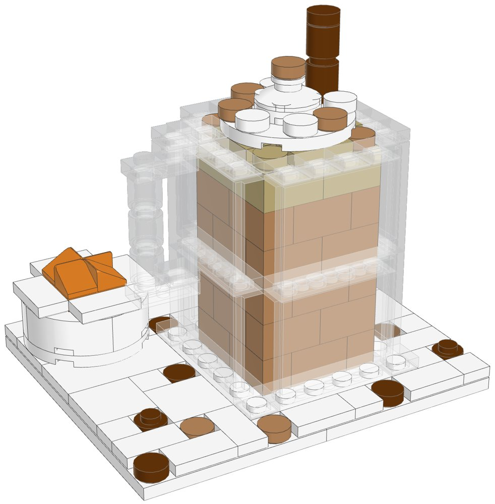
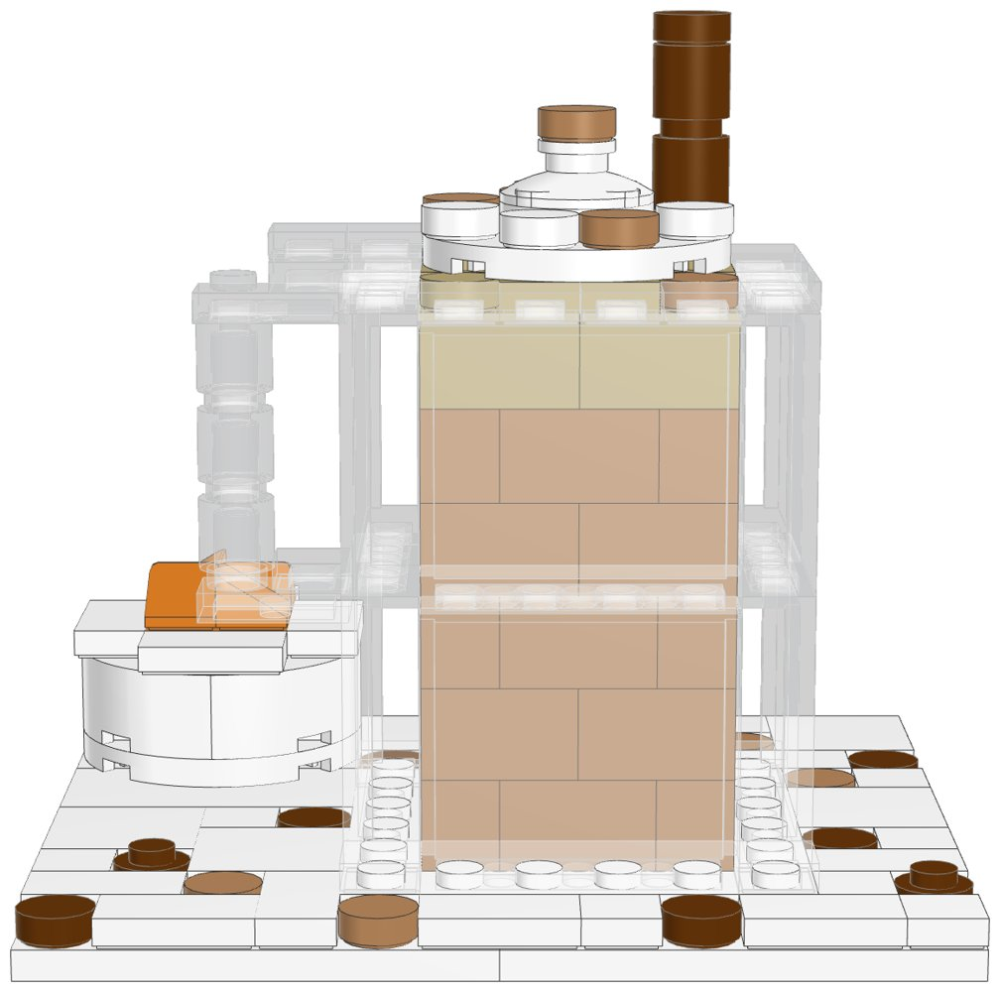
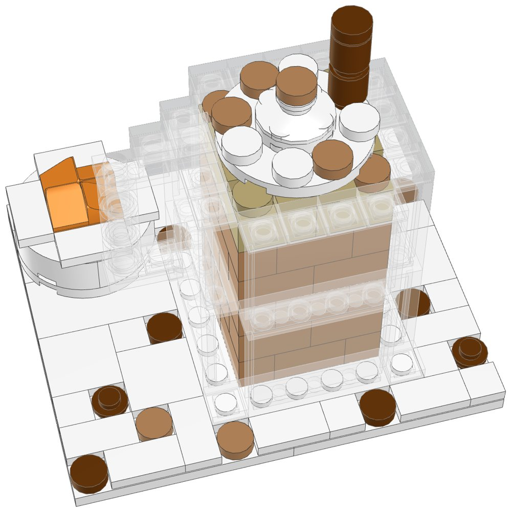

# Whipped Pumpkin Latte: a small LEGO® kit to build and sell



A pumpkin spice latte in a clear glass mug, topped with whipped cream and a cinnamon
stick, on a white marble board. It is modelled on a photo of a glass mug of latte, with
the handle on the left, a bowl of pumpkin purée behind it and spice scattered on a
marble counter. It is designed to be cheap to make and quick to order. It includes:
- a clear glass mug with a handle. The latte and a layer of foam show through the glass
- whipped cream in tiers, dusted with cinnamon, and a cinnamon stick
- a little white bowl of pumpkin purée
- cinnamon, nutmeg and whole cloves scattered on the board

It is a different kit from [`../pumpkin-spice-latte-lego`](../pumpkin-spice-latte-lego)
(a white mug on a wooden board).

Every element was in Pick a Brick's **Bestseller** range and is still in 2026 LEGO
sets, so an order ships from LEGO's US warehouse in LEGO's normal 3–5 business days.
It uses no Standard-range parts (those ship from Denmark and take up to 28 days).
`export_parts.py` checks this and stops if a part isn't a Bestseller.

| | |
|---|---|
| Pieces | **149** (30 kinds, 6 colours) |
| Size | 12 × 10 studs (9.6 × 8 cm), 9 cm tall to the top of the cinnamon stick. The glass is 4.8 cm wide and 6 cm tall to the rim |
| Build time | about 30 to 45 minutes |
| Instructions | 28-page PDF, 30 steps, 3 sections |
| Parts cost | **US$16.08 per kit** at the Pick a Brick prices last seen (2022 and late 2025). Some prices went up in 2026, so check the total in your bag. |



## What's in this folder

| Path | What it is |
|---|---|
| [`instructions/Whipped_Latte_Instructions.pdf`](instructions/Whipped_Latte_Instructions.pdf) | **The instruction booklet** to include with each kit: cover, section intros with parts lists, 30 numbered steps, gallery, parts inventory, ordering guide |
| [`parts/pick_a_brick_upload.csv`](parts/pick_a_brick_upload.csv) | Pick a Brick upload file for **one kit** (30 element IDs) |
| [`parts/pick_a_brick_upload_x10.csv`](parts/pick_a_brick_upload_x10.csv) | Upload file for **10 kits** (1,490 pieces) |
| [`parts/pick_a_brick_upload_x25.csv`](parts/pick_a_brick_upload_x25.csv) | Upload file for **25 kits** (3,725 pieces) |
| [`parts/kit_cost.csv`](parts/kit_cost.csv) | Cost of one kit, line by line, with the price and when it was seen |
| [`parts/parts_by_section.csv`](parts/parts_by_section.csv) | Parts for each section: use it to bag each kit in 3 bags |
| [`parts/pick_a_brick_upload_retry.csv`](parts/pick_a_brick_upload_retry.csv) | Newer element IDs for 18 of the parts (mostly white), for anything the upload doesn't match |
| [`parts/pick_a_brick_mapping.csv`](parts/pick_a_brick_mapping.csv) | Part-by-part mapping: Pick a Brick name, LEGO colour, design ID, evidence, last price, the ID to try next, BrickLink backup |
| [`parts/bricklink_wanted_list.xml`](parts/bricklink_wanted_list.xml), [`parts/rebrickable_parts.csv`](parts/rebrickable_parts.csv) | BrickLink wanted list and Rebrickable import (for one kit) |
| [`model/whipped_latte.mpd`](model/whipped_latte.mpd) | The digital model. Opens in BrickLink Studio, LeoCAD and LDCad |
| [`design.py`](design.py) | The design, written as code on the stud grid |

## Ordering

1. On lego.com, open **Pick and Build → Pick a Brick** and choose **Upload list**.
2. Upload the file for the number of kits you want: 1, 10 or 25.
3. Before you pay, check that every line shows the normal delivery time. The
   Bestseller evidence comes from LEGO's 2022 list (7 of the 30 parts were also
   on the late-2025 listing). LEGO sometimes moves parts between ranges, so a
   line that says it ships later has moved to Standard.
4. If a line isn't matched, try the ID in the "If not found" column of
   [`parts/pick_a_brick_mapping.csv`](parts/pick_a_brick_mapping.csv) or in the
   retry file, multiplied by the number of kits.

**How many kits per order:** Pick a Brick sells up to 999 of one element per
order. The part this kit needs most is the medium nougat 1×2 brick (30 per kit, the
latte inside the glass), so one order holds up to **33 kits**. Above 999 you have to
go through LEGO Customer Service, and they only take large orders from March 1 to
October 31.

**Shipping to you (US):** LEGO ships Bestseller parts from its US warehouse in
3–5 business days, so an order arrives within about a week. LEGO.com ships US
orders over $35 free. Its terms also mention extra handling fees for Pick a Brick,
so check the shipping line at checkout. LEGO adds a $3.50 fee to Bestseller orders
under $14.

## Cost and profit

The parts cost **$16.08 per kit** at the last prices seen, so a batch of 10 costs about
$161 and a batch of 25 about $402. [`parts/kit_cost.csv`](parts/kit_cost.csv) has
every line. The glass is the biggest cost: the eight clear panels ($3.04), the 30
medium nougat 1×2 bricks for the latte ($3.00) and the 22 clear 1×1 tiles ($1.32) come
to $7.36 together. To see today's prices, upload the 10-kit file: the total in your
bag is the real number.

Example with Etsy's US fees and some assumed costs. **Change the numbers to your own.**
- Parts: $17.70 (the $16.08 above plus about 10% for 2026 price rises).
- Packaging: $2.50 (a small box, 3 bags and a printed card with a link to the PDF).
- Etsy: $0.20 listing, 6.5% transaction fee, 3% + $0.25 payment processing.
- Shipping: the buyer pays postage.

| Price | Etsy fees | Parts + packaging | Profit per kit | Margin |
|---|---|---|---|---|
| $29.99 | $3.30 | $20.20 | **$6.49** | 22% |
| $32.99 | $3.58 | $20.20 | **$9.21** | 28% |
| $34.99 | $3.77 | $20.20 | **$11.02** | 31% |
| $39.99 | $4.25 | $20.20 | **$15.54** | 39% |

**$32.99–34.99 is a good place to start.** That's 22–24¢ a piece, which is normal
for a custom kit. The kit is a new design, you bag it and it comes with a
booklet. LEGO's own sets usually cost about 10–12¢ a piece.

The table leaves out the following:
- Your time to sort and bag the kits (the per-section parts list makes this faster).
- Spare parts.
- Etsy's Offsite Ads fee (15% when a sale comes from one of their ads).
- Sales tax (Etsy collects it on US orders).

Printing the full booklet in colour costs more than a card with a link or QR
code to the PDF.

## Before you sell

- **LEGO's shop terms.** LEGO.com's terms of sale say the shop is for personal
  use, not resale. I couldn't open the terms page from here, so read it before you
  order in bulk. LEGO can limit or cancel orders. BrickLink sellers are the usual
  source for kit makers:
  [`parts/bricklink_wanted_list.xml`](parts/bricklink_wanted_list.xml) uploads the
  whole list there, so multiply the quantities by the number of kits.
- **The name.**
  - Don't use "PSL", which is Starbucks' trademark.
  - Don't use their green, logo or cup design. This kit has none of them: it is a
    plain glass mug.
  - "Pumpkin spice latte" is widely used to describe the drink, but trademark
    filings do exist for the phrase. The booklet's title is "Whipped Pumpkin
    Latte"; only its subtitle and description say "pumpkin spice latte". For a
    safer listing, leave the phrase out of the title too. The title and subtitle
    are two lines in `design.py`.
  - This isn't legal advice.
- **LEGO's trademark.** Don't put "LEGO" in your shop name or product title. In
  the description you can say "built with genuine LEGO® elements; not
  affiliated with or endorsed by the LEGO Group", as the booklet cover does.
- **Age and safety.**
  - Sell it as a display kit for ages 14 and up. In the US, toys for children
    12 and under need third-party safety testing.
  - Put a small-parts warning on the box.

## Building notes

- **Sections:**
  1. The board and spices
  2. The glass mug
  3. The pumpkin bowl

  The glass and the bowl are built on their own and set on the board.
- **The glass:** two tiers of clear 1×4×3 panels on a 6×6 plate, with the thin wall of
  each panel facing out. The corners of the glass are cut, with clear 1×1 tiles at the
  foot. Inside, a ring of medium nougat 1×2 bricks (five courses, turned every course)
  is the latte, and a course of tan bricks is the foam. Tan plates bring the foam up
  level with the rim. The latte goes in first, and the panels slide down around it.
- **The whipped cream:** a 4×4 round plate sits on the rim, with a 2×2 round plate, a
  2×2 dish and a small peak on top, dusted with medium nougat round tiles. The peak
  sits on the dish's centre stud, half a stud off the grid. The cinnamon stick is two
  reddish brown round bricks.
- **The handle:** it hangs from a clear 1×2 plate on the rim. Under that plate is a
  second 1×2 plate, then three clear round bricks and a foot plate. The handle is held
  by one stud on the rim, so pick the model up by the board or the glass.
- **The bowl:** four white rounded corner bricks on a 4×4 round plate. It stands on a
  2×2 plate, so it sits just above the tiles. An orange 2×2 brick, a 2×2 plate and four
  1×1 slopes make the purée.
- **The board:** two 6×10 plates. A 2×4 tile, a 1×6 tile and a 1×2 tile cross the
  join, and the glass's 6×6 base plate ties them together as well. The spices sit in
  gaps in the tiles.



## How it was made

The model is generated by [`design.py`](design.py) with the shared toolkit in
[`../lego-kit`](../lego-kit). The toolkit checks that no two elements overlap and
that every element is attached by at least one stud. It then renders the steps with
LeoCAD, maps every part to LEGO element IDs, writes the parts lists and batch files,
and prints the booklet. The glass and the main model are drawn from the front left
(`camera` in `design.py`), so the handle and the bowl can be seen. To rebuild after a
change:

```bash
./build.sh            # set DATA_DIR to refresh element IDs (see ../lego-kit/README.md)
```

lego.com could not be reached from the environment this was made in. Availability
comes from an August 2026 Rebrickable snapshot and Pick a Brick listings from 2022
and late 2025. With internet access, `node ../lego-kit/pab_check.cjs .` checks every
element live.

The renders draw the clear parts lighter than the renderer's default
(`clear_alpha` in `design.py`), so the latte shows through the glass as it does in
real clear parts. For a listing, use photos of a real build.

## Disclaimer

A custom model built from genuine LEGO elements. It is not affiliated with,
sponsored or endorsed by The LEGO Group or Starbucks. LEGO® is a trademark of The
LEGO Group.
