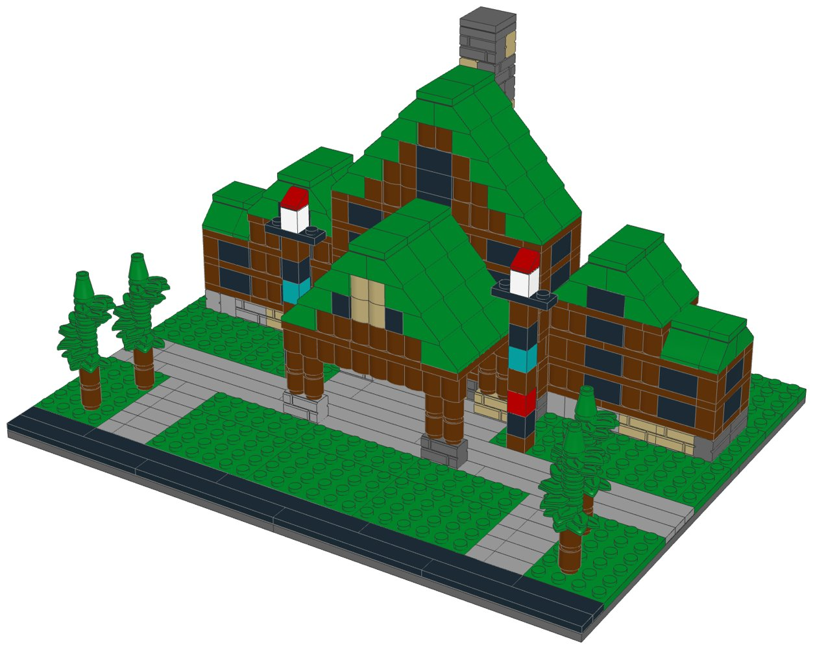
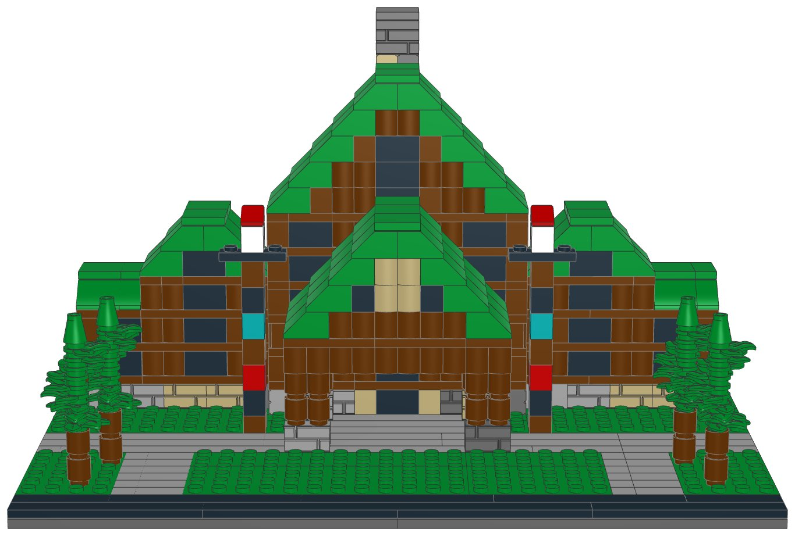
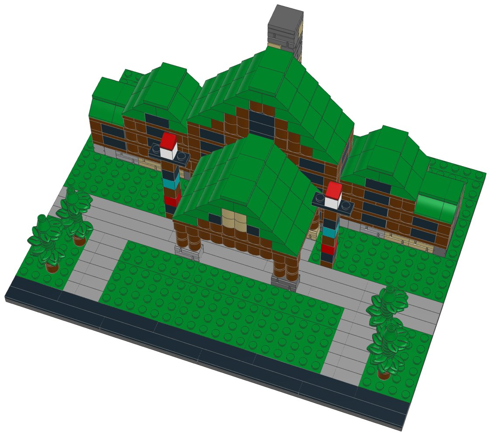

# Wilderness Lodge (mid-size): LEGO® display kit with build instructions



A mid-size display model of Disney's Wilderness Lodge at Walt Disney World, part of the [resort collection](../resort-collection/README.md). The arrival front of the Wilderness Lodge, in the Pacific Northwest style of the great national-park lodges, as a guest sees it from the drive: the six-storey lodge of reddish-brown logs on a stone base, under a steep dark-green front gable with the tall lobby window; the big log porte-cochere over the drive, on paired log columns and stone piers, with a log truss in its own steep gable; guest wings on each side that step down from four storeys to three under green gables; the tall stone chimney rising behind the ridge; the two totem poles either side of the entrance, and dark-green pines along the drive that loops in from the road.

This kit covers Boulder Ridge Villas at Disney's Wilderness Lodge, Copper Creek Villas & Cabins at Disney's Wilderness Lodge as well: they share the property, and the mid-size model shows the part that makes it recognisable.

**Signature features in this kit**

- The six-storey great lodge: a stone storey under five storeys of reddish-brown logs and rows of windows
- The steep dark-green front gable with the tall lobby window
- The big log porte-cochere over the drive: paired log columns on stone piers, log beams and a steep green gable with a log truss
- Guest wings stepping down on each side: four storeys under a front gable, then three under a side gable
- The tall stone chimney rising behind the ridge
- Two totem poles at the entrance, four dark-green pines and the arrival drive

**Left out**

- The long V-shaped guest wings that reach back to the lake, Boulder Ridge and Copper Creek
- The lobby interior, Silver Creek, the geyser and the pool
- The dormers, balconies and smaller gables of the roofs

| | |
|---|---|
| Pieces | **619** (53 part/colour lines, 30 kinds of part, 9 colours) |
| Display base | 32 × 24 studs (25.6 × 19.2 cm), the same for every mid-size kit in the collection |
| Overall size | 25.6 × 19.2 cm, 15.4 cm tall |
| Scale | about 1:250 (one storey = 4 plates, 1 stud ≈ 2 m), like the large resort models |
| Instructions | 56-page PDF, 75 steps, 7 sections |
| Parts cost | **$76.75 per kit** at the Pick a Brick prices last seen (2022 and late 2025); about $84.43 with 2026 price rises (see [Cost assumptions](#cost-assumptions-and-resale-scenarios)) |
| Compact version | [`../wilderness-lodge-compact-lego`](../wilderness-lodge-compact-lego) |



## What's in this folder

| Path | What it is |
|---|---|
| [`instructions/Wilderness_Lodge_Midsize_Instructions.pdf`](instructions/Wilderness_Lodge_Midsize_Instructions.pdf) | **The instruction booklet**: cover, section intros with parts lists, 75 numbered steps, gallery, parts inventory with element IDs, ordering guide |
| [`parts/pick_a_brick_upload.csv`](parts/pick_a_brick_upload.csv) | Pick a Brick upload file for **one kit** (53 element IDs) |
| [`parts/pick_a_brick_upload_x10.csv`](parts/pick_a_brick_upload_x10.csv), [`parts/pick_a_brick_upload_x25.csv`](parts/pick_a_brick_upload_x25.csv) | Upload files for **10 kits** (6,190 pieces) and **25 kits** (15,475 pieces) |
| [`parts/kit_cost.csv`](parts/kit_cost.csv) | Cost of one kit, line by line, with the price and when it was seen |
| [`parts/pick_a_brick_list.csv`](parts/pick_a_brick_list.csv) | Bill of materials: element ID, quantity, part, LEGO colour, design ID, BrickLink part and colour, alternate IDs |
| [`parts/pick_a_brick_mapping.csv`](parts/pick_a_brick_mapping.csv) | Part-by-part sourcing: Pick a Brick name, evidence it's sold, last price, the ID to try next, BrickLink backup |
| [`parts/pick_a_brick_upload_retry.csv`](parts/pick_a_brick_upload_retry.csv) | Newer element IDs for 3 of the parts, for lines the upload doesn't match |
| [`parts/bricklink_wanted_list.xml`](parts/bricklink_wanted_list.xml), [`parts/rebrickable_parts.csv`](parts/rebrickable_parts.csv) | BrickLink wanted list and Rebrickable import (one kit) |
| [`parts/parts_by_section.csv`](parts/parts_by_section.csv) | Parts for each section, for bagging |
| [`model/wilderness_lodge_midsize.mpd`](model/wilderness_lodge_midsize.mpd) | The digital model (LDraw, with steps and submodels). Opens in BrickLink Studio, LeoCAD and LDCad |
| [`checks.md`](checks.md) | Results of the digital build checks |
| [`design.py`](design.py) | The design, written as code on the stud grid |

## Ordering the parts

1. On lego.com, open **Pick and Build → Pick a Brick** and choose **Upload list**.
2. Upload the file for 1, 10 or 25 kits.
3. Before you pay, check that every line shows the normal (Bestseller) delivery time and compare the bag total with the cost below.
4. If a line isn't matched, use the ID in the retry file or in the "If not found" column of the mapping, multiplied by the number of kits.

**Kits per order:** Pick a Brick sells up to 999 of one element per order. The part this kit uses most is needed 68 times, so one order holds up to **14 kits**.

**Sourcing evidence** (every part must pass the Bestseller-only check in `export_parts.py`):

| Evidence | Lines |
|---|---|
| In Pick a Brick Bestseller range (2022 listing); still in LEGO sets in 2026 | 32 |
| On Pick a Brick (late-2025 listing) | 21 |

**Sourcing uncertainties:**

- 32 lines are backed only by LEGO's 2022 Bestseller list, so their range and price today are not confirmed.
- 3 lines have newer element IDs (retry file); an upload may match either.
- LEGO pauses Standard parts in the US and Canada from November 2, 2026; this kit uses none, but check that no line shows a longer delivery time.

## Cost assumptions and resale scenarios

These are planning numbers, not quotes. Upload the 10-kit file to see today's prices: the bag total is the real parts cost.

| Assumption | Value |
|---|---|
| Parts, as listed | Pick a Brick prices last seen in LEGO's 2022 Bestseller list and a late-2025 listing (offline data; lego.com could not be reached to check current prices) |
| Parts, 2026 estimate | +10% on the listed prices (stress case +20%); LEGO's September 14, 2026 repricing raised about a third of Pick a Brick elements by 16.7% on average, hitting tiles and small parts hardest |
| Packaging | $3.00 per kit: box, bags, a card with a link or QR code to the PDF booklet, tape and label (a printed colour booklet adds about $4.00) |
| Labour | $15.00/hour; 3 s per piece to count and bag from sorted stock, plus 6 min to pack |
| Etsy fees (US) | $0.20 listing + 6.5% transaction + 3% + $0.25 processing, on the price the buyer pays |
| Shipping | seller-paid (free shipping) $10.50 for a 1-2 lb box by USPS Ground Advantage; or the buyer pays postage |
| Prices | 1.6x / 2x / 2.5x the 2026 parts estimate, rounded up to $x9.99; market prices for custom kits were not researched for each resort |

| Per kit | Listed prices | 2026 estimate | Stress case |
|---|---|---|---|
| Parts | $76.75 | $84.43 | $92.10 |
| Packaging | $3.00 | $3.00 | $3.00 |
| Labour (619 pieces) | $9.24 | $9.24 | $9.24 |
| Before shipping | $88.99 | $96.66 | $104.34 |
| Seller-paid shipping | $10.50 | $10.50 | $10.50 |

Biggest cost lines: 64× Slope 45 2 x 2 (Dark Green) $8.96, 68× Brick 1 x 2 (Black) $6.80, 59× Brick 1 x 2 Log (Reddish Brown) $6.49.

| Price | Free shipping (seller pays): profit | margin | Buyer pays postage: profit | margin |
|---|---|---|---|---|
| $139.99 (23¢/piece) | $19.08 | 14% | $28.58 | 20% |
| $169.99 (27¢/piece) | $46.23 | 27% | $55.73 | 33% |
| $219.99 (36¢/piece) | $91.48 | 42% | $100.98 | 46% |

Break-even price: $118.91 with free shipping, $108.41 when the buyer pays postage (2026 estimate). The stress case adds about $7.67 per kit.

## Digital checks and physical prototype

`lego-kit/checks.py` checked the digital model ([`checks.md`](checks.md)):

| Check | Result |
|---|---|
| Collisions | Pass |
| Connections | Pass |
| Assembly order | Pass |
| Stability | Pass |

The model was checked on the computer only: parts fit the stud grid without overlaps and every part is held by a stud. **No physical prototype has been built.** Before selling, build one kit from the uploaded parts and the printed booklet, to confirm the parts arrive as listed, the build holds together when handled, and each step is clear.

## Building notes

- **Sections:**
  1. The display base, the drive and the lawns
  2. The great lodge
  3. The left wing
  4. The right wing
  5. The porte-cochere
  6. The chimney
  7. The totem poles and the pines
- The walls are log bricks: 1×4 and 1×2 logs, with a plain 1×1 brick where a run needs one more stud. The ground storey is stone: masonry bricks in two greys and tan, mixed freely.
- Each storey ends with a ring of plates on the walls. It runs the other way round from the one below (across the front and back corners, then along the sides), so the corners lock together.
- The two wings are mirror images, each with its own pages: the lower block goes at the outer end, and the side against the lodge stays open.
- Roofs go up one row of slopes at a time.
- The porte-cochere stands on its own four feet; set it down so its back edge touches the front of the lodge.
- A “Build 2” or “Build 4” badge means you build that module two or four times.



## How it was made

The model is generated by [`design.py`](design.py) with the shared toolkit in [`../lego-kit`](../lego-kit), in the collection's mid-size format (`lego-kit/compact.py`). `./build.sh` renders the steps with LeoCAD, maps every part to LEGO element IDs, writes the parts lists and upload files, runs the checks, prints the booklet and writes this README.

```bash
./build.sh            # set DATA_DIR to refresh element IDs (see ../lego-kit/README.md)
```

lego.com, BrickLink and Rebrickable could not be reached from the environment this was made in. Availability comes from an August 2026 Rebrickable snapshot and Pick a Brick listings from 2022 and late 2025. With internet access, `node ../lego-kit/pab_check.cjs .` checks every element live.

## Disclaimer

An unofficial fan design (MOC) inspired by Disney's Wilderness Lodge at Walt Disney World. It is not affiliated with, sponsored or endorsed by The LEGO Group or Disney. LEGO® is a trademark of The LEGO Group. Resort names are trademarks of Disney; see the trademark note in the [collection README](../resort-collection/README.md) before selling.
